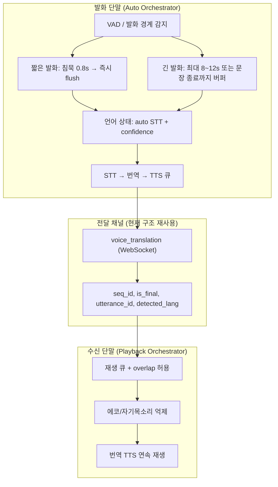

# 오케스트레이터 자율형 대화 & 월드링코(WorldLinco) 통번역 — 분석 및 방향 체크리스트

> 작성: Cursor Cloud Agent 코드 분석 결과 (코드 직접 검증 완료). 날짜 기준 `main` 브랜치.
> 본 문서는 **현재 막혀 있는 두 작업(① 오케스트레이터 멀티 자율형 대화, ② 월드링코 통번역)** 의 진단과 **다음에 진행할 방향**을 체크리스트로 정리한 것입니다.
> 모든 항목에 근거 `파일:라인`을 표기했으며, 표시는 다음과 같습니다: `[ ]` 미착수 · `[~]` 부분 구현/검증중 · `[x]` 완료.

> ### ✅ 이번 PR에서 수정/검증 완료
> - **A-1-1** `CoderAgent` 매니페스트 호출 시그니처 수정 + `written_files` 병합 → 실제 API E2E에서 `coder success` 확인(이전 `TypeError`).
> - **A-1-2** `AutonomousSession.load()`가 `stages`/`agent_results`/`pending_approval_data`/`model_routes`/`extra` 복원하도록 보강 + `to_dict()` 보완.
> - **A-1-3** 모든 턴 응답이 `_build_response`에서 세션 저장 → greeting/status 턴 후에도 재조회 가능.
> - **B-3-1** `VoiceResponse.detected_language` 필드 추가 → 모바일 자동 언어전환 응답 복구.
> - 회귀 테스트 추가: `backend/tests/test_autonomous_orchestrator.py`(coder/세션/persist), `backend/tests/test_voice_gateway_schema.py`. 31개 통과.
> - 비고: 비동기 테스트 실행에는 `pytest-asyncio`가 필요합니다(`python -m pytest ... -p asyncio --asyncio-mode=auto`). 현재 `requirements.txt`에 없음.

---

## PART A. 오케스트레이터 멀티 자율형 대화

대상 모듈: `backend/orchestrator/autonomous/` (router · session · turn_controller · agent_bus · agents/*)
API: `POST /api/llm/autonomous/chat`, `GET /api/llm/autonomous/session/{id}` (`backend/orchestrator/autonomous/router.py:14`)
등록: `backend/main.py:1500-1501` (정상 로드 확인됨)

### A-0. 먼저 알아야 할 구조적 혼선 (중요)
- 이름이 비슷한 **별개의 두 시스템**이 공존합니다.
  - ① 멀티 에이전트 자율 오케스트레이터 = `backend/orchestrator/autonomous/` (지금 구현 중인 것)
  - ② 채팅 오케스트레이터 "대화 모드" = `backend/orchestrator/chat/chat_service.py`, API `POST /api/llm/orchestrate/chat`
- `test_orchestrator_dialogue_mode.py` 와 `verify_autonomous_chat.py` 는 **이름과 달리 ②**를 검증합니다. → ① 전용 테스트가 사실상 부족.

### A-1. 🔴 P0 — 치명적 버그 (먼저 수정해야 진행 가능)

- [x] **(A-1-1) `CoderAgent`의 매니페스트 호출 시그니처 불일치 → 승인 후 코드 생성 시 `TypeError`** ✅ 수정 완료
  - 실제 함수 정의: `backend/llm/orchestrator.py:9191`
    `def _compat_manifest_for_request(task, project_name, validation_profile, required_files)`
  - 잘못된 호출: `backend/orchestrator/autonomous/agents/coder.py:79-85`
    존재하지 않는 인자 `output_dir=`, `b_brain_result=` 전달 + 필수 인자 `required_files` 누락.
  - 올바른 사용 예(메인 오케스트레이터): `backend/llm/orchestrator.py:12665-12669`
  - **방향**: `coder.py`에서 `required_files`를 산출해 위치 인자로 호출하고, `output_dir`/`b_brain_result`는 제거. 이어서 `b_result["written_files"]`를 `_compat_write_manifest` 결과와 **병합**(메인 경로 12666-12669 참고)하여 validator가 검사할 파일 목록 누락 방지.

- [x] **(A-1-2) 세션 복원 불완전 → 멀티턴 재개 시 상태 소실** ✅ 수정 완료
  - 저장은 전체: `session.py:122-139` (`stages`, `agent_results` 포함)
  - 복원은 `conversation`만: `session.py:173-177` → `stages`/`agent_results`/`pending_approval_data`/`model_routes` 미복원.
  - **방향**: `load()`에 `stages`(`StageState`), `agent_results`(`AgentResult`), 승인 대기 컨텍스트를 역직렬화해 복원. 라우팅·승인 흐름이 재개 후에도 일관되게 동작하도록.

- [x] **(A-1-3) 세션 `save()` 누락 경로 → 첫 턴이 인사/상태면 다음 요청에서 404** ✅ 수정 완료
  - `save()` 호출은 파이프라인 종료(`turn_controller.py:173`)와 `_handle_approval()`(`:264`)에서만.
  - greeting(`:107-110`)·status·승인 대기 없는 approval·빈 파이프라인 응답은 저장 안 됨.
  - **방향**: `process_turn()` 반환 직전 모든 분기에서 `session.save()` 보장(또는 응답 빌드 헬퍼 안에서 일괄 저장).

### A-2. 🟠 P1 — 설계/동작 불일치

- [ ] **(A-2-1) `full_auto` 모드가 실제로 자동 실행되지 않음**
  - `requires_approval()`는 `full_auto`에서 False (`session.py:115-120`)지만, coder 자동 실행 분기가 없어 reasoner만 돌고 멈춤.
  - **방향**: `full_auto`일 때 승인 단계를 건너뛰고 coder→validator(→revision 루프)까지 자동 진행하는 경로 추가, 또는 모드 설명을 현실에 맞게 정정.
- [ ] **(A-2-2) STAGE-02~10 자동 순회 미구현**
  - `STAGE_DEFINITIONS`(11단계, `turn_controller.py:25-37`)는 정의돼 있으나, 승인 1회당 1스테이지만 advance하고 `_handle_approval()`은 coder+validator만 실행 → 스테이지별 에이전트 조합이 실질 미사용.
  - **방향**: 스테이지 순회 상태머신을 구현하거나, 우선 STAGE 정의를 단순화하고 문서/코드 일치시키기.
- [ ] **(A-2-3) 거절(`rejected`) 처리 로직 없음**
  - `approval_state` 주석만 존재(`session.py:63`), 거절 시 분기 없음.
  - **방향**: 거절 시 현재 스테이지 롤백/재계획 분기 추가.
- [ ] **(A-2-4) 쿼터/레이트리밋 미적용**
  - `/api/llm/orchestrate/chat`은 `require_llm_mutation_quota` 적용(`orchestrator.py:13150`), `/api/llm/autonomous/chat`은 `get_current_user`만.
  - **방향**: autonomous에도 동일 쿼터/레이트리밋 정책 적용(LLM 비용 보호).

### A-3. 🟡 P2 — 협업/정리

- [ ] **(A-3-1) `agent_bus`의 pub/sub가 실제 협업에 미사용** — `subscribe()` 정의만 있고 에이전트가 구독하지 않음(`agent_bus.py`). 현재는 로그/관찰용. 필요 시 실제 에이전트 간 메시지 소비 구현.
- [ ] **(A-3-2) LLM 미연결 시 스텁 문자열 반환** — `agents/base.py:75-77` (`"[{agent_id}] LLM 미연결 — ..."`). 클라우드(GPU 없음)에서는 스텁으로 "성공" 처리되니, 품질 검증은 LLM 서버(실서버 RTX 5090) 연결 후 수행.
- [ ] **(A-3-3) `_build_llm_call()` 예외 무음 삼킴** — `router.py:106-107`에서 실패 시 `llm_call=None`. 최소한 warning 로그 추가 권장.
- [ ] **(A-3-4) 패키지 `__init__.py` 정리** — `autonomous/`·`agents/` 패키지 구조 정비.
- [ ] **(A-3-5) 프론트엔드 연동 부재** — `/api/llm/autonomous/*` 호출 UI 없음. UI 연동 또는 API 문서화 결정 필요.

### A-4. 테스트 방향

- [ ] **(A-4-1)** `test_autonomous_orchestrator.py`에 **승인→coder→validator 통합 테스트** 추가(A-1-1 회귀 방지). LLM 없이 동작하도록 `llm_call` 페이크 주입.
- [ ] **(A-4-2)** `/api/llm/autonomous/chat` **HTTP 레벨 테스트**(FastAPI TestClient) 추가 — 세션 생성/복원/승인 happy-path.
- [ ] **(A-4-3)** `test_route_to_agents_code_generation_idle`이 실제 `process_turn` 첫 턴 동작(STAGE-01 → `reasoner`만)과 어긋남 → 테스트를 실제 동작에 맞게 정정.
- [ ] **(A-4-4)** ①/② 명명 혼선 정리: `verify_autonomous_chat.py`, `test_orchestrator_dialogue_mode.py`가 ②를 본다는 점을 문서/파일명으로 명확화.

### A-5. GPU/LLM 없이 가능한 검증 (이 클라우드 환경)
- 가능: 의도 분류·인사/상태 응답·`ValidatorAgent`(`py_compile`)·버스 로그·세션 저장/복원.
- 불가(LLM 서버 필요): reasoner/planner/reviewer 실품질, 실제 코드생성 E2E(단, **A-1-1 수정 후** generator 템플릿 경로는 GPU 없이도 동작 검증 가능).

---

## PART B. 월드링코(WorldLinco) 통번역 — "막힌 구간" 진단

### B-0. 명칭 매핑 (혼선 정리)

| 레이어 | 이름 | 위치 |
|--------|------|------|
| 모바일 앱 표시명(브랜드) | **WorldLinco** | `apps/mobile-nadotongryoksa/app.json` (`"name": "WorldLinco"`) |
| 내부 슬러그/프로젝트 | **나도통역사 / nadotongryoksa** | `apps/mobile-nadotongryoksa/`, API 접두 |
| Android 패키지(현재) | `com.parkcheolhong.worldlinco` | `app.json` (2026-06-13 통일) |
| Android 패키지(구 실기기) | `com.parkcheolhong.worldlinco` | `monitoring/reports/voip-*` 로그 — 현재 워크스페이스와 일치 |
| 모바일 번역 엔진 | **NadoTranslator** | `backend/services/nadotongryoksa/translator.py`, `POST /api/llm/translate` |
| 마켓플레이스 통역 엔진 | **SorisaeInterpreter** | `backend/services/shinsegye/interpreter/sorisae_interpreter.py` |

### B-1. 상대적으로 "완료된" 트랙 (방향 문서 대상 아님)
- [x] 텍스트 번역 `POST /api/llm/translate` (NadoTranslator: 사전 캐시 + googletrans)
- [x] 노래 자막 Job API `POST /api/mobile/song-translation/jobs` → SRT/VTT/LRC/JSON export — `NADOTONGRYOKSA_SONG_TRANSLATION_CHECKLIST.md` "완료됨"
- [x] LBS — `NADOTONGRYOKSA_LBS_CHECKLIST.md` "완료됨"
- [x] 사용자 목소리 preview 정책/계약 — `NADOTONGRYOKSA_USER_VOICE_SINGING_CHECKLIST.md`(배포/export는 정책상 기본 보류)

### B-2. 🔴 P0 — 진도 정체의 중심: VoIP 실시간 통역 통화

> 모바일(WebRTC/시그널링 클라이언트/통화 UI)은 상당 부분 있으나, **백엔드와 실기기 빌드가 비어 있어 통화 시그널링 경로가 연결되지 않음.**
>
> 📐 **백엔드 스캐폴딩 설계안**: `NADOTONGRYOKSA_VOIP_BACKEND_DESIGN.md` (모바일 계약 1:1 매핑, REST 3종 + WebSocket 시그널링 룸 릴레이, Phase P1~P3, 테스트 전략 포함). 아래 B-2-1/B-2-2는 이 설계의 P1로 구현 예정.

- [x] **(B-2-1) 백엔드 VoIP API 부재** ✅ **P1 구현 완료** — `backend/voip/`(router/models/registry/signaling/config). REST `POST /calls/initiate`(앱↔앱 자동매칭+PSTN 폴백) · `GET /calls/{id}/audit` · `POST /calls/{id}/end`. `main.py` 등록. 라이브 서버 검증 완료.
- [x] **(B-2-2) 시그널링 서버 / TURN 부재** ✅ **P1 구현 완료** — `WS /api/v1/voip/ws/{call_id}` 룸 릴레이(offer/answer/candidate/chat/voice_translation/ping-pong/hangup) + `config.py`의 STUN/TURN(env) 주입. TestClient 2-클라이언트 통합 테스트 + 라이브 uvicorn ws 릴레이로 E2E 검증(`backend/tests/test_voip_signaling.py`, 5 passed).
- [x] **(B-2 P2) Redis 백엔드 + pub/sub 릴레이** ✅ **구현 완료(플래그 `VOIP_REDIS_URL`, 기본 인메모리)** — `backend/voip/redis_backend.py`(RedisCallStore 룸/감사 + RedisRelay pub/sub). 라이브 Redis로 멀티워커 릴레이/스토어 검증(`test_voip_signaling_redis.py`, 2 passed). 서버측 chat 번역은 모바일이 클라이언트에서 수행하므로 P2에서 제외.
- [x] **(B-2 P3-C) TURN 시간제한 토큰** ✅ **구현 완료** — `config.py`의 coturn `use-auth-secret` HMAC 동적 자격(`VOIP_TURN_STATIC_AUTH_SECRET`/`_TTL_SEC`), 정적 폴백. `get_ice_servers(user_key)` 통화/사용자별 발급. 단위 테스트 `test_voip_turn_tokens.py` 4 passed.
- [x] **(B-3-3 백엔드) `POST /api/llm/voice-translate`** ✅ **구현 완료** — STT(whisper 폴백)+`NadoTranslator` 번역, 모바일 `VoiceTranslateResult` 계약 일치. 라이브 검증(hello→안녕하세요), `test_voice_translate_endpoint.py` 3 passed. 모바일 `voiceTranslate`/VoIP 음성 릴레이 실동작.
- [x] **(B-2-3 / P3-A) FCM presence + 콜리 착신** ✅ **구현 완료** — `backend/voip/presence.py`(디바이스 토큰/presence, 인메모리+Redis), `push.py`(FCM 어댑터, `firebase-admin`+자격 구성 시 전송·아니면 안전 no-op). `POST /api/v1/voip/devices/register`, initiate가 콜리 presence 산정 + 착신 푸시 + `push_sent/push_skipped` 감사, WS 접속 시 presence 갱신. 테스트 `test_voip_presence_push.py` 4 passed, 라이브 검증. 비고: `firebase-admin`은 선택 의존성(요건 미포함), 실제 전송엔 `FCM_ENABLED=true`+서비스계정 키 필요. — 실기기 로그 `No Firebase App '[DEFAULT]' has been created` → `VOIP_PRESENCE_ERROR` (`monitoring/reports/voip-retest-20260524-011147/voip-retest-checklist.md:5-11`).
  - **방향**: Firebase 초기화/푸시 presence 경로 정비(앱 + 서버 키).
- [x] **(B-2 accept/모바일 FCM) 착신 수신 경로** ✅ **백엔드+모바일 클라이언트 완료** — 백엔드 `POST /calls/{call_id}/accept`(콜리 합류) + `accept_callee` 스토어. 모바일 `voipPresence.ts`(register/parse/accept) + `useVoipIncomingCalls` 훅 + `App.tsx` 연결(typecheck 통과). 남은 작업: Firebase 네이티브 설치 + `VoipMessagingAdapter` 주입.
- [x] **(B-2 P3-B) PSTN 다이얼아웃 공급자 어댑터** ✅ **구현 완료(어댑터)** — `pstn.py`(`VOIP_PSTN_PROVIDER`: dialer_fallback/simulated/twilio), `initiate` 연결. 미디어 브리지/통역 삽입·통신사 계약은 후속. 테스트 3 passed, 라이브 폴백 검증.
- [x] **(B-2-4) 패키지 lineage 불일치** ✅ **2026-06-13 해소** — `app.json`·`build35` 실기기(탭 `R83W70QY11H`, S10 `10.92.246.175:5555`) 모두 `com.parkcheolhong.worldlinco` · `versionCode=35` 확인.
  - **남은 작업**: EAS/로컬 네이티브 빌드(CXX1210) 복구 후 신규 APK 재배포.
- [~] **(B-2-5) 네이티브 APK 빌드 복구 진행중**
  - ✅ **2026-06-14 로컬 재검증 통과** — `apps/mobile-nadotongryoksa/android`에서 `./gradlew.bat assembleDebug --stacktrace --console=plain` 실행 결과 `BUILD SUCCESSFUL` 확인.
  - ⏳ **남은 작업**: 동일 산출물 EAS/실기기 재배포 + 2단말 설치 lineage 증거(해시/버전) 갱신.
- [~] **(B-2-6) 실기기 2회 통화 시그널 검증** — **2026-06-13 부분 완료**
  - ✅ **서버 시그널링 2회 E2E PASS** — `119cash`→`burumi69`(user 226) `initiate` 200 ×2, nginx `wss://…/signal` offer→answer 릴레이 확인 (`evidence/voip-b26-e2e-20260613/`).
  - ✅ **2026-06-14 서버 상태 재확인(클라우드)** — `http://127.0.0.1:8000/openapi.json` 응답 200, `backend/tests/test_voip_signaling.py` 5 passed, `backend/tests/test_voip_signaling_redis.py` 2 passed.
  - ✅ **친구 계정 확인** — `burumi69@gmail.com`(`nado-000226`), 대안 `instant-mq88ycr85j@…`(`nado-000517`, `WorldLinco!mq88ycr85jA1`).
  - [~] **실기기 2대 WebRTC logcat** — **r5-1 시그널 PASS** (119cash→burumi `Offer sent`+`INCOMING`, `verify_r5_*_r1.log`). **S10 받기 수동 탭** 후 `Answer`·`connected` ×2 남음.
  - ✅ **`POST /calls/{id}/accept`** — `nadotongryoksa_voip_router.py` 등록·200 검증 (2026-06-13).

- [x] **(B-2-7) nginx VoIP presence/signal WebSocket 프록시** ✅ **2026-06-13 완료** — `nginx/nginx.conf/nginx.conf`에 `^~ /api/v1/voip/presence`, `^~ /api/v1/voip/signal` Upgrade 헤더 블록 추가(HTTP/HTTPS 2곳). `nginx -t` + reload 후 `wss://…/presence` → `presence_ready` E2E 확인. 실기기 logcat `VOIP_PRESENCE_CONNECTED`.

### B-3. 🟠 P1 — 음성(STT)·자동 언어감지 API 계약 버그

- [x] **(B-3-1) `detected_language` 응답 스키마 누락** ✅ 수정 완료 — `VoiceResponse`에 `detected_language: Optional[str] = None` 필드 추가 + `# pyright: ignore` 제거. 회귀 테스트 `test_voice_gateway_schema.py`.
- [x] **(B-3-2) STT 언어 힌트 미전송** ✅ **코드 수정 완료** — `App.tsx` STT 요청에 `language: autoVoiceModeEnabled ? 'auto' : fromLang` 전달. 실기기 음성 품질 검증은 `VOICE_DETECTION_TEST_PROTOCOL.md` 대기.
- [x] **(B-3-3) 이미지 번역(OCR) 엔드포인트** ✅ **2026-06-13 완료** — `backend/mobile/image_translation/` (`POST /api/mobile/image-translation`), 모바일 `translateImage()`·`regionHint` 연동. RapidOCR E2E(영문→한글) 200. 계약 테스트 35 passed.
  - ⏳ **남은 작업**: `Dockerfile.backend` 재빌드 시 `rapidocr-onnxruntime==1.2.3` 영구 반영(현재 컨테이너 `pip install` 적용). 실기기 카메라/OCR UI 검증.
- [x] **(B-3-4) RapidOCR 백엔드 의존성** ✅ **2026-06-13 완료** — `requirements.txt`에 `rapidocr-onnxruntime==1.2.3`(Python 3.13 호환; ≥1.3.x는 `<3.13` 제약). 컨테이너 설치·OCR E2E 확인.

### B-4. 🟡 P2 — 실기기/안정성 검증 미완 (기존 체크리스트에 이미 추적 중)

- [x] **(B-4-0) build35 채팅·친구 404 재검증** ✅ **2026-06-13 통과** — 탭·S10 `build35`/`v1.0.25`: 채팅 레일 `채팅 + 친구 허브` 표시, **404 문구 없음**, 친구 `nado-000517` 등 목록 로드. logcat `VOIP_PRESENCE_CONNECTED`, `pending_call` **status=200**. 증거: `evidence/mobile-restore-functional-verify-20260613/ui_retest_chat3*.xml`, `retest_logcat_*.txt`.

- [ ] **(B-4-1)** BT 이어폰 MIC + 안정성(5회 중 2회 오류) — `mobile-nadotongryoksa-bt-hybrid-verification.md`(항목 4, 10, Round 2 미기록).
- [ ] **(B-4-2)** 음성 국가명 자동 전환(미국/일본/중국) — `VOICE_DETECTION_TEST_PROTOCOL.md:173-178` 전부 미체크.
- [ ] **(B-4-3)** WF(Wi-Fi) 폴백 2회 검증 — `CRITICAL_2_CHECKLIST.md:34-42` `TC-WF-01` 기록 대기.

### B-5. 🟢 P3 — 환경/설계 한계 (인지 필요)
- [ ] 신세계 레거시 통역 모듈(`backend/services/shinsegye/interpreter/hybrid_interpreter_system.py:266-280`)의 "온라인 번역"은 **실 API가 아니라 시뮬레이션** → 프로덕션 경로로 오인 금지.
- [ ] `voice/orchestrate`는 `auto_apply=false`여도 orchestrator chat을 호출(불필요 LLM 비용 가능) — transcript만 필요할 땐 STT-only 경로 분리 검토.
- [ ] googletrans 실패 시 원문 그대로 반환(`translator.py:165-170`) → 번역 실패가 가려짐. 실패 표식/재시도 검토.
- [ ] Song Job 저장소가 DB 실패 시 in-memory 폴백(`service.py:222,264`) → 멀티워커/재시작 시 job 유실 가능.

### B-6. 외부 의존성 / GPU
- googletrans(네트워크), faster-whisper(기본 `cpu`+`tiny`+`int8`, GPU 선택), whisper.cpp(CPU), pyttsx3/SpeechRecognition(서버 TTS/STT), react-native-webrtc(네이티브 빌드 필수 → CXX1210 블로커), Firebase/FCM(presence).
- GPU 없이도 텍스트/노래 번역·STT(tiny)는 동작. 실서버 RTX 5090은 LLM/STT 가속용(AGENTS.md 참조).

### B-7. VoIP Voice Relay Auto Orchestrator (VAD 풀자동 통역)

> **마스터 문서**: [`docs/VOIP_VOICE_RELAY_ORCHESTRATOR_ARCHITECTURE.md`](docs/VOIP_VOICE_RELAY_ORCHESTRATOR_ARCHITECTURE.md)

| ID | 항목 | 파일 경로 | 상태 |
|----|------|-----------|------|
| V-1 | 아키텍처 문서 + mermaid | `docs/VOIP_VOICE_RELAY_ORCHESTRATOR_ARCHITECTURE.md` | [x] |
| V-2 | Sender VAD 오케스트레이터 | `apps/mobile-nadotongryoksa/src/features/voip-voice-relay/voiceRelayOrchestrator.ts` | [x] |
| V-3 | Receiver 재생 큐 | `apps/mobile-nadotongryoksa/src/features/voip-voice-relay/voiceRelayPlaybackQueue.ts` | [x] |
| V-4 | `voice_translation` 메타 송수신 | `apps/mobile-nadotongryoksa/src/services/voipCallClient.ts` | [x] |
| V-5 | 통화 UI VAD 녹음 + 큐 재생 | `apps/mobile-nadotongryoksa/src/screens/VoIPCallScreen.tsx` | [x] |
| V-6 | 백엔드 relay passthrough | `backend/marketplace/nadotongryoksa_voip_router.py` (`_build_voice_translation_relay_payload`) | [x] |
| V-7 | 단위 테스트 | `apps/mobile-nadotongryoksa/src/__tests__/voiceRelayOrchestrator.test.ts`, `backend/tests/test_voip_voice_translation_meta.py` | [x] |
| V-8 | 실기기 2단말 긴/짧은 발화 E2E | `evidence/voip-voice-relay-orchestrator/run_20260614-130405/` | [~] **통화·수락·connected PASS** (`VOIP_INCOMING_ACCEPT_API_OK`, `connectSignaling:open`, 35s hold). **통역 relay logcat**는 발화자 마이크 입력 필요(자동 스피커 톤만으로 VAD 미트리거) |
| V-9 | streaming STT partial (Phase 2) | `backend/llm/router.py` + 모바일 WS | [ ] 미구현 |
| V-10 | 통화 중 언어쌍 자동 보정 (Phase 2) | `VoIPCallScreen.tsx` + `voice-translate` | [ ] `detected_lang` relay만 |

---

## PART C. 권장 진행 순서 (다음 액션)

> **2026-06-14 업데이트**: B-2-5 로컬 assembleDebug 복구 확인, B-2-6 서버 시그널링/Redis 시그널링 테스트 재통과. 아래는 남은 우선순위.

1. **(B-7 / V-8)** Voice Relay Auto Orchestrator 실기기 2단말 긴·짧은 발화 E2E.
2. **(B-2-6)** 실기기 2대 통화 시그널링(offer/answer/connected) 2회 E2E — presence는 복구됨.
3. **(B-2-5)** 복구된 로컬 빌드 기준으로 EAS/실기기 재배포 + 설치 lineage 증거 갱신.
4. **(B-4-1~3)** BT 이어폰·음성 자동전환·WF 폴백 실기기 프로토콜 실행.
5. **(B-2-3 후속)** Firebase FCM 네이티브 초기화(`No Firebase App` 로그 해소).
6. **(A-2~A-4)** 오케스트레이터 full_auto·스테이지 순회·테스트 보강.

### 방향 문서(체크리스트) 운용 제안
- 오케스트레이터: 본 문서 PART A 사용.
- 통번역 VoIP: 루트에 전용 마스터가 없으므로 `monitoring/reports/voip-retest-20260524-011147/voip-retest-checklist.md`를 루트로 승격(`NADOTONGRYOKSA_VOIP_INTERPRETATION_CHECKLIST.md`)하여 PART B-2를 이관 관리 권장. 음성 품질은 `mobile-nadotongryoksa-bt-hybrid-verification.md`를 하위 트랙으로.
- `TRANSLATION_VERIFICATION_COMPLETE.md`는 VoIP·음성 계약 버그·실기기 미검증을 **반영하지 않은** 과거 문서이므로 "완료" 근거로 사용하지 말 것.
