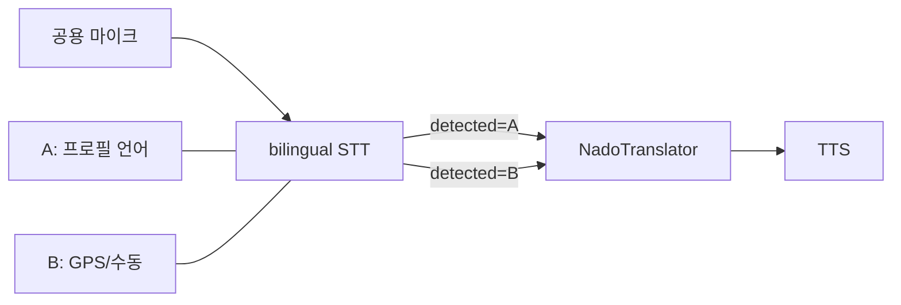

# 기술서 — WorldLinco VoIP · Voice Relay Orchestrator · 오케스트레이터

> **최종 갱신:** 2026-06-22  
> **대상 브랜치/커밋:** `feat/worldlinco-build90-92` · **운영 APK build 145**  
> **현재 운영 APK:** `1.0.93` / **versionCode 145** (`com.parkcheolhong.worldlinco`)  
> **관련 문서:**  
> - `docs/VOIP_VOICE_RELAY_ORCHESTRATOR_ARCHITECTURE.md` — Voice Relay 파이프라인·파라미터·구조도  
> - `evidence/voip-voice-relay-orchestrator/VERIFICATION_REPORT.md` — 실기기 검증·증적 인덱스  
> - `NADOTONGRYOKSA_VOIP_BACKEND_DESIGN.md` — 초기 VoIP 설계안  
> - `docs/checklists/orchestrator-ssot-visual-flow-gap-checklist.md` — PART G Gap 클로저 · DoD-1~6  
> - `docs/ORCHESTRATOR_API_NAMING.md` — ① autonomous vs ② orchestrate/chat 명명  
> - `evidence/worldlinco-v1-launch/E3-8_KO_JA_VOIP_REPORT.md` — E-3-8 strict PASS  
> - `evidence/worldlinco-v1-launch/BUILD73_LAUNCH_STATUS.md` — build 73 SSOT  
> - `docs/worldlinco-v2/IN_APP_AUTO_UPDATE_AND_AUDIO_FIX.md` — 인앱 자동 업데이트 · TTS 발화 회귀 수정 (build 142–145)  
> - `docs/worldlinco-v2/TOURISM_AI_KNOWLEDGE_RAG_DESIGN.md` — 소리새 AI 관광 지식·RAG·사람검수·NPS·CLIP (§0.21)  
> - `AGENTS.md` — 로컬/클라우드 운영 가이드  

---

## 0. 변경 요약 (전체 타임라인)

### 0.1 초기 세션 (P0~P2, `main` / PR #75 계열)

| commit | 내용 |
|--------|------|
| `f127192` | docs: 프론트엔드 기존 테스트 실패/라우트 정보 AGENTS.md 추가 |
| `b1c85aa` | docs: 오케스트레이터 & 월드링코 통번역 분석/방향 체크리스트 |
| `fddfaa2` | fix: CoderAgent 매니페스트 호출, 세션 복원/저장, VoiceResponse.detected_language |
| `4672e67` | feat: VoIP 시그널링 백엔드 P1(REST + WebSocket) — `backend/voip/` |
| `994074f` | feat(voip): P2 Redis 스토어 + pub/sub 릴레이 |
| `7b09d5c` | fix(mobile): WebRTC import/voiceTranslate/tone/props 수정 |

### 0.2 Voice Relay · Silero · build 57~65 (2026-06-14)

| 항목 | 내용 |
|------|------|
| `a989bc9f0` | **WorldLinco VoIP voice relay build 65** — repetition guard, `nadotongryoksa_voip_router`, marketplace APK, 증적·스크립트 |
| build 57~58 | Turn controller 단축, 쌍언어 채팅 UI, `voice_translation` WS 메타(`seq_id`, `utterance_id`, `chunk_index`, `is_final`) |
| build 62~64 | **Silero VAD** 네이티브 모듈, phrase boundary defer, **14s safety cap** |
| build 65 | **반복 환각 가드** (`repetition_hallucination`), TTS 억제·240자 cap, 공백 구분 phrase collapse |

**변경 규모 (build 65 커밋):** 520 files, +47,938 / -2,428 (코드·증적·APK 포함).

### 0.3 v1.0 출시 직전 — build 66 · E-3 자동화 (2026-06-15)

| 항목 | 내용 |
|------|------|
| **APK** | `1.0.41` / **versionCode 66** · Tab+S10 설치 확인 |
| **E-3-1** | WiFi 2대 **5/5 PASS** (`e3_verify_20260615-212949`) — connected + signaling + initiate |
| **누적 DoD** | run A~C **8/10** + build 66 run **5/5** (자동화 게이트 기준) |

**build 66 앱 수정 (`App.tsx`):**
- validation deeplink **자기 보이스 ID 발신 차단** (`VOIP_VALIDATION_AUTO_CALL_REJECTED_SELF`)
- `autoCallVoiceId` **3중 전달** (Modal + ChatRail + Embedded) → Modal만 유지, **중복 initiate** 억제
- `handleStartFriendVoiceCall` **8초 디스패치 디듀프**

**build 66 스크립트 수정 (`voip_manual_call_setup.ps1`, `worldlinco_e3_launch_verify.ps1`):**
- S10 **incoming deeplink auto-accept** (`worldlingo://voip/incoming?...&participant_role=callee`) — UI `받기` 탭 대체
- Tab `call_id` ↔ S10 incoming **매칭** 후 수락 (stale call 혼선 방지)
- `CalleeVoiceId=nado-000001` / `CallerVoiceId=nado-000226` 고정 (Tab→S10)
- pre-call **lightweight hangup** + API stale end (로그인 가능 시)

**잔여 (E-3-2):** ~~Tab 스피커 echo~~ **2026-06-15 완료** — `e3-2_echo_20260615-232900` (repetition 0).

### 0.4 build 67 · 50개국어 정합 · ko↔ja (2026-06-15)

| 항목 | 내용 |
|------|------|
| **APK** | `1.0.42` / **versionCode 67** — 친구 목록 deeplink 재오픈 수정 |
| **백엔드** | `SUPPORTED_LANGUAGES` **50개** (모바일 LANGS 동기화) · `devanalysis114-backend` restart |
| **E-3-6** | `50lang_audit_20260615-235805` — local/remote **50/50** aligned |
| **E-3-7** | ko→ja / ja→ko `voice-translate` API **PASS** |
| **E-3-8** | ko↔ja VoIP E2E — build **69** ja STT + playback · build **73** strict ja→ko (§0.6) |

증적: `evidence/worldlinco-v1-launch/50LANG_ALIGNMENT_REPORT.md` · `BUILD67_LAUNCH_STATUS.md`

### 0.5 build 69 · E-3-8 ko↔ja VoIP (1차 PASS, 2026-06-16)

| 항목 | 내용 |
|------|------|
| **APK** | `1.0.44` / **versionCode 69** — deeplink `preferred_language` · validation `force=1` · Tab+S10 설치 |
| **E-3-8** | **PASS** `call-71a7256e4490` — S10 `detected_lang=ja` · `こんにちは、よろしくお願いします。` · Tab `VOIP_VOICE_RELAY_PLAYBACK` · repetition **0** |
| **프로필** | smoke 전 deeplink: S10 `ja` · Tab `ko` |
| **call_id** | `-SetupOnly` + 8s stable + logcat filter by call_id |
| **한계 (해소됨)** | Tab TTS `Hello, nice to meet you.` (`target_lang=en`) → **build 73 strict PASS** (§0.6) |

**build 69 앱:** `parseAppEntryDeepLink` → `preferred_language` · `VOIP_DEEPLINK_PREFERRED_LANGUAGE_APPLIED`  
**build 69 스크립트:** `worldlinco_ko_ja_voip_smoke.ps1` · `voip_manual_call_setup.ps1` (`-SetupOnly`, `-SetPreferredLanguage`)

증적: `ko_ja_smoke_20260616-005906` · `E3-8_KO_JA_VOIP_REPORT.md` · `BUILD69_LAUNCH_STATUS.md`

### 0.6 build 71~73 · ja→ko relay pairing fix · E-3-8 strict PASS (2026-06-16)

| 항목 | 내용 |
|------|------|
| **APK** | `1.0.45` / **versionCode 73** · Tab+S10 marketplace 설치 확인 |
| **E-3-8 strict** | **PASS** `call-0f44540d27f6` — S10 `ja→ko` · Tab 한국어 TTS `안녕하세요, 잘 부탁드립니다.` · repetition **0** |
| **Backend accept** | `display_language=ko` (invite hint 우선, caller DB `en` 무시) |
| **Tab caller pair** | initiate `display_language=ja` · segment `target_lang=ja` |
| **S10 callee pair** | segment `source_lang=ja` · **`target_lang=ko`** · `VOIP_VOICE_RELAY_SENT` |

**근본 원인 (build 71 FAIL `target_lang=en`):**

1. **Backend** `_build_active_call_response` (callee `/accept`): caller DB `preferred_language`가 initiate invite `display_language=ko`보다 우선 → accept API가 `en` 반환.
2. **Mobile** deeplink auto-accept 시 accept API merge가 invite/deeplink `ko`를 덮어씀 → `voipActiveProfile.preferredLanguage=en` → `effectiveVoipTargetLang=en`.
3. **Tab caller** validation auto-call이 `callee_preferred_language` 미전달 → initiate `display_language`가 친구 DB `en` fallback.

**수정 파일:**

| 파일 | 변경 |
|------|------|
| `backend/marketplace/nadotongryoksa_voip_router.py` | callee accept: `_resolve_call_language_hint(invite, db)` 순서 · accept 로그 `display_language` |
| `apps/mobile-nadotongryoksa/App.tsx` | `resolveVoipRemoteLanguageHint` · accept merge · `callee_preferred_language` deeplink |
| `scripts/voip_manual_call_setup.ps1` | incoming `display_language=$CallerPreferredLanguage` · validation `callee_preferred_language` |
| `scripts/worldlinco_ko_ja_voip_smoke.ps1` | stable wait timeout 45s→**90s** |
| `backend/tests/test_nadotongryoksa_friends_and_voip_contract.py` | `test_voip_accept_prefers_invite_caller_language_over_stale_db` |

**실기기 로그 (strict PASS):**

```
S10 VOIP_VOICE_TRANSLATE_RESULT  source_lang=ja target_lang=ko detected_lang=ja
S10 VOIP_VOICE_RELAY_SENT        translated_text=안녕하세요, 잘 부탁드립니다.
Tab VOIP_VOICE_RELAY_PLAYBACK    target_lang=ko translated_text=안녕하세요, 잘 부탁드립니다.
Backend [VoIP] Call accepted     call_id=call-0f44540d27f6 display_language=ko
```

증적: `ko_ja_smoke_20260616-023813/` · `E3-8_KO_JA_VOIP_REPORT.md` · `BUILD73_LAUNCH_STATUS.md`

### 0.7 build 74 · relay latency trim · marketplace version SSOT (2026-06-16)

| 항목 | 내용 |
|------|------|
| **APK** | `1.0.45` / **versionCode 74** — turn/VAD/Silero 타이밍 단축 |
| **Marketplace** | `nadotongryoksa-v1.manifest.json` + `GET /api/marketplace/apk/worldlinco/manifest` · UI 동적 버전 표기 |
| **Latency** | `playbackMinMs` 2800→**2200** · `silenceFlushMs` 1900→**1500** · Silero `minSegmentMs` 3200→**2800** · `remoteListenHoldMs` 2500→**2100** |
| **E-3-4** | **재개** — backend **`v1.0.46`** 프로필 API + build 74 APK |

**LTE 베타 보안 (v1.0 현재):**

| 항목 | 상태 |
|------|------|
| 앱 VoIP/WSS | `wss://metanova1004.com` TLS only (앱 WiFi-only 차단 **없음**) |
| APK 배포 | 로그인 + HMAC **7일 test_token** (`/apk/test-token`) |
| API | JWT Bearer · voice-translate rate limit (nginx/backend) |
| v1.1 추가 | LTE 전용 QA 매트릭스 · FCM · TURN short-lived token · 데이터 사용량 UI |

### 0.8 v1.0.46 · signup profile API (2026-06-16)

| 항목 | 내용 |
|------|------|
| **Tag** | **`v1.0.46`** @ `88adda287` (GitHub `gpu-llm-server-awq-20260427`) |
| **APK** | build **74** 유지 (`v1.0.45`) — 모바일 재빌드 불필요 |
| **API** | `POST /api/auth/signup` · `GET/PATCH /api/auth/me` — `preferred_language` + `country_code` |
| **Chat** | 1:1 방 생성 시 `default_source_lang` / `default_target_lang` = 양쪽 프로필 |
| **VoIP** | DB 프로필 + 기존 invite/deeplink 언어 힌트 (build 73+ strict 유지) |

### 0.9 관리자 멀티 에이전트 오케스트레이터 (①) — PART A/D-3 (2026-06-16)

| 항목 | 내용 |
|------|------|
| **모듈** | `backend/orchestrator/autonomous/` — `turn_controller` · `session` · `agents/*` |
| **API** | `POST /api/llm/autonomous/chat` · `GET /api/llm/autonomous/session/{id}` |
| **A-2** | `full_auto` coder→validator 자동 · `rejection` 재계획 · `require_llm_mutation_quota` |
| **STAGE** | full_auto 턴당 `AUTONOMOUS_MAX_STAGES_PER_TURN` (기본 **11**) 순회 |
| **GPU A-3-2** | vLLM **32B AWQ** · `verify_autonomous_llm_gpu.py` 3-probe **`overall_passed`** · `evidence/autonomous-a32-gpu-verify/` |
| **vLLM ops** | `gpu-llm-server/docker-compose.vllm-32b.yml` · `scripts/start_vllm_rtx5090_32b.ps1` |
| **Admin ops** | `scripts/reset_fixed_admin_password.py` · 설정 패널 관리자 비밀번호 변경 UI |
| **Admin UI** | `/admin/llm` → `AutonomousOrchestratorPanel` · proxy `app/api/llm/autonomous/*` |
| **명명 SSOT** | `docs/ORCHESTRATOR_API_NAMING.md` (① vs ② vs VoIP relay ③) |
| **테스트** | `test_autonomous_orchestrator.py` **31** · `test_autonomous_orchestrator_http.py` **8** |

**②와 구분:** 관리자 기존 대화형 패널 = `POST /api/llm/orchestrate/chat` (`use-orchestrator-chat.ts`). ①은 승인·STAGE·멀티 에이전트 파이프라인 전용.

### 0.10 Autonomous TurnController 11단계 SSOT · 4-probe 실행 완료 (2026-06-16)

| 항목 | 내용 |
|------|------|
| **SSOT 엔진** | `TurnController` — `stage_definitions.py` · `stage_commands.py` · `stage_coder_scope.py` |
| **표면 어댑터** | `surface_adapter.run_autonomous_surface_chat` — Admin `orchestrate/chat` · Marketplace `customer-orchestrate/chat` **동일 코어** |
| **단계 패치** | 단계당 2~9파일 (`get_stage_patch_scope`) — 기존 파일 필터 제거로 107파일 폭주 방지 |
| **4.5단계** | reviewer → coder fix loop · validator 구조검증(기존 main.py 인정) · reviewer error 시 중단하지 않음 |
| **프로브** | `scripts/run_11stage_orchestrator_probe.py` — `--mode stub|live|http` · `--admin` · `--marketplace` |

**실행 결과 (2026-06-16, 태스크: FastAPI 헬스체크 API):**

| Probe | 결과 | session_id | 증적 |
|-------|------|------------|------|
| stub | **11/11** completed | `064cf9f886464b72` | `evidence/orchestrator-11stage-probe-20260616-125507/` |
| live (vLLM :8008) | **11/11** completed | `b5e16dfa41f94638` | `evidence/orchestrator-11stage-probe-20260616-125528/` |
| http marketplace | **11/11** · stage_run sync OK | `73995f7646e94feb` | `evidence/orchestrator-11stage-probe-20260616-130503/` |
| http admin | **11/11** · `orchestrator_core=autonomous_turn_controller` | `91c715c20e3c4bed` | `evidence/orchestrator-11stage-probe-20260616-131740/` |

**재현:**

```powershell
.\scripts\restart_backend_8000.ps1
python scripts/run_11stage_orchestrator_probe.py --mode stub
$env:OLLAMA_BASE="http://127.0.0.1:8008/v1"; python scripts/run_11stage_orchestrator_probe.py --mode live
python scripts/run_11stage_orchestrator_probe.py --mode http --marketplace --base-url http://127.0.0.1:8000
python scripts/run_11stage_orchestrator_probe.py --mode http --admin --base-url http://127.0.0.1:8000
```

**배포:** `docker compose build backend && docker compose up -d backend` (`devanalysis114-backend` · `./backend` 볼륨 마운트)

### 0.11 Live Flow Rail · Decision Panel · Playwright 계약 (2026-06-17)

| 항목 | 내용 |
|------|------|
| **Live Flow Rail** | `frontend/frontend/shared/orchestrator-live-flow-rail.tsx` — 11 STAGE 레일 · intent/cmd 배지 · 에이전트 타임라인 · `data-testid=orchestrator-live-flow-rail` |
| **Snapshot 빌더** | `frontend/frontend/lib/orchestrator-live-flow.ts` — `diagnostics` + `stage_run` → `OrchestratorLiveFlowSnapshot` |
| **Decision Panel** | `frontend/frontend/shared/orchestrator-decision-card.tsx` — 제안 카드 · 승인 게이트 · `orchestrator-decision-*` / `orchestrator-approval-*` testids |
| **마운트** | Admin `/admin/llm` · Marketplace `/marketplace/orchestrator` — `use-orchestrator-chat.ts` `liveFlowSnapshot` |
| **HTTP SSOT** | Admin `POST /api/llm/orchestrate/chat` · Marketplace `customer-orchestrate/chat` → `run_autonomous_surface_chat` (G-1) |
| **Playwright** | `tests/orchestrator-live-flow-rail.playwright.spec.ts` — **5/5 passed** · 전용 dev **3025** · mock auth |
| **Discuss UI (G-4-2)** | `OrchestratorDiscussBanner` · StageCardPanel discuss 오버레이 · `resolveDiscussArchId` rail↔ARCH sync · `orchestrator-discuss-*` testids |
| **Discuss 검증 (G-4-3)** | probe `discuss4_assertions` (stub/http + sync-inline) · Playwright `e2e:orchestrator-discuss4` (ARCH-004 running · ARCH-005 pending) |
| **실행** | 루트 `npm run e2e:orchestrator-live-flow-rail` · `npm run e2e:orchestrator-discuss4` · 포트 충돌 시 `:fresh` |

**Gap 체크리스트:** `docs/checklists/orchestrator-ssot-visual-flow-gap-checklist.md` (PART G-0~G-5 · DoD-1~6)

### 0.12 PART G Gap 클로저 · DoD-1~6 · Edge TTS · :8000 SSOT (2026-06-17)

> **마스터 Gap 체크리스트:** `docs/checklists/orchestrator-ssot-visual-flow-gap-checklist.md`  
> **증적:** `evidence/orchestrator-visual-flow-20260617/` · `evidence/orchestrator-11stage-probe-20260617-*/`

#### 0.12.1 아키텍처 요약

| 계층 | SSOT | 비고 |
|------|------|------|
| **① 코어** | `TurnController` (`backend/orchestrator/autonomous/`) | design · execute · discuss · approval |
| **표면 어댑터** | `surface_adapter.run_autonomous_surface_chat` | Admin `surface=admin` · Market `surface=marketplace` |
| **HTTP 진입** | `POST /api/llm/orchestrate/chat` · `POST /api/marketplace/customer-orchestrate/chat` | `manual_*` → ① · lightweight/reverse_question → ② fallback |
| **stage_run 동기화** | `stage_run_sync.py` | discuss 턴 `current_stage_id` 전진 금지 (ARCH-004 고정) |
| **프론트 SSOT** | `use-orchestrator-chat.ts` · `orchestrator-live-flow.ts` | diagnostics → Live Flow Rail · Decision Panel |
| **음성** | `orchestrator-voice-entry.ts` · `useOrchestratorVoiceStt` | STT → 동일 `message` · `voice-stt`/`voice-entry` tags |
| **TTS** | `orchestrator-speech.ts` → `/api/llm/voice/synthesize` | Edge neural 우선 · browser `speechSynthesis` fallback |
| **백엔드 포트** | **`:8000` SSOT** | `devanalysis114-backend` · `scripts/restart_backend_8000.ps1` |

#### 0.12.2 PART G 구현 완료 항목

| Part | 내용 | 핵심 파일 |
|------|------|-----------|
| **G-0** | Live Flow Rail · Decision Panel · discuss 배너 · progress substeps | `shared/orchestrator-live-flow-rail.tsx` · `orchestrator-decision-card.tsx` |
| **G-1** | HTTP 채팅 → ① TurnController | `backend/llm/orchestrator.py` · `customer_orchestrate_router.py` |
| **G-2** | discuss intent · `/ask`/`/search` · technology_recommendations mapper | `turn_controller.py` · `autonomous/advisory.py` |
| **G-3** | 음성 STT SSOT · voice badge · Edge TTS | `orchestrator-voice-entry.ts` · `voice_gateway.py` · `orchestrator-speech.ts` |
| **G-4** | discuss-4 ↔ stage_run ARCH-004 고정 | `stage_run_sync.py` · probe · Playwright discuss4 |
| **G-5** | Admin workbench · miniConsoleLayout · API URL 단일화 | `admin/llm/page.tsx` · `orchestrator-chat-endpoints.ts` |

**G-5-3 API 표면 축소:**

| 클라이언트 | 엔드포인트 | 파일 |
|------------|-----------|------|
| Admin | `POST /api/llm/orchestrate/chat` | `postAdminOrchestratorChat` |
| Marketplace | `POST /api/marketplace/customer-orchestrate/chat` | `postCustomerOrchestratorChat` |
| 디버그 | `/api/llm/autonomous/chat` | 내부·디버그 전용 (응답 헤더 `X-Orchestrator-Core`) |

#### 0.12.3 Definition of Done (PART G-6)

| DoD | 상태 | 검증 |
|-----|------|------|
| **DoD-1** | ✅ | Admin·Market `diagnostics.orchestrator_core=autonomous_turn_controller` · `test_orchestrator_dialogue_mode_autonomous.py` |
| **DoD-2** | ✅ | stub **11/11** · **live 11/11** (`064143`) · http admin/market **`orchestrator_core` 13/13** (`063700`/`063618`) |
| **DoD-3** | ✅ | discuss-4 ARCH-004 고정 · probe stub/sync-inline · `e2e:orchestrator-discuss4` |
| **DoD-4** | ✅ | Redis discuss → DecisionCard → execute → live rail passed · `e2e:orchestrator-dod4` |
| **DoD-5** | ✅ | Admin+Market 음성 시나리오 · `e2e:orchestrator-dod5` **3/3** |
| **DoD-6** | ✅ | `ORCHESTRATOR_WORLDLINCO_ANALYSIS_CHECKLIST.md` PART G 링크 · A-6 gap 정리 |

**DoD-2 HTTP probe (2026-06-17, `:8000` after `docker restart devanalysis114-backend`):**

| Probe | orchestrator_core | stages | 증적 |
|-------|-------------------|--------|------|
| stub | 11/11 | 11/11 | `evidence/orchestrator-11stage-probe-20260617-062243/` |
| **live** (vLLM :8008) | **11/11** | 11/11 | `...064143/` · `llm_connected=true` · ~91s |
| http --admin | **13/13 PASS** | 11/11 | `...063700/` (discuss-4 stage_run skip) |
| http --marketplace | **13/13 PASS** | 11/11 | `...063618/` (discuss-4 **ARCH-004** ✅) |

#### 0.12.4 Edge Neural TTS (로봇 읽기 → 자연스러운 안내)

**문제:** 브라우저 `speechSynthesis`만 사용 시 Windows SAPI 기계음.

**해결:**

| 구성요소 | 내용 |
|----------|------|
| **백엔드** | `POST /api/llm/voice/synthesize` · `_synthesize_edge_tts()` · voice `ko-KR-SunHiNeural` · rate `-6%` |
| **의존성** | `edge-tts>=7.0.0` (`requirements.txt`) · Docker: `pip install edge-tts` |
| **프록시** | `frontend/app/api/llm/voice/synthesize/route.ts` → `BACKEND_PROXY_TARGET` (:8000) |
| **프론트** | `speakOrchestratorReply` — server MP3 우선 → `speechSynthesis` fallback |
| **humanize** | `humanizeOrchestratorSpeech()` — 이모지·마크다운 제거 · `4단계`→`사 단계` · `Redis`→`레디스` |
| **확인** | `tts_delivery=server_audio` · `audio_format=audio/mpeg` |

**보조 스크립트:** `scripts/edge_tts_speak.py` (`VOICE_TTS_COMMAND`용)

**환경 변수:**

| 변수 | 기본 | 설명 |
|------|------|------|
| `VOICE_EDGE_TTS_ENABLED` | `1` | `0`/`false` 시 Edge TTS 비활성 |
| `VOICE_EDGE_TTS_VOICE` | `ko-KR-SunHiNeural` | Edge neural voice |
| `VOICE_EDGE_TTS_RATE` | `-6%` | 발화 속도 |

#### 0.12.5 시각 흐름 증적 (G-0-4-5 · G-3-3)

`npm run e2e:orchestrator-visual-evidence` → `evidence/orchestrator-visual-flow-20260617/`:

| 파일 | Surface | 설명 |
|------|---------|------|
| `01-admin-workbench-live-flow.png` | Admin `/admin/llm` | Workbench + Live Flow Rail |
| `02-marketplace-three-track-discuss.png` | Marketplace | 3-track + discuss DecisionCard |
| `03-admin-voice-live-rail.png` | Admin | 음성 STT → voice badge (G-3-3-2) |
| `04-marketplace-voice-live-rail.png` | Marketplace | 음성 STT → DecisionCard (G-3-3-3) |

#### 0.12.7 discuss-4 stage_run 버그 수정 (2026-06-17)

**증상:** execute-4 완료 후 `current_stage_id=ARCH-0045` 상태에서 discuss-4 → `ARCH-0045` 유지 (기대: **ARCH-004**).

**원인:** `_sync_discuss_substeps`가 ARCH-004가 이미 `passed`이면 `current_stage_id` 갱신을 건너뜀.

**수정:** `backend/orchestrator/autonomous/stage_run_sync.py` — discuss 턴은 passed ARCH에도 Q&A 오버레이 + `current_stage_id` **항상** 고정.

**검증:** `test_sync_discuss_turn_pins_arch004_after_stage_passed` · http marketplace probe `063618` discuss4 **PASS** · `e2e:orchestrator-discuss4` 2/2.

#### 0.12.6 백엔드 포트 SSOT (:8000)

로컬·프론트 프록시·HTTP probe는 **항상 `:8000`**. Windows `8001` uvicorn은 `WinError 10013` 바인드 거부 가능 → **사용하지 않음**.

| 설정 | 값 |
|------|-----|
| Docker | `devanalysis114-backend` · `127.0.0.1:8000:8000` |
| `.env` | `LOCAL_API_BASE_URL=http://127.0.0.1:8000` |
| `frontend/frontend/.env.local` | `BACKEND_PROXY_TARGET` · `LOCAL_API_BASE_URL` → `:8000` |
| Playwright | `playwright.config.ts` webServer env 동일 |
| 재기동 | `.\scripts\restart_backend_8000.ps1` |

**재현 (AGENTS.md § Backend port SSOT):**

```powershell
.\scripts\restart_backend_8000.ps1
python scripts/run_11stage_orchestrator_probe.py --mode stub
$env:PROBE_LOGIN_EMAIL="119cash@naver.com"
$env:PROBE_LOGIN_PASSWORD='your-password'   # PowerShell: # 등 특수문자 → 작은따옴표
python scripts/run_11stage_orchestrator_probe.py --mode live
```

#### 0.12.8 Golden probe JWT · pytest-asyncio (2026-06-17)

| 항목 | 내용 |
|------|------|
| **Golden G2/G3 JWT** | `run_11stage_orchestrator_probe.py` — live/stub에서도 `PROBE_LOGIN_*` / `.runtime/secrets` 로그인 · 실패 시 `golden_login` JSON 기록 |
| **pytest-asyncio** | `requirements.txt` + `pyproject.toml` `asyncio_mode=auto` — async orchestrator 테스트 42 passed |

**검증:** stub probe `065043` — `voip_initiate=PASS` · `G3_admin_settings=PASS` · `golden_login.source=login`

#### 0.12.9 G-0-3-3 네이티브 SSE / WebSocket (2026-06-17)

| 항목 | Admin | Marketplace |
|------|-------|-------------|
| **SSE** | `GET /api/llm/orchestrate/stream/{run_id}?token=` | `GET /api/marketplace/customer-orchestrate/progress/stream/{run_id}?token=` |
| **WebSocket** | `WS /api/llm/orchestrate/progress/ws/{run_id}?token=` | `WS /api/marketplace/customer-orchestrate/progress/ws/{run_id}?token=` |
| **Poll 폴백** | `GET /api/llm/orchestrate/progress/{run_id}` | `GET .../customer-orchestrate/progress/{run_id}` |

- **백엔드:** `backend/orchestrator/autonomous/progress_stream.py` — `progress` · `heartbeat` · `done` SSE frames
- **프론트:** `use-orchestrator-live-progress.ts` — SSE 우선 · 실패 시 poll · `OrchestratorFlowSection` SSE/WS/Poll 배지
- **인증:** `get_current_user_flexible` — Bearer 또는 `?token=` (EventSource 호환)

**테스트:** `backend/tests/test_autonomous_progress_stream.py` · `node tests/orchestrator-live-progress-stream.test.mjs`

```powershell
python scripts/run_11stage_orchestrator_probe.py --mode http --admin --base-url http://127.0.0.1:8000
python scripts/run_11stage_orchestrator_probe.py --mode http --marketplace --base-url http://127.0.0.1:8000
cd frontend/frontend
npm run e2e:orchestrator-dod4
npm run e2e:orchestrator-dod5
npm run e2e:orchestrator-visual-evidence
node tests/orchestrator-speech.test.mjs
```

### 0.13 회원가입·친구 OTP + LTE/5G 통신 진단 (2026-06-17)

| 항목 | 내용 |
|------|------|
| **회원가입 이메일 OTP** | `POST /api/auth/signup/request-code` → `/confirm` · legacy `/signup` → **428** (`ALLOW_UNVERIFIED_SIGNUP=1` dev 우회) |
| **회원가입 전화 OTP** | `verificationChannel=phone` + `phone_number` (E.164) · `backend/services/sms_dispatch.py` (Twilio `TWILIO_*` 또는 dev-log) · `User.phone_number` |
| **프로필 필수** | `preferred_language` + `country_code` (국기) — OTP verify 단계에서도 UI 유지 · confirm 시 최종값 merge |
| **친구 추가 OTP** | `POST /api/friends/invites/request-code` → `/confirm` · 이메일/전화 채널 · **연락처 | 직접 입력 | 근처 찾기** 허브 (`FriendFolderScreen` + `expo-contacts`) |
| **LTE/5G 진단** | `@react-native-community/netinfo` · `NetworkTestBanner` · `VOIP_NETWORK_SNAPSHOT` / `NETWORK_TRANSPORT_CHANGED` probe |
| **Audit** | `call_initiated.metadata.client_network` — transport · cellular_generation · carrier |
| **Health** | `GET /api/v1/voip/health` → `network_test_matrix` (wifi_lte · lte_lte · min 2 runs) |
| **스크립트** | `scripts/worldlinco_lte_matrix_verify.ps1` — `-InitTemplate` · `-AppendEvidence` · health + audit `client_network` |
| **테스트** | `test_signup_email_otp.py` (email+phone) · `test_sms_dispatch.py` · `test_voip_backend_consistency` matrix |

**실기기 LTE 매트릭스 (D-0-5 진행 중 — 2026-06-17):**

| 시나리오 | 성공 runs | call_id | 비고 |
|----------|-----------|---------|------|
| `wifi_lte` | 1/2 | `call-ef1952c3714a` | Tab WiFi → S10 WiFi · 자동 deeplink 수락 · relay PASS |
| `lte_lte` | 1/2 | `call-897f88102b80` | Tab KT LTE ↔ S908N SKTelecom LTE · **수동 수락** · 양방향 relay 5+ rounds PASS |
| `wifi_wifi` | 0/2 (매트릭스 CSV) | — | E-3-1 WiFi 5/5는 별도 증적 |

**실패 참고:** `call-71f376399558` — LTE↔LTE 자동 deeplink 수락 타임아웃 (`VOIP_PENDING_CALL_DISMISSED_MISSED`).

**증적:** `evidence/lte-matrix/lte_matrix_runs.csv` · `evidence/lte-matrix/manual_call_check_20260617/`

**일반전화(PSTN) 통역 착신 — 이번 세션 미검증:** 위 통화는 `resolved_mode=voip_full_auto`(앱 WebRTC)입니다. UI 레일 `pstn_assist`는 메뉴명이며 PSTN 발신/착신이 아닙니다. 일반전화 착신·`phone_dialer_required`·FCM 백그라운드 push는 §10.2·D-1-3 후속.

필드 테스트 절차 (잔여 runs):

1. A단말: WiFi OFF · LTE/5G ON → 배너 **셀룰러** 확인  
2. B단말: WiFi ON (또는 반대 조합)  
3. 보이스톡 initiate → `GET /api/v1/voip/calls/{id}/audit` → `metadata.client_network.transport=cellular`  
4. `WiFi↔WiFi` · `WiFi↔LTE` · `LTE↔LTE` 각 **2회+**

```powershell
.\scripts\worldlinco_lte_matrix_verify.ps1 -InitTemplate
.\scripts\worldlinco_lte_matrix_verify.ps1 -HealthOnly
$env:WORLDLINGO_TEST_TOKEN='<jwt>'
.\scripts\worldlinco_lte_matrix_verify.ps1 -CallId call-xxxxxxxxxxxx
.\scripts\worldlinco_lte_matrix_verify.ps1 -AppendEvidence -CallId call-xxx -MatrixScenario wifi_lte -DeviceRole caller
```

**APK:** NetInfo 네이티브 모듈 추가 → **dev client / EAS rebuild 필수**

**베타 UX 원칙:** 테스터에게 “미완성 베타” 인상을 주지 않음 — 연결 배너 **안심 톤** · OTP **발송 완료** 문구 · QA/LTE 힌트는 디버그 모드(`__DEV__` / `EXPO_PUBLIC_AUTH_DEBUG_MARKER=1`)에서만 표시 · SMTP/Twilio 설정 시 실제 발송.

### 0.14 관리자·일반 사용자 비밀번호 복구 · 지문 인증 (2026-06-17)

| 항목 | 내용 |
|------|------|
| **관리자 복구 (웹)** | `https://xn--114-2p7l635dz3bh5j.com/admin/recovery` — 이메일/전화 OTP → `reset_token` → 비밀번호 재설정 **또는** 패스키 등록 (`intent=passkey`) |
| **관리자 API** | `POST /api/auth/recovery/start` (`scope=admin`) · `/verify-identity` · `/reset-password` · 패스키 등록 시 `recovery_reset_token` 또는 현재 비밀번호 |
| **일반 사용자 복구 (모바일)** | 동일 API · `scope=user` · `purpose=user_recovery` · 앱 **비밀번호 찾기** 모달 |
| **로그인 중 변경** | `POST /api/auth/password/change` — JWT + `current_password` + `new_password` (8자+) |
| **지문/생체 (모바일)** | `expo-local-authentication` + `expo-secure-store` (`requireAuthentication`) — 변경·재설정 전 본인 확인 · 선택적 **지문 빠른 로그인** |
| **모바일 UI** | `PasswordSecurityModal` · 로그인 **비밀번호 찾기** · 내 정보 **비밀번호 변경** · **지문 로그인** |
| **관리자 WebAuthn** | `recovery/page.tsx` — `user.id` base64url → `Uint8Array` 디코딩 (패스키 등록 오류 수정) |
| **DB 마이그레이션** | `ensure_user_role_columns()` — `phone_number` · `preferred_language` · `country_code` · `is_staff` |
| **nginx** | xn--114 admin 도메인 `/_next/` 정적 자산 · `Host $host` · admin shell cookie 라우팅 |
| **환경** | `PASSKEY_RP_ID` · `PASSKEY_EXPECTED_ORIGIN` = xn--114 admin 도메인 |
| **테스트** | `test_admin_recovery_otp.py` · `test_user_password_recovery.py` |
| **ADB 보조** | `scripts/worldlinco_clear_for_login.ps1` · `worldlinco_repair_device_input.ps1` · `worldlinco_device_d0_smoke.ps1` |

**흐름 (모바일 일반 사용자):**

1. 로그인 화면 → **비밀번호 찾기** → 이메일 OTP → 지문 인증 → 새 비밀번호  
2. 내 정보 → **비밀번호 변경** → 지문 인증 → 현재/새 비밀번호 → 재로그인  
3. (선택) **지문 빠른 로그인 설정** → SecureStore 암호화 저장 → 다음 로그인 **👆 지문 로그인**

**운영 메모:** SMTP 미설정 시 dev OTP 힌트(`dev_otp_hint`) 표시. 관리자 웹과 WorldLinco APK는 **별도 세션** — 동일 `users` 테이블·비밀번호 공유.

### 0.15 LTE↔LTE 실기기 VoIP · Voice Relay 증적 (2026-06-17)

| 항목 | 내용 |
|------|------|
| **call_id** | `call-897f88102b80` |
| **APK** | v1.0.47 / versionCode **77** |
| **발신 (caller)** | Tab `R83W70QY11H` · `nado-000226` · KT LTE (WiFi off) |
| **착신 (callee)** | S908N `R3CT209943N` · `nado-000001` · SKTelecom 4G LTE (WiFi off) |
| **통화 모드** | `requested_mode` / `resolved_mode`: **`voip_full_auto`** (앱 WebRTC) |
| **착신 경로** | `presence_socket` → `pending_call_poll` → `VOIP_INCOMING_ALERT_*` → **`manual_accept`** → `VOIP_INCOMING_ACCEPT_API_OK` |
| **WebRTC** | Tab connected ~351ms · S908N Answer/ICE after accept ~1s |
| **Voice Relay** | 양방향 `VOIP_VOICE_RELAY_SEGMENT_STARTED` / `FLUSH` **5+ rounds** · `device_speech` TTS |
| **로그** | `evidence/lte-matrix/manual_call_check_20260617/tab_call-897f88102b80.log` · `s908n_call-897f88102b80.log` |
| **CSV** | `evidence/lte-matrix/lte_matrix_runs.csv` — `lte_lte` row appended |

**착신 상태 정리 (혼동 방지):**

| 착신 유형 | 2026-06-17 검증 |
|-----------|-----------------|
| **앱 보이스톡 착신** (친구 발신, 앱 온라인) | ✅ `call-897f88102b80` — 벨소리·진동·수락·connected·relay |
| **FCM 백그라운드 착신 push** | ❌ 미검증 (D-1-3) |
| **일반전화(PSTN) 통역 착신** | ❌ 미검증 — `VOIP_ENABLE_PSTN=false` · SIP/게이트웨이 §10.2 |

**자동 수락 한계:** 동일 세션 `call-71f376399558` — LTE에서 deeplink auto-accept 타임아웃. LTE↔LTE는 **수동 수락**이 안정 경로.

### 0.16 build 90–92 — 지정 언어 · 50개국 VoIP · 여행 대면 통역 (2026-06-17)

> **체크리스트:** [`docs/checklists/worldlinco-build90-92-checklist.md`](docs/checklists/worldlinco-build90-92-checklist.md)

| Build | APK | 핵심 변경 |
|-------|-----|-----------|
| **90** | `1.0.60` / **90** | 친구 목록 아코디언·스크롤 UX · VoIP/채팅 **지정 언어(`preferred_language`) 강제** |
| **91** | `1.0.61` / **91** | **50개국** STT whisper hint + Edge TTS + expo-speech locale SSOT |
| **92** | `1.0.62` / **92** | 여행 대면 통역 **대화 ON/OFF** · 프로필↔GPS 양방향 자동 통역 |

#### 0.16.1 지정 언어 정합성 (VoIP · 채팅)

| 계층 | 파일 | 동작 |
|------|------|------|
| SSOT | `backend/designated_language.py` | 텍스트·STT detected ↔ `preferred_language` 검증 |
| VoIP STT | `backend/llm/router.py` | `detected ≠ from_lang` → **422** (VoIP relay 전용) |
| VoIP WS | `backend/marketplace/nadotongryoksa_voip_router.py` | relay 전 designated gate · `chat_message_rejected` |
| 채팅 REST | `backend/marketplace/nadotongryoksa_chat_router.py` | POST body 언어 불일치 → **422** |
| 모바일 | `VoIPCallScreen.tsx` · `ChatRoomScreen.tsx` | 클라이언트 선행 검증 |

**원칙:** VoIP·채팅은 **프로필 지정 언어만** 송수신. 설정에서 언어 변경 가능.

#### 0.16.2 50개국 VoIP STT/TTS SSOT (build 91)

| 자산 | SSOT | 소비처 |
|------|------|--------|
| Whisper hint · initial prompt | `backend/voip_language_locales.py` | `voice_gateway.py` |
| Edge neural voice | 동일 | `_synthesize_tts(target_lang)` |
| expo-speech locale | `apps/.../voipLanguageLocales.ts` | `VoIPCallScreen` · TTS playback |
| 감사 | `scripts/audit_voip_language_coverage.py` | 50/50 parity gate |

```powershell
python scripts/audit_voip_language_coverage.py
pytest backend/tests/test_voip_language_locales.py backend/tests/test_designated_language.py
```

#### 0.16.3 여행 대면 통역 — bilingual face mode (build 92)

**UX:** 여행 홈(`activeRailSection=null`) · **대화 통역 ON/OFF** · 수동 마이크 버튼 없음.

| 역할 | 소스 | 비고 |
|------|------|------|
| **A (내 언어)** | 프로필 `preferred_language` | 읽기 전용 칩 |
| **B (상대 언어)** | GPS 국가 → `resolveLangFromCountry` · 수동 override | 칩 탭으로 변경 |
| **감지** | Whisper bilingual STT | `lang_a` / `lang_b` 힌트 순차 시도 |
| **라우팅** | `_resolve_bilingual_route` | A 감지 → B 번역·TTS · B 감지 → A |

**API (`bilingual_mode=true`):** VoIP designated-language 422 **미적용** — A/B 쌍 기준 양방향.



**배포:**

```powershell
docker compose build backend
docker compose up -d backend
pwsh -File scripts\publish_worldlinco_apk.ps1
```

**APK:** `uploads/marketplace_local/apk/nadotongryoksa-v1.apk` → `/api/marketplace/apk/nadotongryoksa-v1.apk`

### 0.17 build 142–145 — 인앱 자동 업데이트 · TTS 발화 회귀 수정 (2026-06-20)

> **상세 기술서:** [`docs/worldlinco-v2/IN_APP_AUTO_UPDATE_AND_AUDIO_FIX.md`](docs/worldlinco-v2/IN_APP_AUTO_UPDATE_AND_AUDIO_FIX.md)

| Build | APK | 핵심 변경 |
|-------|-----|-----------|
| **142** | `1.0.90` / **142** | VoIP 재생 라우팅 보강 — `playThroughEarpieceAndroid:false` · `setVoipSpeakerphone(true)` · `enableVoipAudio(true,true)` 재적용 |
| **143** | `1.0.91` / **143** | **인앱 자동 업데이트** 모듈 신설 (메타 조회 + 다운로드 + 설치) · 업데이트 프롬프트 항상 활성화 |
| **144** | `1.0.92` / **144** | **TTS 발화 회귀 수정** — `expoAvAudio.ts` shim `isLoaded:false` 조기 종료 가드 (VoIP·대면 공통) |
| **145** | `1.0.93` / **145** | `AppState` 포그라운드 복귀 시 업데이트 재확인 (30초 스로틀) · 스누즈 빌드 키 |

#### 0.17.1 인앱 자동 업데이트 (sideload OTA)

| 단계 | 동작 | SSOT |
|------|------|------|
| ① 메타 조회 | `GET /api/marketplace/latest-apk-metadata` (versionName·versionCode·다운로드 경로) | `fetchLatestApkMetadata()` |
| ② 버전 비교 | versionCode 우선 + semver 보조 → 신규 여부 판정 | `isRemoteApkNewer()` |
| ③ 업그레이드 프롬프트 | 신규 빌드 감지 시 토스트/모달 · 스누즈 빌드 재알림 차단 | `App.tsx` · `VERSION_SNOOZE_BUILD_KEY` |
| ④ 다운로드·설치 | `GET /api/marketplace/latest.apk` → content URI → 시스템 패키지 설치 인텐트 | `downloadAndInstallLatestApk()` |

**클라이언트 SSOT:** `apps/mobile-nadotongryoksa/src/features/app-update/appUpdate.ts`
**권한/매니페스트:** `REQUEST_INSTALL_PACKAGES` + `queries`(INSTALL_PACKAGE·VIEW) — `AndroidManifest.xml` · `app.json`
**의존성:** `expo-intent-launcher ~56.0.4` · `expo-file-system`
**활성화:** 기본 ON — `EXPO_PUBLIC_DISABLE_UPDATE_PROMPT=1` 로만 비활성화. 콜드 스타트 + 포그라운드 복귀(`AppState`) 양쪽에서 재확인.

> **부트스트랩 주의:** `<=1.0.90` 빌드에는 업데이터 코드가 없으므로 **최초 1회 수동 업데이트(1.0.91+)** 가 필요하다. 이후부터 자동 감지·설치. sideload 특성상 Android 패키지 설치 화면 + Play Protect 스캔 단계는 정상 동작이다.

#### 0.17.2 TTS 발화 회귀 수정 (silence regression)

**증상:** 백엔드·볼륨·라우팅 정상인데도 재생이 2초 클립을 0.6초 만에 stop/unload → "소리 없음". VoIP·대면 통역 양쪽 동일.

**근본 원인:** `expo-av → expo-audio` 마이그레이션 shim(`src/compat/expoAvAudio.ts`). expo-audio 는 소스를 비동기 로드하므로 재생 시작 *전* `isLoaded:false` 이벤트를 먼저 흘리는데, 호출부가 expo-av 관례대로 이를 "재생 종료"로 보고 promise resolve → 즉시 stop/unload.

**수정:** shim 에 `hasLoaded`·`shouldPlayRequested` 필드 추가 →
- `isLoaded:false` 는 **한 번이라도 로드된 뒤(또는 `didJustFinish`)에만** 종료성 상태로 전달.
- 로드 완료 시 `shouldPlayRequested` 면 `player.play()` 1회 재보장(생성 직후 play() 가 로딩 전이라 무시된 경우 대비).
- 공유 shim 단일 지점 수정으로 `playVoiceRelayOutput`(VoIP)·`playFaceTranslationOutput`(대면) 동시 해소.

#### 0.17.3 VoIP 재생 라우팅 보강

`MODE_IN_COMMUNICATION` 에서 미디어가 수화부(earpiece)로 라우팅되는 경향을 상쇄하기 위해 TTS 재생 직전 `playThroughEarpieceAndroid:false` · `setVoipSpeakerphone(true)` · `enableVoipAudio(true,true)` 를 재적용하여 라우드스피커 출력·통신 최대 볼륨을 강제.

**배포:**

```powershell
cd apps/mobile-nadotongryoksa
pwsh -File scripts\publish_worldlinco_apk.ps1
```

### 0.18 build 93–141 — 미기술 기능 일괄 정리 (백그라운드 착신 · 튜닝 SSOT · 상관 ID · 정합성)

> build 92 이후 ~141 사이에 추가됐으나 마스터 타임라인에 누락돼 있던 신규 모듈/기능을 일괄 정리한다. (커밋 미반영 작업 트리 기준)

#### 0.18.1 FCM 백그라운드 착신 · 채팅 알림

화면 꺼짐/백그라운드 상태에서도 수신 통화·채팅을 알리는 FCM(Firebase Cloud Messaging) 푸시 경로. § 10.2 의 "FCM 백그라운드 미완" 항목을 해소.

| 계층 | 파일 | 역할 |
|------|------|------|
| 백엔드 발송 | `backend/marketplace/fcm_push.py` | FCM HTTP v1 + legacy 폴백 · `device_registrations` 토큰 원장 |
| 모바일 브리지 | `src/services/worldlincoPushBridge.ts` · `worldlincoPushHandler.ts` | 토큰 등록 · `chat_message`/`voip_incoming` 데이터 파싱·라우팅 |
| VoIP 착신 | `src/services/voipIncomingPushBridge.ts` · `voipIncomingPushStore.ts` · `voipIncomingNotifications.ts` | 푸시→착신 모달 부트스트랩 · 중복 억제 store |
| 채팅 착신 | `src/services/chatIncomingNotifications.ts` | 채팅 메시지 로컬 알림 |
| 네이티브 알림 | `src/native/voipIncomingAlert.ts` | 화면 꺼짐 풀스크린 인텐트/링 알림 |
| 설정 | `apps/mobile-nadotongryoksa/google-services.json` | Firebase 앱 초기화 |
| 테스트 | `src/__tests__/voipIncomingPushBridge.test.ts` | 푸시 페이로드 파싱·라우팅 단위테스트 |

#### 0.18.2 네이티브 VoIP 오디오 라우팅 (raw audio fix · build 117 계열)

| 항목 | 내용 |
|------|------|
| 파일 | `src/native/voipAudio.ts` (+ Android `VoipAudioModule`) |
| 동작 | 통화 중 `AudioManager.MODE_IN_COMMUNICATION` 강제 → OEM(삼성) 하드웨어 **AEC/NS/AGC** 활성, 수신 발화 라우드스피커 라우팅, `STREAM_VOICE_CALL` 최대 볼륨 |
| 근거 | `expo-av setAudioModeAsync` 가 모드를 덮을 수 있어 expo-av 호출 *이후* `enableVoipAudio(speakerphone, maximizeVolume)` 재적용 |
| 증적 | `evidence/build117-raw-audio-fix-20260618/` |

#### 0.18.3 WorldLinco 런타임 튜닝 SSOT (관리자 원격 튜닝)

VAD/TTS 타이밍(safety cap · silence flush · echo guard 등)을 코드 재빌드 없이 원격 조정하는 단일 출처.

| 계층 | 파일 | 역할 |
|------|------|------|
| 런타임 SSOT | `knowledge/worldlinco_tuning_config.json` | voip/face 타이밍 calibrated 값 |
| 백엔드 | `backend/marketplace/worldlinco_tuning.py` | 로드·검증·기본값 폴백(LTE 단절 시 14s/12s 과배칭 회귀 방지) |
| 관리자 UI | `frontend/.../components/admin/admin-worldlinco-tuning-panel.tsx` · `app/api/admin/worldlinco-tuning/` | 값 조회·수정 |
| 모바일 소비 | `src/services/worldlincoTuningConfig.ts` | 원격 fetch + 캐시 + 기본값 3단 폴백 |
| 테스트 | `tests/test_worldlinco_tuning.py` | 스키마·폴백 정합 |

#### 0.18.4 상관 ID(correlation) 백본 — 기능 ID 자동 매핑

모든 기능(VOIP·대면·채팅·TTS·OCR·가사)을 단일 ID로 `기능 ID 자동 매핑 → 셀프 서빙 → 딜리버리 → 음성 발화` 전 구간 추적.

| 항목 | 내용 |
|------|------|
| 포맷 | `{feature_id}-{base36(epoch_ms)}-{rand6}` (예 `voip.voice_relay-l9x2k3-a3f9c2`) |
| 백엔드 SSOT | `backend/llm/correlation.py` — `FEATURE_IDS` 레지스트리 · echo/발급 규칙 |
| 클라이언트 SSOT | `src/features/correlation/correlationId.ts` — 동일 스킴·1:1 정합 |
| 설계 문서 | [`docs/worldlinco-v2/ORCHESTRATOR_ID_BACKBONE.md`](docs/worldlinco-v2/ORCHESTRATOR_ID_BACKBONE.md) |

#### 0.18.5 대면 통역 VAD · 즉시 단말 발화

| 파일 | 역할 |
|------|------|
| `src/features/face-conversation/faceConversationVadController.ts` | 대면 meter-poll 의사 VAD(파일 증가율 휴리스틱) — 대면 전용 턴테이킹 |
| `src/utils/instantDeviceSpeech.ts` | 오디오 teardown/모드 전환 대기 없이 expo-speech 즉시 발화(지연 체감 최소화) |
| `src/features/channelProfiles.ts` | 채널(대면/VOIP/채팅)별 프로필 상수 |

#### 0.18.6 에코·발화 정합성 P0 수정 (F1/F2/F3 · build 135–136)

> 전수 점검: [`docs/worldlinco-v2/V2_FEATURE_AUDIT.md`](docs/worldlinco-v2/V2_FEATURE_AUDIT.md)

| ID | 갭 | 수정 |
|----|----|------|
| **F1** | 공백 없는 CJK 에코 유사도 무력 → 일본어 에코 핑퐁 | `relayTextsSimilar` 문자 바이그램(Dice≥0.55) 추가 · jest 18/18 |
| **F2** | `synthesizeSpeech` 타임아웃 대면 12s vs VOIP 6s → VOIP 단말폴백(붙여읽기) | 기본 12000ms SSOT 정합 |
| **F3** | 서버 TTS 텍스트/보이스 언어 불일치 시 오디오 거부 | `_synthesize_edge_tts` 스크립트 감지 보이스 폴백 |

> 잔여 갭 G1~G6(폴백 상수 vs 런타임 SSOT 불일치 등)은 `V2_FEATURE_AUDIT.md` § 4 트래커에서 추적(설계 동결 원칙: 한 번에 하나·검증 동반).

### 0.19 build 146–147 — 정합성 갭 클로저 · 턴 튜닝 · self-echo 원복 (2026-06-20)

> 전수 점검 트래커: [`docs/worldlinco-v2/V2_FEATURE_AUDIT.md`](docs/worldlinco-v2/V2_FEATURE_AUDIT.md) § 4·5. 본 세션은 **설계 동결 원칙(완료·동결 섹션은 사용자 명시 승인 없이 무수정, 한 번에 하나, 실통화 검증 동반)** 하에 진행.

#### 0.19.1 정합성 갭 클로저 (G1·G3·G4·G5·G6)

| ID | 갭 | 수정 | 검증 |
|----|----|------|------|
| **G1** | 폴백 상수 vs 런타임 SSOT 불일치(safetyCap 7000 vs 12000 등) | 폴백을 SSOT로 정합(maxSegment/safetyCap 12000·silence 1400·silenceFlush 1500·remoteListenHold 2600) + boundary config 타입 number화 | jest 47/47 |
| **G3** | VOIP 인라인 `roundtrip_self_echo`가 공유 헬퍼 재구현(드리프트) | 인라인 단어겹침 제거 → 공유 `relayTextsSimilar`(F1 CJK 바이그램) 수렴 | jest 47/47 |
| **G4** | 지비리시 임계 0.35(백엔드)/0.40(클라) 불일치 + 백엔드 데드코드 | 클라 0.40→0.35 정합(오차단만 감소) + `_is_likely_silence_hallucination` 데드코드 제거 | jest 18/18 · backend gibberish |
| **G5** | TTS 로케일 리졸버 3종(대면 5/백엔드 9/voip 0) | 공유 SSOT `src/utils/scriptLangResolver.ts`(백엔드 9-스크립트 미러) 신설, 대면 `inferTtsLanguage`(5→9 위임·5종 보존)·`resolveVoipTtsLocale`(text 교정) 수렴 | jest 16/16 · 실통화 `call-624f6b60ac75` |
| **G6** | 클라/백엔드 로케일 SSOT 자동 동기화 검사 부재 | `test_voip_language_locales.py`에 모바일 TS↔백엔드 단언 추가(드리프트 시 CI 실패) | 6/6 |

> 유일 잔여 구현 항목 **G2**(대면 `outputLangEcho` 라벨 의존 정리)는 대면 모드 동작 변경이라 자동 검증 경로가 없어 **사용자 실통화 검증과 함께** 진행 예정(현재 사용자 결정 대기 — self-echo 원복 확인 후 진행).

#### 0.19.2 T1 — 반복 환청 relay 차단 (build 147)

실통화 logcat 분석: Whisper 환청(`통역 문장`→`翻訳文`, 자막 크레딧 등)이 relay돼 상대 단말에서 중복 발화. 백엔드 `_WHISPER_HALLUCINATION_SIGNATURES` + 모바일 `SILENCE_HALLUCINATION_PATTERNS.ko` 에 시그니처 추가. **결과: 사용자 중복 발화 해소 확인** (jest 18/18 · backend 13/13).

#### 0.19.3 T2 — 턴 핸드백 지연 단축 → **self-echo 회귀로 원복(무효)**

| 단계 | 내용 |
|------|------|
| 시도(T2) | 사용자 피드백('재생 후 즉시 녹음 연결')에 따라 에코가드 suppress 창 단축 `remote_echo_guard_ms 4800→3000` · `speaker_echo_guard_ms 5800→4000` (런타임 SSOT JSON 라이브, 재빌드 불필요) |
| 회귀 | 실통화에서 재생 직후 마이크가 ~1.6–1.8s 일찍 열려 **자기 TTS 꼬리를 재캡처→릴레이→재생하는 self-echo 루프**("S10이 혼자 듣고 혼자 발화") |
| **원복** | `remote 3000→4800` · `speaker 4000→5800` 복귀. 코드 폴백 기본값과도 일치(LTE fetch 실패 시에도 회귀 없음). 사용자 확인 빌드 147 상태로 복귀. **재빌드 불필요** |
| 검증 | `call-e9f79e51ba99`(84s·quality=good): S10 한국어→Tab 일본어 재생 정상(`'실험 종료 끝 로그 확인해'→'実験終了しました。ログを確認してください。'`), START_BLOCKED 사유 `remote_tts_active`/`recording_in_progress`만 → **self-echo 폭주 해소 확인** |
| 교훈 | 턴 지연 단축은 에코 억제 창을 건드리지 않는 별도 방식(재생 종료 이벤트 기반 즉시 해제 등)으로만 추후 재시도 |

**SSOT 읽기 경로:** `backend/marketplace/worldlinco_tuning.py::load_worldlinco_tuning()` 은 요청마다 파일을 새로 읽고(캐시 없음), 파일은 백엔드 컨테이너에 볼륨 마운트 → 편집 즉시 서버 라이브 반영. 단말은 콜드 스타트 + 포그라운드 복귀 시 재fetch.

#### 0.19.4 G7 — meter-dead 시 음향 에코 누수 (**신규 등재 · 미수정**)

self-echo 폭주는 해소됐으나, `call-e9f79e51ba99` 에서 **에코 1건**이 잔존. 에코가드 타이밍과 무관한 **별도 갭**으로 트래커에 등재(수정은 승인 후).

| 항목 | 증거 |
|------|------|
| 현상 | 직전 ja 재생문이 마이크로 재캡처 → `mode=designated`가 입력을 강제 `from=ko` 라벨링 → 일본어 오디오를 ko로 오판해 ko→ja 재번역→재전송(되먹임) |
| 백엔드 | `cid=…38ukj2 from=ko to=ja detected=ko transcript='雲さん、ここで、もうこれで、お帰りにしてあげてくださいね。'` (앞 세그먼트 번역문의 재캡처) |
| 단말 | `METER_UNAVAILABLE poll_misses:5 last_meter_db:null file_rms_vad:true` · `SEGMENT_FLUSH reason=max_duration peak_meter_db:-160 meter_unavailable:true` |
| 근본 원인 | 마이크 미터가 `null`(−160dB)이라 **RMS 기반 에코 억제가 무력화**되고, 12s `max_duration`으로 통째 flush되며 원격 재생 잔향까지 포함 |
| 수정 후보(미적용) | meter-dead 폴백 시 designated 강제 라벨 신뢰 축소(텍스트 유사도 우선) 또는 file-RMS 억제 강화 — **승인 후 진행** |

#### 0.19.5 중거리(VoWi-Fi) 실시간 통화 — "신호는 잡히는데 음성이 안 들린다" 점검 매트릭스

> S10 Wi-Fi Calling(VoWi-Fi) 환경에서 **시그널은 등록되나 음성(RTP) 미전달** 현상의 점검용 레퍼런스. 우리 앱 경로(WebRTC relay + voice-translate HTTP)와 별개로, 통신 인프라·캐리어·단말 계층의 원인을 분리 진단하는 체크리스트.

| 구분 | 구체적 원인 | 왜 음성이 안 전달되는가 | 확인·해결 |
|------|-------------|-------------------------|-----------|
| **네트워크·인프라** | Wi-Fi 품질 저하(패킷 손실·지연↑) | 음성은 RTP/UDP 실시간 스트림 — 20%↑ 손실 시 복구 불가 | 라우터-단말 거리/장애물 확인 · 2.4/5GHz 모두 시도(5GHz 권장) · Speedtest 다운·업 30Mbps↑·Ping<30ms·Loss≈0% |
| | 라우터 방화벽(SIP/IMS 포트 차단) | VoWi-Fi는 UDP 3478/5060/5061·TCP 5060 사용 — 차단 시 RTP만 실패(신호·등록 OK) | UPnP/Port-Forward 5000-5999(UDP) 개방 · **SIP ALG 비활성화** · 게스트 SSID 대신 메인 SSID |
| | NAT / CG-NAT(대형 ISP) | 시그널은 잡혀도 RTP NAT Traversal 실패 | STUN/TURN 사용 여부 확인 · 공용 고정 IP 또는 VPN(OpenVPN-TCP) 시험 |
| | 대역폭 제한(QoS·트래픽 셰이핑) | VoWi-Fi 저우선순위로 패킷 버림 | 라우터 QoS Voice/VoIP 우선순위 · 단말 데이터 절약 모드 해제 |
| **이동통신사·캐리어** | VoWi-Fi 미지원/비활성(플랜·단말 제한) | 전화가 Wi-Fi에 등록돼야 함 — 캐리어 미허용 시 음성채널 차단 | 캐리어 Wi-Fi Calling 지원 여부 · SIM 플랜 음성 포함 확인 |
| | IMS 장애 | SIP REGISTER는 성공하나 IMS가 RTP 세션 미수립 | 캐리어 고객센터 "Wi-Fi Calling 음성 불량" 문의 · 타 지역/타 Wi-Fi 재현 확인 |
| | VoLTE↔Wi-Fi Calling 전환 버그 | 셀↔Wi-Fi 전환 시 세션 끊겨 음성만 미수신 | 설정→이동통신→Wi-Fi Calling→자동 전환 끄고 수동 전환 테스트 |
| **단말·OS** | 마이크/스피커·오디오 라우팅 오류 | 연결돼도 오디오가 마이크/스피커에 미연결 | 통화화면 오디오 아이콘 스피커/핸드셋 전환 · 접근성 음성 경로 · 헤드폰/BT 해제 |
| | 시스템 업데이트·버그 | 패치 미적용 시 Wi-Fi Calling 모듈 비정상 | 소프트웨어 업데이트 최신 · 전화/통신 앱 캐시·데이터 초기화 |
| | 앱·프로파일 충돌(VPN·보안앱) | VPN이 UDP 3478 미터널링 시 RTP 차단 | VPN 끄고 재시도 · Ad-block/NetGuard 등 일시정지 |
| | APN/데이터 설정 오류 | 데이터 차단 시 RTP 패킷 미전송 | 모바일 네트워크→APN `default` 또는 캐리어 제공 APN |

> **참고:** 우리 앱은 P2P 음성에 WebRTC(STUN/TURN: `metanova1004.com:3478`)를, 통역 릴레이에 `voice-translate` HTTP + `voice_translation` WS를 사용한다. 위 매트릭스 중 **NAT/CG-NAT·방화벽·QoS** 항목은 WebRTC TURN 경로 진단과 직결되며, IPv6-only LTE↔IPv4-only 서버 조합의 대용량 HTTP 업로드 취약성은 별도 추적 대상이다.

#### 0.19.6 문서 정합

- `V2_FEATURE_AUDIT.md` § 4: **G5 종료** · **G7 신규 등재** · T2 원복 기록. 유일 잔여 구현 항목은 **G2**.
- `V2_FEATURE_AUDIT.md` § 5: T2 원복 실통화 검증(`call-e9f79e51ba99`) · G7 증거 기록.

### 0.20 build 148–149 — G2 대면 에코 가드 보강 · G8 대면 이중 발화 제거 (2026-06-20)

#### 0.20.1 G2 — 대면 `outputLangEcho` 텍스트 유사도 보강 (build 148)

대면 `outputLangEcho`가 불신 STT 라벨(`data.from`)에만 의존해 정상 발화를 오차단할 위험 → 조건에 F1 공유 `relayTextsSimilar`(CJK 바이그램 Dice≥0.55)를 AND로 추가. '출력 언어로 되돌아옴' **그리고** '방금 발화한 출력문과 텍스트가 닮음'일 때만 차단하도록 좁혀, 닮지 않은 정상 발화는 통과. `app.json` v1.0.96/148. lint clean.

#### 0.20.2 G8 — 대면 이중 발화(중복 TTS 경로) 원인 확정·제거 (build 149)

사용자 보고: 대면(S10)에서 "1차 자체발화 후 뒤따라서 팝업창이 또 발화"(한 문장 2회 발화). 화면엔 **내 언어/상대 언어 두 박스가 같은 번역**을 표시.

**라이브 logcat로 원인 확정(에코 아님):**

| 시각 | 로그 |
|------|------|
| 22:11:22 | `[FACE_CONVERSATION] segment_response from=ko to=ja transcript='안녕하세요 반갑습니다…' translated='こんにちは…'` |
| 22:11:27 | `[AUTO_VOICE_TTS_…] speakText='こんにちは…' toLang=ja` ← **디바이스 Expo Speech.speak (1차)** |
| 22:11:29 | `[FACE_TTS] played server_audio target=ja` ← **playFaceTranslationOutput 서버 뉴럴 TTS (2차)** |

두 세그먼트 모두 `detected=ko` 단일 발화 → 자가 에코 루프 아님. **원인:** `App.tsx`의 `resultText` 변경 감지 `useEffect`(L4466~)에 있는 **일반 자동발화(디바이스 Expo TTS)** 가, 대면 핸들러의 `playFaceTranslationOutput`(서버 뉴럴 TTS)과 **동일 번역문을 각각 발화**.

**수정(최소·안전):** 해당 effect의 **디바이스 발화 분기에서만** `if (autoVoiceModeEnabledRef.current) return;` — 대면(자동음성)에선 `playFaceTranslationOutput` 서버 오디오 **1회만** 발화. 수동 번역(`autoVoiceMode=false`)·노래 미리듣기(voice preview 분기)는 **미접촉**. `app.json` v1.0.97/149. lint clean → gradle `BUILD SUCCESSFUL` → 마켓 퍼블리시(`nadotongryoksa-v1.0.97-build149-current.apk`).

**실통화 검증(build 149, 2026-06-20):** S10 대면 라이브 logcat 3세그먼트(ko→en `'We are testing…'` · ko→ja `'こんにちは、お元気ですか…'` · ko→ja `'本当にそんな良いこと…'`) — **각 세그먼트 `[FACE_TTS] played server_audio` 1회만 찍히고 `[AUTO_VOICE_TTS]`는 0건**(build 148: 매 세그먼트 둘 다 → 149: 중복 디바이스 경로 소멸). 모든 세그먼트 `detected=ko`(에코 없음). → **이중 발화 해소 확인, G8 종료.**

#### 0.20.3 대면 통역 완료·🔒 동결 + 실행맵 전환 (build 149)

- **대면 통역 동결(LOCKED):** build 149 기준 대면 경로(자동음성 핸들러·`playFaceTranslationOutput`·일반 자동발화 effect 가드·대면 VAD)를 **사용자 승인 없이는 수정 금지**로 잠금. 공유 헬퍼 수정 시 대면 회귀 무증명 후에만 진행. (`V2_FEATURE_AUDIT` § 🔒 동결 선언)
- **실행맵 전환:** `WORLDLINCO_V2_ROADMAP.md`를 "미래 계획"이 아닌 **현재 실행맵(ACTIVE)** 으로 재정의(build 149 운영 중). 1순위 = VoIP 통역 안정화(진행).

#### 0.20.4 G7 — meter-dead 음향 에코 누수 수정 (build 150)

VOIP에서 마이크 미터가 죽으면(`meterUnavailable`, peak −160dB) RMS 기반 무음/에코 억제가 무력화되고, `max_duration` flush로 **직전 재생한 상대 TTS가 통째로 재캡처**돼 `mode=designated`(from 고정) STT를 거쳐 되먹임(재번역→재전송)되는 누수(G7).

**수정(옵션 A·VOIP 국한·대면 동결 무영향):** `VoIPCallScreen.tsx` 송신 경로의 기존 에코 결정 직후, **`meterUnavailable`일 때만** 캡처문/번역문을 직전 재생한 상대 출력(`lastRemotePlaybackTranslatedRef`)과 공유 **`relayTextsSimilar`**(F1 CJK 바이그램 Dice≥0.55 포함)로 비교해 닮으면 `meter_dead_remote_playback_echo`로 차단. **타이밍 창에 의존하지 않으므로** max_duration으로 창이 지난 재캡처도 잡는다. 미터 정상 시 경로 무영향, 정상 신규 발화는 직전 재생문과 닮지 않아 오차단 없음. lint 신규 0건. `app.json` v1.0.98/150 → `BUILD SUCCESSFUL` → 퍼블리시.

> **검증(build 150 `call-f86de35d52d3`·~4분20초):** meter_unavailable 3회 재현에도 자가-에코 재전송 0건. G7 가드 전용 로그(`meter_dead_remote_playback_echo`)는 미발동(서버 VAD가 "음성 감지 안 됨"으로 선차단 + 로컬 `silent_file_rms` 스킵). 가드는 상위 방어선이 놓칠 때를 위한 백스톱으로 잔존. 회귀 없음 확인.

#### 0.20.5 G9 — VOIP 원격 트랙 억제 누수(ontrack 콜백 누락) 수정 (build 151)

사용자 보고: build 150 실통화에서 **S10만** 대면 G8과 같은 이중/중복 발화(원음+TTS 겹침), **Tab은 정상**. 양쪽 동일 build인데 차이가 무엇인지.

**원인(로그 확정 · `call-f86de35d52d3`):** VOIP 통역은 수신 시 원격 WebRTC 원음을 `setRemoteAudioSuppressed(true)`로 끝까지 차단하고 번역 TTS만 들려주는 구조다. 그런데 S10에서는 WebRTC **`ontrack`/`onRemoteStream` 콜백이 둘 다 누락**됐다("Remote stream update" 로그 0건, `Remote audio track not detected via callback`). 원격 트랙은 폴링(`hasRemoteAudioTrack`)으로만 뒤늦게 잡혔고(teardown `trackCount:1`), `setRemoteAudioSuppressed`의 **ref 동일성 가드**(`remoteAudioSuppressedRef.current === suppressed`면 client 호출 생략) 때문에 늦게 도착한 트랙에 `client.setRemoteAudioEnabled(false)`가 **한 번도 재적용되지 못했다**. 결과적으로 통화 전 구간 `VOIP_REMOTE_AUDIO_SUPPRESSION suppressed:true` **0건** → 원음이 계속 재생 → 원어+TTS 이중음. Tab은 콜백이 정상 도착해 억제가 걸려 단일. **즉 build 차이가 아니라 WebRTC 콜백 도착 여부 차이.**

**수정(VOIP 수신 억제 국한·대면 동결 무영향):** `syncRemoteAudioState`(500ms 폴링 effect가 매 0.5초 호출)에서 **통역 모드 + 원격 트랙 감지** 시 ref 동일성 가드를 우회해 `activeClient.setRemoteAudioEnabled(false)`를 **강제·멱등 재적용**한다. 통역 모드는 원음을 끝까지 차단(release 무시)하므로 반복 재적용은 무해. 1회성 관측 로그 `VOIP_REMOTE_AUDIO_SUPPRESSION { forced:true, source:'sync_detected_track' }` 추가, `remoteTrackForceSuppressedRef`는 cleanup에서 초기화. lint 신규 0건. `app.json` v1.0.99/151 → `BUILD SUCCESSFUL(1m 7s)` → 퍼블리시.

> **잔여:** build 151 S10/Tab 동시 실통화로 `suppressed:true forced` 적용 + 이중음 소거 확인.

> ⚠️ **추적 정정(2026-06-20, 원거리 실측 후):** build 151 `call-978201e696c5`(S10=caller, Tab 10m 원거리·ADB 분리) 분석 결과 G9의 WebRTC 원음 억제 가설은 **이 모드의 증상 원인이 아니었음**(통화 중 원격 트랙 미존재·강제 mute 미발동). 실제 증상은 **caller 굶김**(`START_BLOCKED remote_tts_active` 146회·송신 0건·수신 21건 단일 재생)과 **자기 TTS 음향 재캡처**(PLAYBACK 겹침 구간 `NATIVE_CAPTURE peak≈0dB`)였다. G7/G9 텍스트·억제 가드는 설계도(§1.2)가 경고한 "버그 땜질"로 재분류하고, 근본 작업 A로 전환. G9 코드는 무해 백스톱으로 잔존.

#### 0.20.6 근본 전환 — AEC 참조 루프 정합(계획 A) (build 152, A-1 코드 완료)

**근본 원인(설계도 §1.2·§3.1 + 코드 + 라이브 3중 확정):** 음성 릴레이 **캡처는 이미 네이티브 `AudioRecord(VOICE_COMMUNICATION)`**(`VoiceRelaySileroVadModule.kt` L88, 로그 `NATIVE_CAPTURE`)라 HW AEC가 켜져 있으나, **TTS 재생은 expo-av `Audio.Sound`(미디어 스트림)**(`VoIPCallScreen.tsx` L967)라 HW AEC의 **참조 루프(통화 렌더 경로) 밖**으로 나간다. 그래서 AEC가 자기 TTS를 참조·소거하지 못해 마이크가 그걸 peak≈0dB로 되잡고(`call-978201e696c5` 증거), 그 에코 캡처가 caller(S10) 턴을 잡아먹어 굶김(10분 송신 0건)을 만든다. `VoipAudioModule.kt`은 `MODE_IN_COMMUNICATION`만 설정하고 `AcousticEchoCanceler.create(sessionId)`는 **0회 호출**(이펙트 미attach).

**사전확인 C1–C4(2026-06-20, 실기기·코드 0줄):** ① C1 — STT 업로드는 네이티브 `VOICE_COMMUNICATION` WAV(`endVoiceRelaySileroCapture`, expo m4a 폐기, `VoIPCallScreen.tsx` L1690-1718) → 캡처는 AEC 적용 소스 확정. ② C2 — TTS는 expo-av `Audio.Sound`=USAGE_MEDIA/STREAM_MUSIC(스트림 오버라이드 API 부재) → AEC 참조 밖 확정. ③ C3 — S10 `/vendor/etc/audio_effects_sec.xml`의 `aec`/`ns`는 `<preprocess><stream type="voice_communication">`에만 apply·주석 `<!-- fake AEC and NS -->`(실상쇄=HAL이 통화 RX 참조) → **A-2 소프트 attach 단독 무의미**. ④ C4 — 단일 캡처+신규 `AudioTrack` 렌더 공존 저위험(과거 차단=동시 캡처 한정). **결론: A-1 채택 확정.**

**해결 A(=A-1, 코드 완료):** TTS 재생을 **통화 렌더 경로(`USAGE_VOICE_COMMUNICATION`/`CONTENT_TYPE_SPEECH`)로 네이티브 `AudioTrack` 재생**으로 옮겨 HW AEC 참조 루프에 합류 → 자기 TTS 소거 → 굶김·자가에코 동시 해소.
- 신규 `android/.../voip/VoipTtsPlayerModule.kt`(name `VoipTtsPlayer`): `playFile(path)` = MediaExtractor+MediaCodec 디코드 → `AudioTrack(MODE_STREAM, USAGE_VOICE_COMMUNICATION)` 재생(완료/중단까지 Promise 보류), `stop()` = pause/flush/stop. `VoipIncomingAlertPackage`에 등록.
- `native/voipAudio.ts`: `isVoipTtsPlayerNativeAvailable`/`playVoiceCallTts`/`stopVoiceCallTts` 브리지 추가.
- `VoIPCallScreen.playVoiceRelayOutput`: 서버 TTS 파일을 **네이티브 통화-렌더로 우선 재생**(`voiceCallTtsNativeEnabledRef` on), 실패/미가용 시 **expo-av 폴백(무회귀)**. 재생 중 `voiceRelayNativeTtsActiveRef`로 원격 억제 유지, `stopVoiceRelayPlayback`에 네이티브 stop 연결. 로그 `tts_delivery: 'server_audio_voicecall_native'`.
- 상세 계획·DoD·롤백은 [`docs/worldlinco-v2/VOIP_AEC_CAPTURE_PLAN.md`](docs/worldlinco-v2/VOIP_AEC_CAPTURE_PLAN.md).

**보존 불변식(무접촉):** §6.4 원음 차단(ontrack 재음소거)·§8 라운드트립 셀프에코·§9 자기발신 차단·**대면 통역 동결**·릴레이 public contract. 병행 B(무재빌드 `worldlinco_tuning` VAD 튜닝: silence_ms 950→700 등)는 완화일 뿐, A 없이는 회귀하므로 닫지 않는다.

**실통화 DoD 결과(2026-06-20, build 152, `call-a3f9bf002ea8` S10 원거리 3분20초):** ① TTS 재생 **4/4 `server_audio_voicecall_native`**(expo-av 폴백 0) → 통화 렌더 경로 합류 확정. ② S10 송신 2건+번역요청 다수(이전 10분 0건 굶김과 정반대). ③ `START_BLOCKED remote_tts_active` **17회가 실제 재생 4회 구간에만 국한·즉시 `playback_complete` 해제**(이전 146회 무한 누적과 대비) → 굶김 해소. ④ `roundtrip_self_echo`·`meter_dead_remote_playback_echo`·`PLAYBACK_SKIPPED(반복)` **전부 0**, 재생 직후 첫 캡처 `peak_db -65`(무음·SKIP) → 자기 TTS 재캡처 흔적 없음. ⑤ `WEBRTC_LOCAL_AUDIO_KEEP_SUSPENDED` 정상(§6.4 무회귀). 증거: `evidence/s10-g10-152-livecall-call-a3f9bf002ea8.log`.

**체감 확인(사용자, build 152):** 끊김·이중발화·지연 **해소** 확인. 단, "한쪽이 연속 발화하면 상대 턴이 늦게 열린다"는 반이중(half-duplex) 구조적 관찰 + 잠깐잠깐 끊김 잔여를 보고.

**후속 — 공정성 캡(굶김 방지 barge-in, build 153):** 턴 전환 트리거가 "상대가 멈추는 것" 하나뿐이라, 상대 연속 발화가 `remoteListenUntilMs`(courtesy listen-hold)를 계속 갱신하면 로컬이 영원히 턴을 못 잡는 굶김이 이론상 가능했다(기존 `markRemotePlaybackDrained`로 부분 완화되어 있었으나 하드 상한 없음). 이를 보완:
- `voiceRelayTurnController.shouldStartVoiceRelayCapture`에 **공정성 캡** 추가 — 로컬이 `fairness_barge_in_ms`(기본 7000ms, SSOT `worldlinco_tuning`) 이상 연속으로 턴을 못 잡으면 캡처를 **강제 허용(barge-in)**. **단, ① 활성 재생 중(`remotePlaybackUntilMs`)에는 절대 미적용(자기 TTS 재캡처/에코 방지), ② 에코 억제창·`remote_tts_active` 게이트는 상위에서 그대로 차단** → 푸는 것은 '재생 종료 후 courtesy hold'뿐.
- 굶김 시계 기준점은 `lastLocalRelayAtMs`(통화 시작으로 초기화). 로그 `VOICE_RELAY_FAIRNESS_BARGE_IN{starved_ms}`.
- 단위테스트 25/25 통과(활성재생 중 미발동·굶김 후 발동·cap=0 비활성 검증 포함).

> **상태:** ✅ **해결·검증 완료(2026-06-21).** build 153 `call-0d3e2e4f332e`(~6분) 재검: TTS 9/9 `server_audio_voicecall_native`, 송신 4·수신 9, `FAIRNESS_BARGE_IN` 0(대화 균형→미발동·정상), 무음 세그 peak avg -46dB(자기 TTS 재캡처 없음), 자가에코/반복 0, 무회귀. build 152에서 사용자 체감 끊김·이중발화·지연 해소 확인. 증거: `evidence/s10-g10-153-fairness-call-0d3e2e4f332e.log`. 공정성 캡은 dormant 안전망으로 잔존. (Track B VAD 튜닝은 선택 — 미실행)

**후속 — 재무장 타이밍 정밀화(build 154):** 개발자 보고("상대 발화가 끝나면 마이크가 열려야 하는데 타이밍이 어긋난다 / 음성 발화중 마이크 녹음은 무의미"). 근본은 **억제창의 기준점 오류**였다.
- 기존: `playVoiceRelayOutput` 시작 시점에 `voiceRelaySuppressUntilRef = now + estimateVoiceRelayPlaybackMs(text) + 700`(**추정** 길이)로 박아두고, 재무장 대기 `scheduleVoiceRelayCaptureRetry`의 `waitMs`가 그 추정창에 묶임. **추정 > 실제** 재생 길이일 때(짧은 오디오인데 추정이 상한 4800ms로 잡힌 경우 등) 마이크가 실제 발화 종료 후에도 **추정 초과분(최대 수초) 만큼 늦게** 열림 → "발화 끝 ↔ 마이크 열림 불일치".
- 수정: 실제 재생 종료 시점(`settleOnce` — 네이티브 `await playVoiceCallTts` resolve / expo·디바이스 `onDone`)에서 억제창을 **실측 종료 기준 짧은 에코 꼬리**로 collapse. 네이티브(HW AEC 동작) `VOICE_RELAY_NATIVE_ECHO_TAIL_MS=250`, expo/디바이스 폴백(AEC 미정합) `VOICE_RELAY_FALLBACK_ECHO_TAIL_MS=700`. 재무장 시점 = **실제 발화 종료 + max(턴가드 550, 꼬리)**. turn 컨트롤러는 이미 `markRemotePlaybackDrained`로 실측 collapse돼 있었고, 억제창만 추정에 묶여 있던 것을 정합.
- 재생 중 캡처는 종전대로 `voiceRelayTtsActiveRef`/`remote_tts_active`로 차단 → **실제 녹음은 0**(폴링 로그만 존재). "발화중 마이크 녹음" 우려는 실 녹음이 아니라 재무장 폴링 로그였고, 본 수정으로 늦게 열리던 실제 타이밍을 교정.

> **상태:** ⏳ **build 154 빌드·실통화 DoD 재검 대기.** 단위테스트(turn 컨트롤러 25/25) 무회귀. **G10 클로즈는 build 154 원거리 실통화 재검 후 확정.**

**후속 — 반이중 "녹음 중 재생 무음" 레이스 차단(build 155) + 발신 3~7초 창 튜닝(config v3):**
- **증상(사용자 실통화):** 양쪽 마이크가 거의 동시에 열린 상태에서 A→B 딜리버리가 오면, B에서 **딜리버리된 TTS 발화가 무음으로 죽음**. 사용자 가설: "마이크가 거의 동시에 열리는 것이 원인".
- **근본 원인(코드 확정):** 수신 핸들러(`VoIPCallScreen.tsx` L2869)가 반이중 처리로 로컬 녹음을 멈추되 `void stopVoiceRelaySegment(false)` — **await 없이** 던지고 바로 `enqueueVoiceRelayPlayback`. `stopVoiceRelaySegment`는 `await recording.stopAndUnloadAsync()`로 실제 마이크 해제를 기다리는 비동기인데, 그 teardown이 끝나기 전에 큐 워커가 `playVoiceRelayOutput`→네이티브 AudioTrack 재생을 시작 → **AudioRecord(통화 입력 VOICE_COMMUNICATION)가 아직 세션을 쥔 채** AudioTrack 출력이 충돌 → 재생 무음. (`voiceRelayRecordingRef`는 teardown 전 동기적으로 null 처리되므로 ref 검사로는 레이스 미감지.)
- **수정(build 155):** stop teardown promise 를 `voiceRelaySegmentStopInFlightRef`에 보관하고, `playVoiceRelayOutput` 시작부에서 **재생 전 그 promise 를 await**(+ 잔존 녹음 시 `stopVoiceRelaySegmentRef`로 한 번 더 해제). 녹음이 없던 정상 케이스는 즉시 통과(지연 0). 마이크 동시 오픈이어도 **재생은 항상 녹음 완전 해제 후** 시작 → 무음 사망 차단.
- **병행 튜닝(config v3, 무재빌드):** 사용자 실통화 피드백(max 12s 대기 문맥 끊김)으로 발신 구간을 **3~7초 + 1초 침묵 엔드포인트**로 전환 — `silero_min_segment_ms` 2400→3000, `silero_safety_cap_ms` 12000→7000(※ admin PUT API 하한 8000 미만이라 파일 직접 편집), `silero_silence_ms` 1400→1000, `vad_*` 동기화. 06-19 캘리브레이션(호흡 컷·장문 분할 방지)을 의도적으로 되돌린 트레이드오프(단일 장문 충실도↓ vs 턴 응답성↑)를 사용자가 선택. `load_worldlinco_tuning` 매요청 파일 read → 백엔드 재시작 불필요, 앱은 포그라운드 복귀 시 재fetch.

> **상태:** ⏳ **build 155 + config v3 원거리 실통화 재검 대기.** 새 린트 0건(기존 `Audio` 네임스페이스 3건만). 검증 포인트: ① 딜리버리 후 무음 사망 소멸, ② max_duration 강제 flush 빈도↓·서빙 cadence↑, ③ 호흡 컷 회귀 여부, ④ 자가에코/반복 0 무회귀.

---

### 0.21 소리새 AI 관광 지식·RAG — 사람검수·베타 피드백(NPS/A·B)·SSE 스트리밍·멀티모달 CLIP (2026-06-22)

> 상세 기술서: [`docs/worldlinco-v2/TOURISM_AI_KNOWLEDGE_RAG_DESIGN.md`](docs/worldlinco-v2/TOURISM_AI_KNOWLEDGE_RAG_DESIGN.md) (단일 SSOT). 본 절은 마스터 타임라인 요약.

관광 특화 RAG(자체 Qdrant 인덱스 → LLM 구조화 일정 JSON, 무환각 서버 사실주입)의 파일럿 마무리 작업. 모두 기존 VoIP/대면 경로와 분리된 신규 모듈이며 **대면 통역 동결(§0.20.3)에 무영향**.

#### 0.21.1 사람검수 루프(휴먼 인더루프)
- `backend/services/tourism_kb/review.py` + `backend/api/tourism_review_router.py` — POI 분류·실재성(`poi_accuracy`)과 검색 관련성(사람 `precision@k`) 표본 검수. 라벨은 Postgres `tourism_review_label`(경량 raw SQL, graceful).
- UI 2종: admin 정식 메뉴 `app/admin/tourism-review/page.tsx`(좌측 레일 "관광 검수🧭" + 상단 칩) + 자체완결 HTML 콘솔 `GET /api/tourism-review/console`.

#### 0.21.2 컴플라이언스 7/7 — 콘텐츠 저작권·접근성·탄소
- **미디어 라이선스 게이트(default-deny):** `backend/services/media_license.py`(+ `test_media_license.py`) · 모바일 미러 `src/media/licenseGate.ts` · `LicensedImage.tsx`. CC0/CC-BY(+출처표기)/소유·상업만 허용, NC/미상 차단. Wikimedia 연동 `backend/services/tourism_media.py`.
- **접근성:** `scripts/audit_color_contrast.py`(WCAG AA) + CI 게이트 `.github/workflows/accessibility-contrast-gate.yml` + `make contrast`. 실패 색대비 2건 수정(`#5b6b7c`→`#79889a`).
- **탄소:** `backend/services/carbon_meter.py`(nvidia-smi 표본, fail-open) + `backend/api/carbon_router.py` + admin `app/admin/carbon/`.
- **PII:** `backend/services/pii_crypto.py`(AES-256-GCM) · 위치 동의 `src/privacy/locationConsent.ts` · 출처화면 `DataSourcesModal.tsx`.

#### 0.21.3 E2E<1s — 답변 캐시 + SSE 스트리밍 + 모바일 SSE 클라이언트
- `backend/llm/voice_gateway.py`: `timing_ms` 계측, 답변 캐시(정규화 질의·거친 좌표·언어·days 키, Redis, 기본 6h) → **반복질의 HIT 266ms(server 0.5ms)<1s**.
- SSE `POST /api/llm/voice/answer/stream`: `preview`(검색 직후 장소·도시컨텍스트, **327ms**) → `final`(LLM 일정) → `done`. 캐시 적중 시 final 즉시.
- **모바일 SSE(over-POST) 클라이언트:** RN EventSource(GET 전용) 제약으로 **XHR 점진 `responseText` SSE 파서** `streamTravelItinerary()`(`src/api/tourismAnswer.ts`). `TravelItineraryPanel`이 preview 도착 즉시 후보를 OSM 지도 핀("추천 후보")으로 먼저 그리고 final 로 교체, 실패 시 비스트리밍 폴백.

#### 0.21.4 파일럿 베타 피드백(만족도·NPS·A/B)
- `backend/services/tourism_kb/feedback.py`(`tourism_answer_feedback`, PII 비저장) + `backend/api/tourism_feedback_router.py`. 엄지(👍/👎)+NPS(0~10)+코멘트+A/B variant 수집, **NPS=%추천자−%비추천자** + variant별 분해 집계.
- 모바일: 일정 완료 시 평가 카드(`getAbVariant` 설치별 안정 버킷, 베스트에포트). admin: tourism-review 페이지에 "📊 베타 피드백(NPS·A/B)" 카드.
- 검증: A(👍/9)·B(👎/4) → overall NPS=0·👍50%, A=100/B=−100, 빈 피드백 422. ✅

#### 0.21.5 멀티모달 CLIP(텍스트↔이미지 정렬 검색)
- `backend/services/tourism_kb/multimodal.py` — fastembed CLIP ViT-B/32(ONNX·CPU, GPU 불요), 이미지 `-vision`/텍스트 `-text` 동일 512d 공간.
- 스토어(`service.py`): qdrant-client 가 기존 컬렉션에 named vector in-place 추가 불가 → **별도 컬렉션 `tourism_places_clip`(동일 point id)** + 검색 시 **클라이언트측 RRF 병합**(`_rrf_merge`). `TOURISM_CLIP_ENABLED=1` 게이트(기본 OFF). 백필 CLI `scripts/index_tourism_clip.py`(비파괴 enrichment, 본 컬렉션 재적재 불요).
- 검증: 고양이 사진 vs 텍스트 — "a photo of a cat" 0.296(1위). live Qdrant 텍스트→이미지 변별 정상. ✅

#### 0.21.6 배포·의존성
- 의존성(`requirements.txt`): `fastembed>=0.8.0`, `cryptography>=42`, `Pillow>=12.2`, `google-auth>=2.30`.
- 배포: Docker Compose `docker restart devanalysis114-backend` → health 200, `tourism review/feedback/carbon router loaded` 확인.

---

## 1. 개발 환경 구성

상세 운영 절차는 `AGENTS.md` 참조.

| 서비스 | 포트 | 비고 |
|--------|------|------|
| Backend (FastAPI) | 8000 | `uvicorn backend.main:app` 또는 Docker `devanalysis114-backend` |
| Marketplace FE | 3000 | Next.js |
| Admin FE | 3005 | Next.js |
| Postgres | 5432 | |
| Redis | **6380** (host) → 6379 (container) | |
| nginx (운영) | 80/443 | `metanova1004.com` |

**실서버:** RTX 5090, Docker Compose 전체 스택 가동. APK는 `uploads/marketplace_local/apk/` → 컨테이너 `/app/uploads` 볼륨 마운트.

---

## 2. 자율 오케스트레이터 (①) · 음성 P0

> 체크리스트: `ORCHESTRATOR_WORLDLINCO_ANALYSIS_CHECKLIST.md` PART A · D-3 · D-4-2

### 2.1 P0 — A-1 (완료)

| ID | 파일 | 내용 |
|----|------|------|
| A-1-1 | `agents/coder.py` | `_compat_manifest_for_request` 시그니처 · `written_files` 병합 |
| A-1-2 | `session.py` | `load()` — stages · agent_results · pending_approval_data · model_routes |
| A-1-3 | `turn_controller.py` | 모든 턴 분기 `session.save()` |

### 2.2 P1 — A-2 / D-3 (2026-06-16)

| ID | 상태 | 구현 |
|----|------|------|
| A-2-1 | ✅ | `full_auto` → `_execute_code_pipeline()` (승인 생략) |
| A-2-2 | ✅ | full_auto STAGE loop · 기본 `AUTONOMOUS_MAX_STAGES_PER_TURN=11` · env 조절 |
| A-2-3 | ✅ | intent `rejection` · `_handle_rejection()` |
| A-2-4 | ✅ | `router.py` · `Depends(require_llm_mutation_quota)` |

### 2.3 P2 — A-3 (2026-06-16)

| ID | 상태 | 구현 |
|----|------|------|
| A-3-3 | ✅ | LLM setup failure → `logger.warning` |
| A-3-4 | ✅ | `autonomous/__init__.py` · `agents/__init__.py` |
| A-3-5 | ✅ | `components/ui/AutonomousOrchestratorPanel.tsx` · `/admin/llm` |
| A-3-1 | ✅ | `_run_agent_with_bus` · request/response/handoff · inbox |
| A-3-2 | ✅ | A뇌 live LLM · `llm_connected` · **32B AWQ 3-probe** (`A32_GPU_VERIFY_20260615-220314.json`) |

**A-3-2 GPU 검증 (2026-06-16):**

| Probe | 결과 |
|-------|------|
| turn_controller | reasoner/planner `success` · reviewer `needs_revision` |
| http_testclient | subprocess 격리 · reasoner `success` |
| http_api | Admin login + `/api/llm/autonomous/chat` · `llm_connected: true` |
| vLLM | `Qwen/Qwen2.5-Coder-32B-Instruct-AWQ` · `profile_aligned_32b_awq: true` |

재현: `scripts/verify_autonomous_llm_gpu.py` · 보고서 `evidence/autonomous-a32-gpu-verify/A32_GPU_VERIFY_REPORT.md`

### 2.4 테스트 — A-4 (2026-06-16)

| 파일 | tests | 범위 |
|------|-------|------|
| `test_autonomous_orchestrator.py` | 35 | TurnController · session · validator · bus · stub · STAGE cap |
| `test_autonomous_orchestrator_http.py` | 9 | HTTP greeting · semi_auto · approval · full_auto · rejection · llm_connected |
| `test_model_config_live_routes.py` | 3 | live vLLM model route fallback |
| `test_voice_voip_d4_extended.py` | 32 | VoIP relay · call mode · signaling helpers |
| `test_voice_translate_stt.py` | 18 | STT energy · duration · language hint |
| `test_voice_gateway_schema.py` | 2 | B-3-1 `detected_language` |

실행:

```powershell
python -m pytest backend/tests/test_autonomous_orchestrator.py backend/tests/test_autonomous_orchestrator_http.py backend/tests/test_voice_voip_d4_extended.py backend/tests/test_voice_translate_stt.py -p asyncio --asyncio-mode=auto -q
```

### 2.5 B-3-1 VoiceResponse.detected_language

- `backend/llm/voice_gateway.py` — Pydantic 필드 → 모바일 자동 언어전환

---

## 3. VoIP 백엔드 — P1/P2 (`backend/voip/`)

초기 시그널링 스캐폴딩. 인메모리 또는 Redis(`VOIP_REDIS_URL`) 멀티 워커.

| REST/WS | 경로 |
|---------|------|
| initiate | `POST /api/v1/voip/calls/initiate` |
| audit | `GET /api/v1/voip/calls/{call_id}/audit` |
| end | `POST /api/v1/voip/calls/{call_id}/end` |
| signaling | `WS /api/v1/voip/ws/{call_id}?token=&role=` |

**검증:** `test_voip_signaling.py` (5 passed), `test_voip_signaling_redis.py` (2 passed, Redis 필요).

> **운영 주 경로:** 모바일 WorldLinco는 아래 §4 **`nadotongryoksa_voip_router`** (`/api/v1/voip/signal`, `/presence`)를 사용. P1 `backend/voip/`와 병존.

---

## 4. VoIP 백엔드 — Marketplace Router (운영)

**파일:** `backend/marketplace/nadotongryoksa_voip_router.py`  
**등록:** `backend/main.py` → `prefix="/api"` + router `prefix="/v1/voip"`

### 4.1 REST 엔드포인트

| 메서드 | 경로 | 역할 |
|--------|------|------|
| GET | `/api/v1/voip/identity` | 발신자 voice_id 등 VoIP 신원 |
| POST | `/api/v1/voip/calls/initiate` | 통화 개시, signaling URL·TURN·participant_role 반환 |
| GET | `/api/v1/voip/calls/pending/incoming` | 착신 대기 통화 조회 |
| POST | `/api/v1/voip/calls/{call_id}/accept` | 수락 |
| POST | `/api/v1/voip/calls/{call_id}/end` | 종료 |
| GET | `/api/v1/voip/calls/{call_id}` | 통화 상태 |
| GET | `/api/v1/voip/calls/{call_id}/mode-audit` | call-mode 감사 이벤트 |
| GET | `/api/v1/voip/calls/missed/recent` | 부재중 최근 목록 |
| GET | `/api/v1/voip/health` | VoIP 서브시스템 헬스 |

### 4.2 WebSocket

| 경로 | 역할 |
|------|------|
| `WS /api/v1/voip/presence` | 온라인·FCM 연동 presence |
| `WS /api/v1/voip/signal` | WebRTC offer/answer/candidate + **`voice_translation`** 릴레이 |

**nginx:** `location ^~ /api/v1/voip/presence`, `location ^~ /api/v1/voip/signal` — WebSocket 업그레이드 프록시.

### 4.3 Call Mode · 감사

- **모드:** `pstn_assist` | `voip_full_auto` (`VALID_CALL_MODES`)
- **스키마:** `backend/marketplace/call_mode_schema.py`
- **서비스:** `backend/marketplace/services/call_mode_audit_service.py`
- initiate 응답에 `requested_mode`, `resolved_mode`, `auto_relay_applied` 포함.

### 4.4 FCM / PSTN (부분 구현)

- FCM: `_send_incoming_call_push_invite`, service account / legacy key 경로 · backend v1 ready · **native token + 백그라운드 착신 push 실기기 미완** (D-1-3)
- PSTN: `_is_pstn_gateway_configured()`, `phone_dialer_required` 폴백 — **일반전화 발신/착신 통역 미연동** (`VOIP_ENABLE_PSTN=false`)
- **2026-06-17 구분:** 앱 보이스톡 착신(`voip_full_auto`, presence/poll)은 `call-897f88102b80`에서 PASS. UI `pstn_assist` 레일명 ≠ PSTN 회선 착신.
- **테스트:** `test_voip_presence_push.py`, `test_voip_pstn.py`, `test_voip_turn_tokens.py`

### 4.5 voice_translation WS 릴레이 (서버)

- 클라이언트 → signal WS → `_build_voice_translation_relay_payload` → 상대에게 전달
- 서버측 필터: `_collapse_voice_relay_text`, `_should_reject_voice_translation_relay` (동일언어 identity 번역 거부)
- **오디오 base64는 WS에 실리지 않음** — 텍스트 메타만 relay (모바일 `device_speech` TTS)

---

## 5. 음성 통역 API — `POST /api/llm/voice-translate`

**상태: ✅ 구현 완료** (구 §7.4 “미구현” → **폐기**)

**파일:** `backend/llm/router.py` (`tags=["mobile-public"]`)

### 요청
```json
{
  "audio_base64": "...",
  "from_lang": "ko",
  "to_lang": "en",
  "language": "auto",
  "region_hint": null,
  "transcript": null
}
```

### 처리
1. **STT:** `_transcribe_mobile_voice_audio` (faster-whisper, `language_hint` / auto)
2. **언어쌍 보정:** detected_lang ≠ client from → relay 방향 자동 스왑
3. **필터:** gibberish transcript/translation → 422
4. **번역:** `NadoTranslator`
5. **응답:** `original_text`, `translated`, `from`, `to`, `detected_language`, `engine`, (옵션) `audio_*`

### 최소 세그먼트
- 백엔드 ffmpeg 정규화 후 최소 길이 검사 (`VOICE_RELAY_MIN_SEGMENT_MS` 등, translator 연동)
- 짧은/무음 → 422 `"음성이 감지되지 않았습니다..."`

### 테스트
- `backend/tests/test_voip_voice_translation_meta.py`
- `backend/tests/test_voice_translate_stt.py`
- `backend/tests/test_voip_backend_consistency.py`

---

## 6. 모바일 — Voice Relay Auto Orchestrator

WebRTC **원음 통화**와 **통역 릴레이**를 분리. Phase 1 = **half-duplex turn 교대**.

### 6.1 모듈 구조

| 레이어 | 파일 |
|--------|------|
| 화면·파이프라인 | `apps/mobile-nadotongryoksa/src/screens/VoIPCallScreen.tsx` |
| VAD·STT 게이트 | `src/features/voip-voice-relay/voiceRelayOrchestrator.ts` |
| Silero 경계 | `src/features/voip-voice-relay/voiceRelaySegmentBoundary.ts` |
| Turn / 언어쌍 | `src/features/voip-voice-relay/voiceRelayTurnController.ts` |
| 파일 RMS | `src/features/voip-voice-relay/voiceRelayAudioMetrics.ts` |
| 재생 큐 | `src/features/voip-voice-relay/voiceRelayPlaybackQueue.ts` |
| Silero JS 브리지 | `src/native/voiceRelaySileroVad.ts` |
| **Silero Native** | `android/.../voip/VoiceRelaySileroVadModule.kt` |
| WS 클라이언트 | `src/services/voipCallClient.ts` |
| HTTP STT/번역 | `src/api/translate.ts` → `voiceTranslate()` |
| Signaling URL | `src/utils/voipSignalingUrl.ts` |
| 에러 경계 | `src/components/VoipCallErrorBoundary.tsx` |
| expo 호환 | `src/compat/expoAvAudio.ts`, `expoLegacyFileSystem.ts` |

### 6.2 이중 VAD 계층

#### A) Silero (phrase boundary — 1순위, build 62+)

`VOICE_RELAY_SILERO_BOUNDARY_DEFAULTS` (`voiceRelaySegmentBoundary.ts`):

| 상수 | 값 | 의미 |
|------|-----|------|
| `silenceMs` | **1100** | trailing silence → `speech_end` |
| `speechMs` | 120 | 최소 voiced frames → `speech_start` |
| `minSegmentMs` | **3200** | flush 전 최소 캡처 길이 |
| `minSpeechSpanMs` | **2000** | speech_start→speech_end 최소 span |
| `safetyCapMs` | **14000** | 장발화 safety cap (`max_duration`) |
| `postFlushCooldownMs` | **1200** | flush 직후 endpoint 무시 |

**Defer 사유 (`flush:false`):**
- `segment_too_short`
- `speech_span_too_short`
- `post_flush_cooldown`

**Safety cap:** `shouldFlushSileroSafetyCap` → `reason: max_duration` (14s 근처, 실측 ~13.8s)

#### B) Expo meter / file-RMS (fallback)

`VOICE_RELAY_VAD_DEFAULTS` (`voiceRelayOrchestrator.ts`):

| 상수 | 값 | 의미 |
|------|-----|------|
| `minSegmentMs` | **2400** | STT send 최소 (processVoiceRelaySegment) |
| `maxSegmentMs` | 12000 | meter 살아 있을 때 chunk 상한 |
| `silenceFlushMs` | 1900 | 침묵 flush |
| `meterUnavailableFixedFlushMs` | **5400** | Android 미터 dead 시 타이머 |
| `speechMeterMinDb` | -52 | 발화 미터 임계 |

> Silero 활성 시 phrase boundary는 Silero가 담당. `fixed_interval`은 meter-dead fallback.

### 6.3 Turn Controller (에코·반쪽 duplex)

`VOICE_RELAY_TURN_DEFAULTS` (`voiceRelayTurnController.ts`):

| 상수 | 값 |
|------|-----|
| `remoteListenHoldMs` | 2500 |
| `postPlaybackGuardMs` | 700 |
| `playbackMinMs` ~ `playbackMaxMs` | 2200 ~ 5500 | 예상 재생 시간 (build 74) |
| `playbackCharMs` | 45 |

**게이트 함수:**
- `shouldStartVoiceRelayCapture` — `remote_listen_active` 시 캡처 금지
- `shouldDeferVoiceRelayFlush` — caller/callee별 timer flush defer
- `shouldSendVoiceRelaySegment` — listen hold·remote WebRTC 구간 send 차단
- `shouldPlayRemoteVoiceRelay` — 발화자 폰 TTS skip

### 6.4 송신 파이프라인 (`processVoiceRelaySegment`)

1. 세그먼트 flush → base64 read
2. `shouldSendVoiceRelaySegment` / silent skip / min duration
3. `voiceTranslate(base64, from, to, regionHint, 'auto')`
4. **필터 체인 (순서):**
   - `isLikelyRepetitionHallucination` → skip `repetition_hallucination` **(build 65)**
   - `collapseRepeatedRelayPhrases` (`.`, `,`, **공백 구분** 반복 collapse)
   - `isLikelySilenceHallucination` / `isLikelyGibberishRelayTranscript`
   - `isLikelyVoiceRelayEcho` (`playback_pickup_echo`, `remote_transcript_echo`, …)
   - `remote_echo_dedupe`, `identity_translation`, duplicate key (12s)
5. WS `sendVoiceTranslation` + 채팅 UI `appendChatEntry`

### 6.5 수신·재생 (`playVoiceRelayOutput`)

- `Speech.speak(translated)` — `tts_delivery: device_speech`
- **발화자 폰은 TTS 재생 안 함** (`shouldPlayRemoteVoiceRelay`)
- build 65: repetition 시 `PLAYBACK_SKIPPED` / `repetition_hallucination`
- TTS 텍스트 **최대 240자** (`VOICE_RELAY_MAX_SPEAK_CHARS`)
- 억제: `estimateVoiceRelayPlaybackMs` + 700ms (구 4.5s 고정 cap 제거)

### 6.6 에코·중복 가드 상수 (`VoIPCallScreen.tsx`)

| 상수 | ms | 용도 |
|------|-----|------|
| `VOICE_RELAY_DUPLICATE_GUARD_MS` | 12000 | 동일 transcript+translation 재송신 |
| `VOICE_RELAY_REMOTE_PLAYBACK_DEDUPE_MS` | 4000 | 원격 재생 dedupe |
| `VOICE_RELAY_REMOTE_ECHO_DEDUPE_MS` | 12000 | remote transcript echo |
| `VOICE_RELAY_REMOTE_ECHO_GUARD_MS` | 4000 | suppress after remote |
| `VOICE_RELAY_SPEAKER_ECHO_GUARD_MS` | 5500 | 스피커 ON |
| `VOICE_RELAY_ECHO_GUARD_MS` (orchestrator) | 20000 | playback pickup echo |

### 6.7 build 65 — Tab 무한 반복 버그 수정

**증상:** 통화 중 Tab에서 동일 문구 TTS/텍스트가 순식간에 무한 반복, **다시 말하면 멈춤**.

**원인 (logcat `call-7acec80be31c`):**
1. TTS/원격음 → Tab 마이크 수음 → Silero 14s 세gment
2. Whisper가 `안녕하세요 여러분` × 수백 회 STT 환각
3. 기존 `collapseRepeatedRelayPhrases`는 **마침표/쉼표** 구분만 처리 → 공백 반복 통과
4. TTS suppress 4.5s cap → 긴 TTS 재생 중 마이크 재개 → 피드백 루프

**수정 (build 65):**
- `isLikelyRepetitionHallucination()` — 공백 구분 4회+ 반복, 고유 단어 비율, collapse 후 길이 급감
- 송신·수신·`shouldRejectRemoteVoiceRelayPlayback` 전 구간 차단
- TTS 240자 cap + playbackMs 기반 suppress

**재현 테스트 (다음 세션):**
```powershell
adb -s R83W70QY11H logcat -v time -s ReactNativeJS:* |
  Select-String 'repetition_hallucination|VOIP_VOICE_RELAY_PLAYBACK_SKIPPED'
```

### 6.9 build 66 — v1.0 출시 블로커 3건 해소

| 이슈 | 원인 | 수정 |
|------|------|------|
| Accept tap failed | UI Automator `받기` testID flaky | S10 **incoming deeplink** + Tab `call_id` 매칭 |
| S10 incoming timeout | stale ringing + 다중 initiate | lightweight hangup, API `/end`, triple auto-call 차단 |
| Tab→자기 voice id | `CalleeVoiceId=nado-000226` / validation deeplink | 앱 self-call guard + 스크립트 `nado-000001` |

**E-3-1 실검 (build 66, 2026-06-15):**

| 라운드 | connected | signaling | initiate | relay | accept(log) | pass |
|--------|-----------|-----------|----------|-------|-------------|------|
| 1~5 | yes | yes | yes | no* | no* | yes |

\* setup 스크립트는 monitor/accept log 패턴으로 `exit=1`이나 logcat 게이트는 PASS. relay는 무음 구간이라 SENT 미관측 가능.

증적: `evidence/worldlinco-v1-launch/e3_verify_20260615-212949/`

---

### 6.8 초기 모바일 VoIP 버그 (유지)

- `voipCallClient.ts` — `react-native-webrtc` import/타입 수정
- `translate.ts` — `voiceTranslate` regionHint, audio 응답 필드
- `VoIPCallScreen.tsx` — `playRingbackTone` 오타
- `App.tsx` — `localSourceLang`/`localTargetLang` props

---

## 7. APK · 마켓플레이스 배포

| 항목 | 값 |
|------|-----|
| versionName | **1.0.47** |
| versionCode | **77** |
| package | `com.parkcheolhong.worldlinco` |
| canonical | `uploads/marketplace_local/apk/nadotongryoksa-v1.apk` |
| versioned | `uploads/marketplace_local/apk/nadotongryoksa-v1.0.47-build77-current.apk` |
| manifest | `uploads/marketplace_local/apk/nadotongryoksa-v1.manifest.json` |
| 빌드 스크립트 | `scripts/publish_worldlinco_apk.ps1` (로컬 Gradle arm64-only ~64MB) · `scripts/fetch_eas_release_apk.ps1` (EAS fat APK) |
| 다운로드 (공개 latest) | `GET /api/marketplace/latest.apk` |
| manifest API | `GET /api/marketplace/apk/worldlinco/manifest` |
| 다운로드 (구매/토큰) | `GET /api/marketplace/apk/nadotongryoksa-v1.apk?test_token=...` |

**2026-06-17 배포 확인 (build 77):**
- APK size: **~64.2 MB** (arm64-v8a only, local Gradle)
- 기능: 비밀번호 찾기/변경 · 지문 인증 · NetInfo LTE 배너
- LTE 매트릭스 실기기: Tab `R83W70QY11H` · S908N `R3CT209943N` — versionCode **77** · `call-897f88102b80` PASS
- EAS build `80d4d4b0` (189MB, 4 ABIs) — marketplace에는 **로컬 arm64 빌드** 우선 배포

**2026-06-16 배포 확인 (build 74):**
- APK size: **~67.0 MB**
- Tab `R83W70QY11H`, S10 `172.30.1.19:5555` — versionCode **74** 설치 확인
- E-3-8 strict + latency smoke: `ko_ja_smoke_20260616-030406`

**2026-06-15 배포 확인 (build 66, superseded by 74):**
- APK size: **~63.9 MB**
- Tab `R83W70QY11H`, S10 `172.30.1.19:5555` — versionCode **66** 설치 확인
- E-3-1 자동 5/5: `e3_verify_20260615-212949`

**2026-06-14 배포 확인 (build 65):**
- 로컬·컨테이너 APK size: **67,020,732 bytes**
- `https://metanova1004.com/api/marketplace/latest.apk` → **200**
- Tab `R83W70QY11H`, S10 `172.30.1.19:5555` — versionCode **65** 설치 확인

---

## 8. 검증 · 증적 · 스크립트

### 8.1 단위 테스트 (모바일)

| 파일 | 대상 |
|------|------|
| `voiceRelayOrchestrator.test.ts` | VAD, collapse, repetition, echo, gibberish |
| `voiceRelaySegmentBoundary.test.ts` | Silero defer/cap |
| `voiceRelayTurnController.test.ts` | turn/send/defer |
| `voiceRelaySileroVad.test.ts` | native bridge contract |
| `voiceRelayAudioMetrics.test.ts` | file RMS |
| `voipIncomingCallStatus.test.ts` | 착신 상태 |

### 8.2 단위·통합 테스트 (백엔드)

| 파일 | 대상 |
|------|------|
| `test_voip_voice_translation_meta.py` | WS 메타 passthrough |
| `test_voice_translate_stt.py` | voice-translate STT |
| `test_voip_backend_consistency.py` | 라우터 일관성 |
| `test_voip_signaling*.py` | P1/P2 signaling |
| `test_nadotongryoksa_friends_and_voip_contract.py` | friends+voip 계약 |

### 8.3 실기기 E2E · 경계 테스트 스크립트

| 스크립트 | 용도 |
|----------|------|
| `scripts/voip_voice_relay_v8_e2e.ps1` | accept·signaling·connected·relay 게이트 |
| `scripts/voip_boundary_cap_defer_test.ps1` | **14s cap** + **defer 3종** dual-device logcat |
| `scripts/voip_boundary_monitor.ps1` | Silero flush 실시간 모니터 |
| `scripts/voip_manual_call_setup.ps1` | 수동 통화 연결 |
| `scripts/voip_audit_relay_diag.ps1` | relay 감사 진단 |
| `scripts/worldlinco_ko_ja_voip_smoke.ps1` | E-3-8 ko↔ja VoIP smoke strict (build 73+) |
| `scripts/worldlinco_e3_beta_user_record.ps1` | E-3-4 beta user CSV append |
| `scripts/worldlinco_50lang_alignment_audit.ps1` | E-3-6/7 50-lang + API smoke |
| `scripts/worldlinco_e3_launch_verify.ps1` | E-3-1 multi-round WiFi verify |

**표준 테스트 기기:**
- Tab (caller): `R83W70QY11H`
- S10 (callee): `172.30.1.19:5555`, voice_id `nado-000226`

| `scripts/publish_worldlinco_apk.ps1` | Gradle release + marketplace 복사 |

### 8.4 v1.0 E-3 실측 (2026-06-15~16)

| Gate | build | 결과 | 증적 |
|------|-------|------|------|
| E-3-1 WiFi connected | 66 | **PASS** 5/5 + 누적 8/10 | `e3_verify_20260615-212949` |
| E-3-2 repetition echo | 66 | **PASS** repetition 0 | `e3-2_echo_20260615-232900` |
| E-3-6 50-lang align | 67 | **PASS** 50/50 | `50lang_audit_20260615-235805` |
| E-3-7 ko↔ja API | 67 | **PASS** | 동일 audit |
| **E-3-8 ko↔ja VoIP (1차)** | **69** | **PASS** ja STT + Tab PLAYBACK | `ko_ja_smoke_20260616-005906` |
| **E-3-8 ko↔ja strict** | **73** | **PASS** `target_lang=ko` + Tab KO TTS | `ko_ja_smoke_20260616-023813` |
| E-3-4 beta ×10 | — | **ON HOLD** | `E3-4_beta_users.csv` |
| E-3-5 git tag | 74+46 | **PASS** | **`v1.0.45`** @ build 74 · **`v1.0.46`** profile API |

### 8.5 Silero·경계 실측 (2026-06-14)

| 항목 | build | 결과 | 증적 |
|------|-------|------|------|
| Silero START/END | 62 | PASS | `run_20260614-211448` |
| 14s safety cap | 64 | PASS (logcat ~**13848–13868ms**) | `cap_defer_test_20260614-220616`, `230216/s10_cap_phase.log` |
| defer `segment_too_short` (Tab) | 64 | PASS | `cap_defer_test_20260614-225011` (`defer_repro_pass: true`) |
| defer 3종 (역사) | 64 | Tab `call-89b67e1b5f4e` | segment/speech_span/post_flush_cooldown |
| `fixed_interval` mid-phrase | 63+ | **0** (모니터 run) | `boundary_build63_monitor_*` |
| Tab 무한 반복 | 64 | **재현** | logcat `call-7acec80be31c` 23:06 |
| repetition guard | **65** | 코드 반영, **실기기 재검 pending** | — |
| E2E accept+connected | 62 | FAIL (자동 accept flaky) | `run_20260614-211448` |

상세: `evidence/voip-voice-relay-orchestrator/VERIFICATION_REPORT.md`

---

## 9. 기타 백엔드·모바일 (동일 커밋)

| 영역 | 파일/기능 |
|------|-----------|
| 이미지 번역 | `backend/mobile/image_translation/` |
| 친구 API | `apps/mobile-nadotongryoksa/src/api/friends.ts` |
| Call mode UI | `useCallModeController.ts` |
| Hybrid GPS | `src/utils/hybridGps.ts`, `hybridGpsCache.ts` |
| nginx | VoIP WS 프록시, voice-translate 프록시 |
| docker-compose | backend/interpreter/music 서비스 갱신 |

---

## 10. 남은 방향 (미완 · Phase 2~3)

### 10.1 즉시 후속 (build 73+)
- [x] E-3-1 WiFi 2대 connected 자동화 **5/5** (build 66)
- [x] E2E accept — incoming deeplink + call_id 매칭
- [x] Tab self-call / triple initiate 차단 (build 66)
- [x] Tab **repetition_hallucination** echo (E-3-2)
- [x] **E-3-8** ko↔ja VoIP smoke (build 69) — ja STT + Tab playback
- [x] **E-3-8 strict** ja→ko · `target_lang=ko` · Tab 한국어 TTS (build **73**)
- [~] **E-3-4** 지인·커뮤니티 실사용 **10명** — **보류**
- [x] **E-3-5** git tag **`v1.0.45`** @ build 74 · **`v1.0.46`** profile API (2026-06-16)
- [~] **LTE 베타 QA 매트릭스** — 앱 배너·audit·health·script ✅ · **실기기 2/6+ runs** (`wifi_lte` 1 · `lte_lte` 1) · D-0-5 잔여: 각 시나리오 2회+
- [ ] `voip_boundary_cap_defer_test.ps1` cap phase **summary.json PASS** 안정화

### 10.2 P3 (체크리스트·설계 잔여)
- FCM 착신 push 완전 연동 (Firebase 앱 초기화) — **앱 폴링 착신은 2026-06-17 PASS, FCM 백그라운드는 미완**
- **일반전화(PSTN) 통역 착신/발신** (통신사/SIP) — `VOIP_ENABLE_PSTN=false` · `phone_dialer_required` 폴백만 구현
- TURN HMAC 단기 토큰 (`test_voip_turn_tokens.py` 기반)

### 10.3 Voice Relay Phase 2~3
- [ ] streaming partial STT
- [ ] full-duplex / barge-in
- [x] **오케스트레이터 웹 TTS** — Edge neural `/api/llm/voice/synthesize` (§0.12.4) · VoIP relay는 여전히 device Speech 위주

### 10.4 문서·운영
- [ ] APK Git LFS (65MB+ GitHub warning)
- [ ] `certbot/` 로컬 인증서 — **git 미포함** (secret)

---

## 11. 파일 인덱스 (build 65 기준)

### 신규·핵심
- `backend/marketplace/nadotongryoksa_voip_router.py`
- `backend/marketplace/call_mode_schema.py`
- `backend/marketplace/services/call_mode_audit_service.py`
- `backend/mobile/image_translation/`
- `backend/llm/router.py` — `/voice-translate`
- `apps/mobile-nadotongryoksa/src/features/voip-voice-relay/*`
- `apps/mobile-nadotongryoksa/src/native/voiceRelaySileroVad.ts`
- `apps/mobile-nadotongryoksa/android/.../VoiceRelaySileroVadModule.kt`
- `docs/VOIP_VOICE_RELAY_ORCHESTRATOR_ARCHITECTURE.md`
- `scripts/voip_*.ps1`, `scripts/publish_worldlinco_apk.ps1`
- `uploads/marketplace_local/apk/nadotongryoksa-v1.apk`
- `evidence/voip-voice-relay-orchestrator/**`

### 초기 VoIP (P1/P2, 병존)
- `backend/voip/{config,models,registry,signaling,router,redis_backend}.py`

### 본 문서
- `TECHNICAL_REPORT_VOIP_ORCHESTRATOR.md` — **마스터 기술서 (본 파일)**

---

## 12. WorldLinco V.2 계획 (Communication OS 로드맵)

> **상태:** 계획 고정 (Future) · **1차 출시(v1.0) 범위 아님**  
> **원칙:** 기존 VoIP·Voice Relay·`POST /api/llm/voice-translate`(≈2.8s) **hot path 동결**. V2는 상위 계층·인프라를 **Strangler Fig** 로 점진 추가.  
> **계획 SSOT 폴더:** [`docs/worldlinco-v2/`](docs/worldlinco-v2/)

### 12.1 제품 비전

**Communication OS** — 사람↔사람, 사람↔AI, AI↔AI. 언어·감정·의도·문화·기억·지식·행동을 잇는 자동 연결 플랫폼.

| v1.0 (1차 출시) | V2 (업그레이드) |
|-----------------|-----------------|
| 개인 APK · 친구 통역 통화 | Communication OS · 다채널 Delivery |
| Android · marketplace APK | Android · iOS · Web · Desktop · API Client |
| voice-translate hot path | Language Engine + Intelligence Engine 전층 |
| 베타 → v1.1 구독 | AI Control/Compute Plane · Event/Memory Fabric |

### 12.2 계층 아키텍처 (요약)

```text
CLIENT → API GATEWAY → COMMUNICATION ORCHESTRATOR
  → (Signal Hub · Agent Hub · Event Bus)
  → COMMUNICATION SESSION CORE (Session·Context·Relationship·Memory·Language)
  → INTELLIGENCE ENGINE (Meaning·Emotion·Culture·Memory·Knowledge·Agent AI)
  → LANGUAGE ENGINE CORE (Detection·Accent·Dialect·Translation Router)
  → VOICE PIPELINE (VAD·NoiseRemove·SpeakerID·STT·MT·TTS·VoiceClone)
  → DELIVERY ENGINE (VoIP·Chat·Meeting·Video·API·SMS·Email)
```

부가 평면: **AI Control Plane**(Model/Prompt/Workflow/Agent/Policy/Feature/Memory Registry), **AI Compute Plane**(GPU Scheduler → STT/LLM/TTS GPU Pool), **Fabrics**(Event·Memory·Storage·Realtime·Observability·Security).

### 12.3 구현 우선순위 (출시 후 순차)

> v1.0 출시 전에는 **1번만**. 2~10은 1차 출시(PART E) 완료 후.

| # | 목표 | 현재 기반 | v1.0 후 |
|---|------|-----------|---------|
| **1** | VoIP 통역 안정화 | Voice Relay (본 기술서 §6) | PART E/D-1 |
| **2** | Session Core | `session_id` · `CallModeAuditLog` | `backend/communication/session/` |
| **3** | Call Orchestrator | `nadotongryoksa_voip_router` | lifecycle·policy 래퍼 |
| **4** | Redis Cluster | `backend/voip/redis_backend.py` | `VOIP_REDIS_URL` 운영 |
| **5** | Signal Cluster | WS `/signal` | nginx sticky + Redis relay |
| **6** | Coturn Cluster | `backend/voip/config.py` TURN HMAC | coturn compose |
| **7** | Monitoring | `prometheus_metrics.py` | VoIP Grafana |
| **8** | Memory Engine | Qdrant · chat history | session-scoped memory |
| **9** | Meaning Engine | translator LLM | post-STT meaning (flag) |
| **10** | Agent Engine | `orchestrator/autonomous/` | Agent Hub (통화와 분리) |

### 12.4 버전 매핑

| 버전 | 내용 |
|------|------|
| **v1.0** | PART E — 개인 APK 통역 통화 베타 공개 |
| **v1.1** | 무료 N분 → 구독 (`check_mobile_license`) |
| **v1.2** | Session Core 얇은 버전 (언어쌍·통화 맥락 기억) |
| **v2.0** | 로드맵 4~7 (Redis · Signal · Coturn · Monitoring) |
| **V2 Ultimate** | 로드맵 8~10 + Communication OS 전층 |

### 12.5 마이그레이션 원칙 (Strangler Fig)

1. **Hot path 동결** — `voice-translate` + `voip-voice-relay/*` public contract 변경 금지 (v1.x).
2. **Adapter** — `nadotongryoksa_voip_router` → `backend/voip/` 내부 위임 후 swap.
3. **클라이언트 relay 타이밍 유지** — 서버 orchestrator는 정책·감사·라우팅만.
4. **Feature flag** — Meaning·Memory·Agent는 `COMM_V2_*` env opt-in.

### 12.6 V.2 계획 문서 인덱스 (`docs/worldlinco-v2/`)

| 문서 | 내용 |
|------|------|
| [`WORLDLINCO_V2_ROADMAP.md`](docs/worldlinco-v2/WORLDLINCO_V2_ROADMAP.md) | Communication OS 전층 아키텍처·우선순위·버전 매핑 (계획 SSOT) |
| [`V2_FEATURE_AUDIT.md`](docs/worldlinco-v2/V2_FEATURE_AUDIT.md) | 음성/통화 파일별 전수 점검 · 정합성 갭 트래커(F1~F3·G1~G6) |
| [`SERVICE_SEPARATION_DESIGN.md`](docs/worldlinco-v2/SERVICE_SEPARATION_DESIGN.md) | 서비스 분리 설계 |
| [`SCALING_STT_MT_SEPARATION.md`](docs/worldlinco-v2/SCALING_STT_MT_SEPARATION.md) | STT/MT 분리·스케일링 |
| [`SECURITY_STRIDE_DESIGN.md`](docs/worldlinco-v2/SECURITY_STRIDE_DESIGN.md) | STRIDE 보안 설계 |
| [`ORCHESTRATOR_ID_BACKBONE.md`](docs/worldlinco-v2/ORCHESTRATOR_ID_BACKBONE.md) | 상관 ID 백본 (기능 ID 자동 매핑) |
| [`MOBILE_CALL_TRANSLATION_ARCHITECTURE.md`](docs/worldlinco-v2/MOBILE_CALL_TRANSLATION_ARCHITECTURE.md) | 모바일 통화 통역 오디오 스택 아키텍처 |
| [`IN_APP_AUTO_UPDATE_AND_AUDIO_FIX.md`](docs/worldlinco-v2/IN_APP_AUTO_UPDATE_AND_AUDIO_FIX.md) | 인앱 자동 업데이트 · TTS 발화 회귀 수정 (build 142–145) |
| [`FILE_MAP.md`](docs/worldlinco-v2/FILE_MAP.md) | 현재 코드 → V2 목표 구조 매핑 |
| [`BETA_LAUNCH_GUIDE.md`](docs/worldlinco-v2/BETA_LAUNCH_GUIDE.md) | 통역 통화 베타 이용 안내 |
