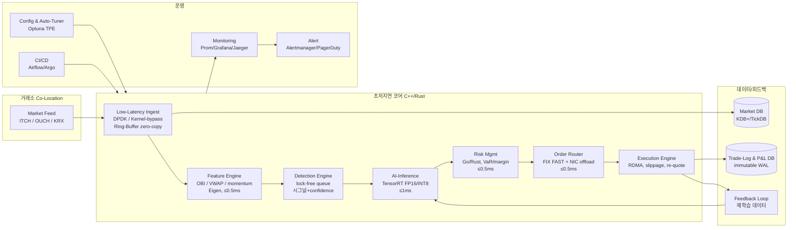
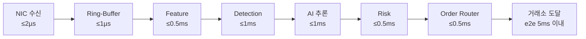
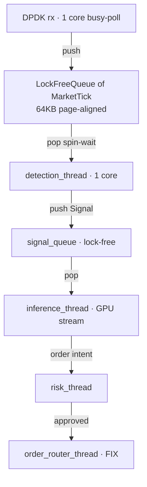
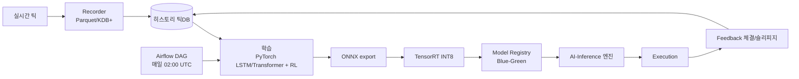
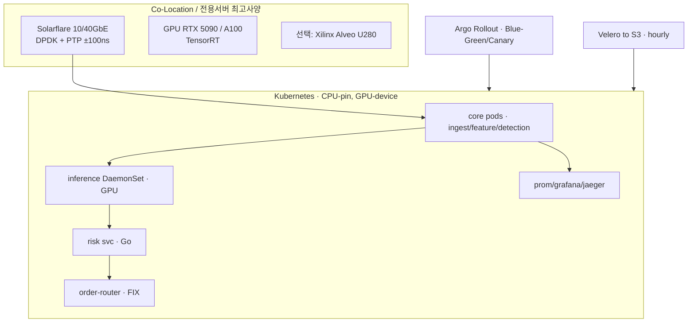
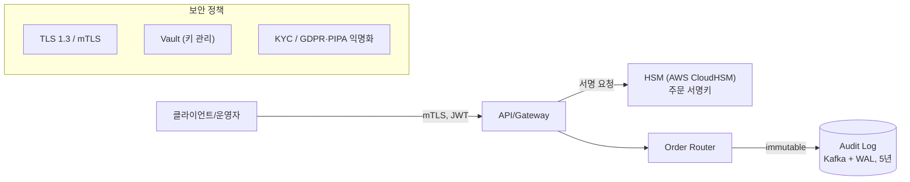

# daytrade-ai 마스터 기술서 (Master Technical Specification)

> 설계서(1️⃣~15️⃣)를 **구현 가능한 기술 사양**으로 정밀화한 문서. `MASTER_PLAN.md`(무엇을/언제)와 짝을 이루어
> 이 문서는 **어떻게(아키텍처·인터페이스·스키마·레이턴시 버짓·프로토콜)** 를 규정한다. 설계 구조도(다이어그램) 포함.
>
> SSOT 규칙: 컴포넌트 추가/변경 시 본 문서의 인터페이스·스키마·구조도를 먼저 갱신한 뒤 구현한다.

---

## 0. 문서 범위
- 대상: AI 단타(스캘핑·초단타) 자동매매 풀스택(설계서 전 영역).
- 비범위: 거래 전략의 알파(수익 모델) 그 자체 — 본 문서는 **시스템·인프라·인터페이스**를 규정(전략은 `models/`·`training/`).

---

## 1. 시스템 설계 구조도

### 1.1 전체 컴포넌트 아키텍처 (설계서 §1)



### 1.2 틱→주문 레이턴시 버짓 (설계서 §2·§6)



### 1.3 스레딩/큐 모델 (설계서 §3-2)



### 1.4 데이터 흐름 & 재학습 루프 (설계서 §7)



### 1.5 배포 토폴로지 (설계서 §4·§10)



---

## 2. 컴포넌트 사양 (설계서 §2 정밀화)

| 컴포넌트 | 언어/프레임워크 | 책임 | 레이턴시 | I/O 인터페이스 |
|----------|-----------------|------|----------|----------------|
| Low-Latency Ingest | C++20 / Rust + DPDK / Solarflare Onload | NIC rx, zero-copy ring-buffer, hardware TS | ≤ 2 µs | out: `MarketTick`(FlatBuffers) → ring-buffer |
| Feature Engine | C++ (Eigen) **[M3 스캐폴드: `cpp/feature_engine.hpp`, pybind11]** | OBI, depth, volume-spike, VWAP, micro-momentum, NLP sentiment | ≤ 0.5 ms | in: `MarketTick`; out: `FeatureVector` |
| Detection Engine | C++ + lock-free queue **[M3 스캐폴드: `cpp/detection_engine.hpp`]** | 규칙 시그널 + confidence threshold | < 1 ms | in: `FeatureVector`; out: `Signal` |
| AI-Inference | C++ TensorRT(FP16/INT8) + ONNX Runtime | LSTM/Transformer/RL 추론 | ≤ 1 ms | in: feature tensor; out: `[prob_buy, prob_sell]` |
| Risk Mgmt | Go / Rust | 포지션·VaR·max-drawdown·레버리지·마진 | < 0.5 ms | in: `Order`+state; out: `RiskDecision` |
| Order Router | C++ (FIX FAST) + NIC offload | 최적 라우팅, IOC/LIT, 다거래소 | ≤ 0.5 ms | FIX NewOrderSingle |
| Execution Engine | C++ + RDMA | 체결 확인, 슬리피지, re-quote, 피드백 | < 1 ms | in: ExecReport; out: `Fill` |
| Monitoring | Go (Prom exporter) + Grafana | 메트릭/트레이싱/알림 | 실시간(1s) | Prometheus scrape |

> **폴백 정책**: DPDK/Solarflare/RDMA 미가용 환경(개발/클라우드)에서는 AF_XDP 또는 일반 소켓,
> CUDA EP(ONNX Runtime)로 폴백한다. 인터페이스는 동일하게 유지(구현체만 교체).

---

## 3. 핵심 데이터 스키마 (C++/Python 공유, FlatBuffers/Cap'n Proto)

### 3.1 MarketTick (설계서 §3-2 struct 준수)

```capnp
struct MarketTick {
  tsNs       @0 :UInt64;   # NIC hardware timestamp (nanoseconds, PTP)
  symbol     @1 :Text;
  bidPx      @2 :List(Float64);  # depth=10 (index0 = best)
  bidQty     @3 :List(Float64);
  askPx      @4 :List(Float64);
  askQty     @5 :List(Float64);
  lastPrice  @6 :Float64;
  tradeVol   @7 :Float64;
}
```

### 3.2 FeatureVector (Python 레퍼런스 `features/engine.py` 와 동일 순서)

`[obi, obi_norm, volume_spike, micro_momentum, vwap, vwap_delta, spread, mid_price]`
→ AI 입력 텐서 순서의 **SSOT**. C++/Python/ONNX 입력 모두 이 순서를 따른다.

### 3.3 Signal / Order / Fill

- `Signal { side(BUY/SELL/FLAT), confidence[0,1], tsNs, symbol, reason, features }`
- `Order { symbol, side, qty, type(MARKET/LIMIT/IOC), limitPrice?, tsNs, clientOrderId }`
- `Fill  { order, filledQty, avgPrice, tsNs, slippage, status }`

> Python 레퍼런스(`daytrade/types.py`)가 의미론적 SSOT이며, `schemas/*.fbs|*.capnp` 가 직렬화 SSOT.
> 두 정의의 필드/순서는 **골든 테스트**로 일치 검증한다.

---

## 4. 인터페이스 계약 (확장 포인트)

| 인터페이스 | 역할 | 현재 구현 | 확장 구현(목표) |
|------------|------|-----------|-----------------|
| `MarketFeed.ticks()` | 시장 데이터 소스 | Simulated/CsvReplay/**Binance·Upbit(L2)·Alpaca(L1)**/RecordingFeed | DPDK ingest(C++), KDB+ tick store |
| `InferenceModel.predict()` | 추론 | Heuristic / **NumpyLogReg(JSON)** / **Onnx(단일)** / **SequenceOnnx(LSTM·Transformer 윈도)** / **OnnxPolicy(RL 연속정책, stateful)** | TensorRT C++ 엔진(pybind11) |
| `training/*` (M2) | 라벨링·학습·ONNX export·워크포워드 검증·HPO | numpy 로지스틱 / torch LSTM·Transformer → `onnx.helper`·`torch.onnx`; rolling/anchored OOS(purge embargo); **Optuna TPE/random 튜닝(워크포워드 목적함수)** | TensorRT INT8, RL(Ray-RLlib), Airflow 자동 재튜닝 |
| `OrderExecutor.submit()` | 주문 실행 | Paper(슬리피지·수수료·세금·부분체결) | FIX/FAST 라우터(브로커) |
| RiskManager | 사전 점검·서킷브레이커 | Python | Go/Rust 서비스(gRPC) |

> 모든 확장은 **기존 인터페이스를 깨지 않고** 구현체만 교체/추가(Liskov 치환). 이로써 백테스트·페이퍼·실거래가 동일 코드 경로.

---

## 5. 레이턴시·정확도 측정 방법론

- **하드웨어 TS(`tsNs`)** 와 내부 처리 시점 차이로 구간별 지연 산출(설계서 §3-2).
- 구간별 마이크로벤치: Google Benchmark(C++), `perf_counter_ns`(Python).
- e2e: tcpreplay + dpdk-app 재생(설계서 §7/§12) → 히스토그램(p50/p95/p99/max).
- 추론 정확도: FP32 vs INT8 출력 KL divergence/Top-1 일치율.
- 골든 테스트: 동일 입력 → Python 레퍼런스와 C++ 출력 수치 동일성. **구현됨** — `tests/test_cpp_golden.py`
  (시드 고정 SimulatedFeed 1,500틱, 8개 피처 `|Δ|≤1e-9` + side/confidence 일치; C++ 미빌드 시 자동 skip).

---

## 6. 프로토콜·직렬화·스트리밍 (설계서 §5)

| 계층 | 선택 | 비고 |
|------|------|------|
| 시장 수신 | ITCH/OUCH raw, DPDK | zero-copy |
| 내부 직렬화 | FlatBuffers / Cap'n Proto | 0-copy 바이너리 |
| 스트리밍/백업 | Kafka(Raft) + Pulsar | 0-lag 재시도, 감사로그 |
| 주문 | FIX FAST (QuickFIX/N) | IOC/LIT |
| RPC(리스크/모니터) | gRPC + mTLS | 서비스간 |
| 저장 | KDB+/TickDB(틱), PostgreSQL(거래/P&L) | — |

---

## 7. 보안·규제 아키텍처 (설계서 §8)



- 모든 주문·취소·거절·체결 → 불변 로그(5년 보관).
- 키: Vault/HSM, 주문 서명 HSM. 통신: TLS 1.3 + mTLS.
- 규제: KRX/SEC/NASDAQ 알고리즘 매매 신고·사전 인증, 실시간 보고(<15분).

---

## 8. 운영 SLO/SLA & 서킷브레이커

| 항목 | SLO |
|------|-----|
| e2e 레이턴시 | p99 < 5 ms (코로케이션 < 3 ms) |
| 가동률 | 거래시간 99.9% |
| 슬리피지 | 평균 ≤ 0.05 % |
| 데이터 손실 | 0 (Kafka 재시도) |

**자동 차단(circuit-breaker)**: 처리지연 > 10 ms, 당일 손익 ±2% 도달, 마진 위반, 피드 단절 → 즉시 신규진입 중지(현재 Python `RiskManager`에 구현, C++/Go 포팅 시 동일 규칙 유지).

---

## 9. 기술 부채/리스크 레지스터(요약)

| 리스크 | 영향 | 완화 |
|--------|------|------|
| DPDK/FPGA/코로케이션 미가용 | 레이턴시 목표 미달 | 폴백 모드 개발, 장비 가용 시 M9 |
| INT8 양자화 정확도 저하 | 시그널 품질 | FP16 폴백, 정확도 게이트 |
| 거래소 승인 지연 | 실거래 차단 | 페이퍼/시뮬로 선개발(M11 게이트) |
| 과최적화 | 실전 성과 괴리 | walk-forward, out-of-sample |
| 규제 변경 | 운영 중단 | 규제 모니터링, 감사로그 |

---

## 부록 — 구조도 갱신 규칙
컴포넌트/인터페이스 변경 시 §1 구조도와 §2~§4 표를 먼저 수정 → 리뷰 → 구현 → 골든/벤치 테스트.
