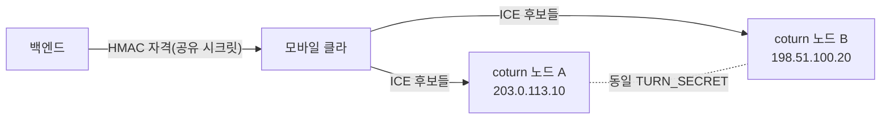

# coturn TURN 릴레이 — 멀티노드 운영 (#6 Coturn Cluster)

LTE/5G CGNAT(대칭 NAT) 환경에서 P2P가 막히면 TURN 릴레이로 미디어(음성)를 우회시킨다.
coturn은 host 포트(시그널 3478 + 미디어 UDP 레인지)를 점유하므로 **한 호스트에 한 노드**가 원칙이며,
"멀티노드"는 **여러 호스트**에 각각 노드를 띄우고 클라가 여러 TURN 후보를 쓰게 하는 구조다.

## 단일 노드 기동
```bash
cd coturn
cp .env.example .env       # TURN_SECRET / TURN_EXTERNAL_IP / TURN_NODE_NAME 설정
docker compose -f docker-compose.coturn.yml up -d
docker logs -f $TURN_NODE_NAME
```

## 멀티노드 구성 (핵심 규칙)
1. **공유 시크릿**: 모든 노드 `.env` 의 `TURN_SECRET` + 백엔드 `.env` 의 `TURN_SECRET` 을 **동일**하게.
   coturn `use-auth-secret`(TURN REST API)이므로 백엔드가 만든 HMAC 시간제한 자격
   (`backend/voip/config.py::dynamic_turn_credentials`)이 **어느 노드에서도** 검증된다.
2. **노드별 고유값**: `TURN_EXTERNAL_IP`(그 노드 공인 IP), `TURN_NODE_NAME`(식별 이름)만 다르게.
3. **백엔드에 노드 나열**: 백엔드 `.env` 의 `TURN_URLS` 에 모든 노드를 CSV로:
   ```
   TURN_URLS=turn:203.0.113.10:3478,turn:198.51.100.20:3478,turns:203.0.113.10:5349
   ```
   `get_ice_servers()` 가 이를 한 ICE 서버 항목의 `urls` 배열로 내려 클라가 **모든 노드를 후보**로 사용한다
   (WebRTC가 후보별로 연결성 검사 → 가장 빠른 릴레이 선택). `VOIP_TURN_*`/`TURN_*` 두 이름 모두 인식.



## 확장/지리 분산 권장
- **지연 기반 선택은 클라가 수행**(WebRTC 연결성 검사). 사용자 권역별로 가까운 노드를 `TURN_URLS`
  앞쪽에 두면 선택 확률↑(엄밀한 geo-routing이 필요하면 DNS GeoIP 또는 권역별 별도 빌드).
- **용량**: 노드당 `TURN_TOTAL_QUOTA` 로 동시 할당 상한. 모니터링은 노드 메트릭(coturn prometheus
  exporter) 또는 백엔드 `voip_turn_credentials_issued_total` 로 발급량 추적(#7).
- **시크릿 회전**: 전 노드 + 백엔드를 동시에 새 `TURN_SECRET` 으로 롤링(겹치는 창 동안 구/신 자격 공존
  불가하므로 저트래픽 시간대 권장).

## 하드닝(이 compose 적용됨)
- `--no-multicast-peers`, `--denied-peer-ip`(사설/메타데이터 대역 릴레이 차단), `--stale-nonce`,
  `--total-quota`, `--fingerprint`, `--no-cli`.
- 방화벽: `TURN_LISTENING_PORT`(udp+tcp) + `TURN_MIN_PORT~TURN_MAX_PORT`(udp)만 공개.
