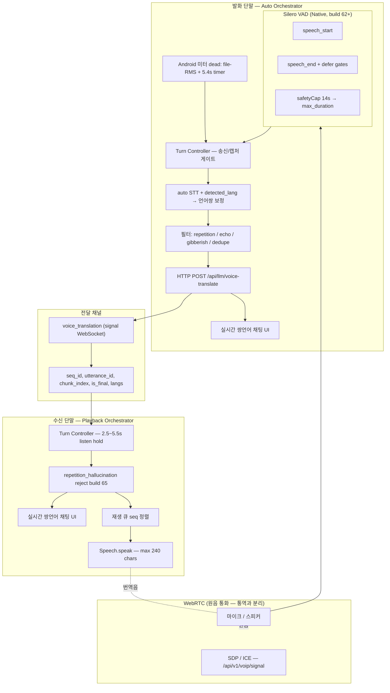

# VoIP Voice Relay Auto Orchestrator — 아키텍처

> **최종 갱신:** 2026-06-16 · **APK build 69** (`1.0.44`)  
> WebRTC 음성 통화는 그대로 두고, **통역만** 별도 경로(Silero VAD → HTTP STT/번역 → `voice_translation` WS → 수신 TTS)로 처리한다.  
> **Phase 1 = half-duplex 턴 교대** · Phase 2~3 = streaming STT / full-duplex.

**마스터 기술서:** `TECHNICAL_REPORT_VOIP_ORCHESTRATOR.md`  
**검증 증적:** `evidence/voip-voice-relay-orchestrator/VERIFICATION_REPORT.md`

---

## 구조도 (Phase 1 — build 65 실제 구현)

---

## 이중 VAD 계층

Silero가 **phrase boundary**를 담당하고, Expo meter / file-RMS는 **fallback·send gate**를 담당한다.

### Silero boundary (`voiceRelaySegmentBoundary.ts`)

| 상수 | build 65 값 | 의미 |
|------|-------------|------|
| `silenceMs` | **1100** | trailing silence → native `speech_end` |
| `speechMs` | 120 | 최소 voiced frames |
| `minSegmentMs` | **3200** | endpoint flush 전 최소 세그먼트 |
| `minSpeechSpanMs` | **2000** | speech_start→end 최소 span |
| `safetyCapMs` | **14000** | 장발화 cap → `max_duration` |
| `postFlushCooldownMs` | **1200** | flush 직후 endpoint 무시 |

**Defer (`flush:false`, `defer_reason`):**

| reason | 조건 |
|--------|------|
| `segment_too_short` | duration < 3200ms |
| `speech_span_too_short` | span < 2000ms |
| `post_flush_cooldown` | flush 후 1200ms 이내 |

**Safety cap:** 실측 `segment_duration_ms` **13848–13868ms** (14s cap − silence tail).

**Native:** `VoiceRelaySileroVadModule.kt` — 16kHz, frame 512, `VadSilero` konovalov.

### Meter / file-RMS fallback (`voiceRelayOrchestrator.ts`)

| 상수 | build 65 값 | 의미 |
|------|-------------|------|
| `minSegmentMs` | **2400** | STT send 최소 (`processVoiceRelaySegment`) |
| `maxSegmentMs` | 12000 | meter 살아 있을 때 chunk 상한 |
| `silenceFlushMs` | 1900 | 침묵 flush |
| `meterUnavailableFixedFlushMs` | **5400** | Android `-160` dead meter |
| `speechMeterMinDb` | -52 | 발화 미터 |
| `meterUnavailableFilePollEvery` | 5 | partial file RMS poll |

> **구버전 문서(0.8s/1.2s/2800 단일층)는 폐기.** build 62+는 Silero + 위 표를 따른다.

---

## Turn Controller (half-duplex)

`voiceRelayTurnController.ts` — `VOICE_RELAY_TURN_DEFAULTS`:

| 상수 | 값 | 역할 |
|------|-----|------|
| `remoteListenHoldMs` | 2500 | 상대 TTS 후 mic 재개 최소 대기 |
| `postPlaybackGuardMs` | 700 | TTS tail |
| `playbackMinMs` ~ `playbackMaxMs` | 2800 ~ 5500 | 예상 재생 시간 |
| `playbackCharMs` | 45 | 글자당 ms (cap 96 chars) |

**주요 함수:**

| 함수 | 역할 |
|------|------|
| `shouldStartVoiceRelayCapture` | `remote_listen_active` 차단 |
| `shouldDeferVoiceRelayFlush` | caller/callee timer flush defer |
| `shouldSendVoiceRelaySegment` | listen·WebRTC 구간 send 차단 |
| `shouldPlayRemoteVoiceRelay` | 발화자 폰 TTS skip |
| `resolveVoiceRelayLanguagePair` | detected_lang → relay lang swap |
| `applyRemoteRelayTurn` / `applyLocalRelayTurn` | post-playback hold 갱신 |

**실제 UX:** 상대 TTS 종료 후 **약 2.5~6.5초** 다음 발화 가능 (full-duplex 아님).

---

## 송신 필터 체인 (build 65)

`VoIPCallScreen.processVoiceRelaySegment` → `voiceRelayOrchestrator.ts`

| 순서 | 검사 | skip reason |
|------|------|-------------|
| 1 | listen / abort / suppress window | `listen_or_abort`, `echo_suppression_window` |
| 2 | audio too small / segment too short | `audio_payload_too_small`, `segment_duration_too_short` |
| 3 | silent segment (meter/RMS) | `silent_segment` |
| 4 | turn send gate | `segment_send_blocked`, … |
| 5 | STT+번역 HTTP | `/api/llm/voice-translate` |
| 6 | **repetition hallucination** | `repetition_hallucination` |
| 7 | collapse repeated phrases | `.` / `,` / **공백** 반복 |
| 8 | silence / gibberish | `gibberish_transcript`, … |
| 9 | echo guards | `playback_pickup_echo`, `remote_echo_dedupe`, … |
| 10 | identity / duplicate | `identity_translation`, dedupe 12s |

### repetition hallucination (build 65)

**함수:** `isLikelyRepetitionHallucination`, `collapseRepeatedRelayPhrases`

**탐지:**
- 동일 phrase 4회+ 공백 구분 반복 (예: `안녕하세요 여러분` × N)
- 고유 단어 비율 과低 (24+ words)
- collapse 후 길이 35% 이하

**적용:** 송신 skip · 원격 playback reject · `playVoiceRelayOutput` skip

**버그 배경:** Tab TTS/원격음 피드백 → Whisper 반복 환각 → 무한 relay (logcat `call-7acec80be31c`).

---

## 수신 · TTS · 에코

| 항목 | 구현 |
|------|------|
| 재생 | `VoiceRelayPlaybackQueue` — seq_id 순차, overlap 없음 |
| TTS | `Speech.speak`, `VOICE_RELAY_MAX_SPEAK_CHARS = 240` |
| Suppress | `estimateVoiceRelayPlaybackMs(text) + 700ms` |
| Remote WebRTC | capture 중 mute + `remoteAudioSuppressed` |
| Echo dedupe | 4~20s guards (표는 TECHNICAL_REPORT §6.6) |

**속기사 모델:** WS에는 **텍스트만** relay. `audio_base64` WS 미전송. 상대폰만 TTS.

---

## 코드 경로 매핑

| 레이어 | 파일 |
|--------|------|
| 화면 | `VoIPCallScreen.tsx` |
| VAD·필터 | `voiceRelayOrchestrator.ts` |
| Silero 경계 | `voiceRelaySegmentBoundary.ts` |
| Turn | `voiceRelayTurnController.ts` |
| RMS | `voiceRelayAudioMetrics.ts` |
| Queue | `voiceRelayPlaybackQueue.ts` |
| Silero JS | `native/voiceRelaySileroVad.ts` |
| Silero Android | `VoiceRelaySileroVadModule.kt` |
| WS | `voipCallClient.ts` ↔ `nadotongryoksa_voip_router.py` |
| STT/번역 | `translate.ts` ↔ `backend/llm/router.py` |

---

## 백엔드 연동

| API | 경로 |
|-----|------|
| voice-translate | `POST /api/llm/voice-translate` |
| initiate | `POST /api/v1/voip/calls/initiate` |
| signal WS | `WS /api/v1/voip/signal` |
| voice_translation | signal WS message type |

서버 relay 필터: `_collapse_voice_relay_text`, `_should_reject_voice_translation_relay`.

**50개국어:** `backend/services/nadotongryoksa/translator.py` `SUPPORTED_LANGUAGES` **50** (모바일 `App.tsx` LANGS 동기화).  
`GET /api/llm/translate/languages` · `POST /api/llm/voice-translate` — `from_lang`/`to_lang` 50코드 검증.  
정합 감사: `scripts/worldlinco_50lang_alignment_audit.ps1` · 증적 `50lang_audit_20260615-235805/`.

**백엔드 최소 세그먼트:** `VOICE_RELAY_MIN_SEGMENT_MS` default **2400** (`voice_gateway.py`), tolerance 350ms — 모바일 `minSegmentMs`와 정합.

---

## 구조도 vs 코드 — 일치 여부 (build 65)

| 블록 | 일치 |
|------|------|
| Silero VAD + defer 3종 | ✅ |
| 14s safety cap (not 12s) | ✅ |
| Turn controller half-duplex | ✅ |
| auto STT + detected_lang | ✅ |
| voice_translation WS + meta | ✅ |
| 쌍언어 채팅 UI | ✅ |
| repetition guard | ✅ build 65 |
| playback queue sequential | ✅ |
| streaming partial STT | ❌ Phase 2 |
| full-duplex | ❌ Phase 3 |

---

## v1.0 E-3 자동화 (build 66)

Tab(caller `nado-000226`) → S10(callee `nado-000001`) WiFi 통화 검증:

1. `worldlingo://voip/open?action=validation&callee_voice_id=nado-000001` — Tab 발신  
2. S10 `worldlingo://voip/incoming?call_id=...&signaling_server=...&participant_role=callee` — deeplink 수락  
3. logcat 게이트: connected · signaling · initiate  

스크립트: `scripts/worldlinco_e3_launch_verify.ps1` · `scripts/voip_manual_call_setup.ps1`  
증적: `evidence/worldlinco-v1-launch/e3_verify_20260615-212949/`

---

- **Phase 1 (현재, build 66):** Silero boundary + half-duplex turn + WS relay + repetition guard + **E-3 launch automation**
- **Phase 2:** streaming STT partial + utterance confidence
- **Phase 3:** full-duplex mix, barge-in, WebRTC ducking

---

## 체크리스트

- [x] V-1~V-7 모듈·단위 테스트
- [x] Silero native POC (build 62+)
- [x] 14s safety cap 실측 (~13.8s)
- [x] defer gates Tab repro (build 64)
- [x] repetition guard 코드 (build 65)
- [x] V-8 E2E accept+connected — build 66 deeplink accept **5/5** (`e3_verify_20260615-212949`)
- [x] repetition guard echo 실기기 (E-3-2) — `e3-2_echo_20260615-232900` · repetition **0**
- [x] 50개국어 백엔드 정합 (E-3-6) — `50lang_audit_20260615-235805`
- [x] ko↔ja API voice-translate (E-3-7)
- [x] ko↔ja VoIP E2E (E-3-8) — `ko_ja_smoke_20260616-005906` · build **69** deeplink `preferred_language`
- [ ] V-9 streaming STT
- [ ] V-10 full-duplex

---

## 연구·표준 참고

| 출처 | 시사점 | 반영 |
|------|--------|------|
| Meta Synchronous LLM (2024) | full-duplex ≠ turn VAD | Phase 3 목표 |
| NeurIPS 2024 half-duplex | FTED ~2.28s | turn hold 2.5s |
| StreamSpeech / Simul-S2ST | chunk ↔ latency | min/max segment 튜닝 |
| ITU-T F.745 / Q.4072 | S2ST 지연 | WS seq meta |
