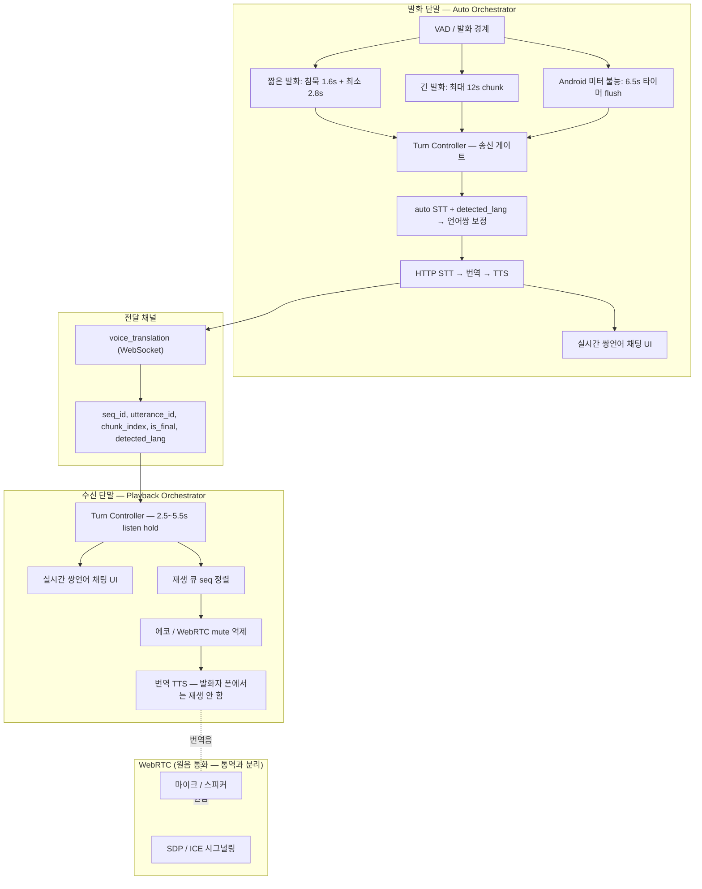

# VoIP Voice Relay Auto Orchestrator — 아키텍처

> WebRTC 음성 통화는 그대로 두고, **통역만** 별도 경로(VAD → HTTP STT/번역/TTS → `voice_translation` WS → 수신 재생)로 처리한다.  
> **Phase 1 = 반쪽(duplex) 턴 교대**이며, 구조도의 “자연스러운 양방향”은 Phase 2~3(full-duplex / streaming STT) 목표다.

## 구조도 (Phase 1 — 실제 구현)

## 구조도 vs 코드 — 일치 여부

| 구조도 블록 | 구현 | 일치 |
|-------------|------|------|
| VAD / 침묵·최대길이 flush | `voiceRelayOrchestrator.ts` | ✅ (단, 문서 구버전 0.8s/1.2s **아님**) |
| Android 미터 fallback | `VoIPCallScreen` meter poll + `fixed_interval` | ✅ (구조도에 **미표기**였음) |
| auto STT + detected_lang | `voiceTranslate(..., 'auto')` + `router.py` | ✅ build 57+ |
| STT → 번역 → TTS | `processVoiceRelaySegment` + `/api/llm/voice-translate` | ✅ |
| `voice_translation` WS | `voipCallClient.sendVoiceTranslation` ↔ `nadotongryoksa_voip_router` | ✅ |
| seq / utterance 메타 | 송·수신 + backend passthrough | ✅ |
| 재생 큐 | `voiceRelayPlaybackQueue.ts` | ✅ (overlap **없음**, 순차 재생) |
| 에코 억제 | `voiceRelayTurnController` + remote WebRTC suppress | ✅ |
| **Turn Controller (반쪽 duplex)** | `shouldStartVoiceRelayCapture`, `shouldDeferVoiceRelayFlush` | ✅ (구조도에 **누락**되어 있었음) |
| **실시간 쌍언어 채팅** | `appendChatEntry` in `VoIPCallScreen` | ✅ build 57 UI |
| streaming partial STT | 없음 | ❌ Phase 2 |
| full-duplex 동시 송수신 | 없음 | ❌ Phase 3 |

**결론:** 파이프라인 **골격은 구조도와 같다**. 다만 (1) VAD 숫자가 다르고, (2) **턴 교대·에코 게이트**가 추가되어 있어, 구조도만 보면 “말하면 바로 양쪽 채팅”처럼 보이지만 **실제는 상대 TTS가 끝난 뒤 ~3~6초 후** 다음 말이 가능하다.

## VAD 파라미터 (build 57~58, 실측 기준)

| 상수 | 값 | 의미 |
|------|-----|------|
| `minSegmentMs` | **2800** | STT 최소 길이 (Whisper 환각 방지) |
| `maxSegmentMs` | 12000 | 긴 발화 chunk 상한 |
| `silenceFlushMs` | **1600** | 침묵 후 utterance 종료 |
| `meterUnavailableFixedFlushMs` | **6500** | Android 미터 dead 시 타이머 flush |
| `speechMeterMinDb` | -48 | 발화 감지 (미터 살아 있을 때) |

백엔드 `VOICE_RELAY_MIN_SEGMENT_MS=2800` — ffmpeg 정규화 후 동일 기준.

## Turn Controller (양방향 “자연스러움”의 핵심)

| 상수 | build 58 | 역할 |
|------|----------|------|
| `remoteListenHoldMs` | **2500** | 상대 번역 TTS 후 mic 재개 최소 대기 (구 8000ms → 대화 끊김) |
| `postPlaybackGuardMs` | 700 | TTS 길이 + tail |
| `playbackMinMs` ~ `playbackMaxMs` | 2800~5500 | 예상 재생 시간 |

**왜 8초였나:** 초기 echo 방지용으로 과도하게 길었고, NeurIPS 2024 half-duplex baseline도 VAD endpoint + pipeline으로 **~2.3s FTED** — 우리도 2.5~6.5s 구간으로 조정.

## 연구·표준 참고 (반영 방향)

| 출처 | 시사점 | 우리 반영 |
|------|--------|-----------|
| [Meta Synchronous LLM (2024)](https://ai.meta.com/research/publications/beyond-turn-based-interfaces-synchronous-llms-as-full-duplex-dialogue-agents/) | full-duplex ≠ turn-based VAD | Phase 3 목표로 명시 |
| NeurIPS 2024 half-duplex vs full-duplex | half-duplex FTED ~2.28s, full-duplex ~0.68s | Phase 1 = half-duplex, 턴 hold 단축 |
| StreamSpeech / Simul-S2ST (2024) | chunk size ↔ latency tradeoff | `minSegmentMs`·`maxSegmentMs` 튜닝 |
| ITU-T F.745 / Q.4072 | S2ST 기능·지연 요구 | WS relay + seq 메타 (legacy 호환) |

## 코드 경로 매핑

| 레이어 | 파일 |
|--------|------|
| Sender VAD | `voiceRelayOrchestrator.ts` |
| Turn / 언어쌍 | `voiceRelayTurnController.ts` |
| Sender Pipe + Chat | `VoIPCallScreen.tsx` (`processVoiceRelaySegment`) |
| Channels | `voipCallClient.ts` ↔ `nadotongryoksa_voip_router.py` |
| STT/번역 API | `backend/llm/router.py` |
| Receiver Queue | `voiceRelayPlaybackQueue.ts` |
| Receiver Playback + Chat | `VoIPCallScreen.tsx` |

## 속기사(Stenographer) 전달 모델 (build 58+)

통화 중 통역은 **속기사**와 같다:

1. **기록(원문)**: 마이크 → STT → `transcript` (채팅에 쌍언어로 표시)
2. **번역 ledger**: 서버 `voice-translate` → `translated`
3. **전달**: WebSocket에는 **텍스트만** (`transcript` + `translated_text` + 언어 메타). `audio_base64`는 WS 크기 한계로 **보내지 않음**
4. **낭독(상대폰만)**: 수신 단말 `Speech.speak(translated)` = `tts_delivery: device_speech`

발화자 폰에서는 TTS 재생 **하지 않음**. 상대폰에서만 번역문을 읽어 준다.

- **Phase 1 (현재):** half-duplex turn + VAD chunk + WS relay + 쌍언어 채팅 UI
- **Phase 2:** streaming STT partial + utterance별 언어 confidence
- **Phase 3:** full-duplex mix (WebRTC + 번역 TTS ducking, barge-in)

## 체크리스트

- [x] V-1~V-7 구현·단위 테스트
- [~] V-8 실기기 E2E — build 57+ 수동 발화 필요
- [ ] V-9 streaming STT
- [ ] V-10 full-duplex
