# WorldLinco — 앱 디자인 (UI/UX 설계 · SSOT)

> **용도:** 모바일 앱(`apps/mobile-nadotongryoksa/`)의 화면(UI) 설계·디자인 시스템 단일 진실원천.
> **상위/연계 문서:** [`WORLDLINCO_V2_ROADMAP.md`](WORLDLINCO_V2_ROADMAP.md) · [`FILE_MAP.md`](FILE_MAP.md) · [`SERVICE_SEPARATION_DESIGN.md`](SERVICE_SEPARATION_DESIGN.md) · [`FEATURE_SEPARATION_MASTER_SPEC.md`](FEATURE_SEPARATION_MASTER_SPEC.md)
> **구현 토큰:** `apps/mobile-nadotongryoksa/src/theme/theme.ts` (본 문서의 디자인 시스템을 코드 토큰으로 옮긴 SSOT)
> **주의:** 목업 이미지의 텍스트/레이아웃은 시안(illustrative)이며, **권위 있는 사양은 본 문서의 표·토큰**이다.

---

## 0. 디자인 원칙

1. **언어 장벽 제로** — 모든 통역/번역 화면은 *원문 + 번역*을 쌍으로 보여준다(원문 작게·보조색, 번역 크게·강조색).
2. **한 손·한 탭** — 핵심 동작(말하기/통화/전송)은 큰 탭타깃(≥48dp)과 원형 마이크 버튼으로.
3. **채널 정합** — 화면 정책은 `channelProfiles.ts` 와 1:1: `face = bilingual·자동감지`, `voip·chat = designated·언어락`.
4. **SSOT 연결** — 하단 섹션 레일은 `navigation/sectionRegistry` 의 키/순서를 그대로 따른다(추가 시 자동 연결).
5. **신뢰감 + 친근함** — 차분한 azure-teal(신뢰) + 따뜻한 coral(행동) + 소리새 파랑새 마스코트(친근).
6. **태스크 우선 · 쉬운 접근** — UI는 "메뉴"가 아니라 "할 일"로 구성한다. 사용자가 하려는 행동(전화번호로 찾기 · 지도로 찾기 · 채팅하기 · 단체채팅 · 통역통화)은 각 랜딩에서 **큰 라벨 + 아이콘의 액션 타일**로 즉시 보이고, **2탭 이내**에 실행돼야 한다. 시각/표현은 단순하게(타일당 1동작·1아이콘·1줄 카피), 부가 옵션은 접어둔다.

---

## 1. 화면 흐름도 / 네비게이션

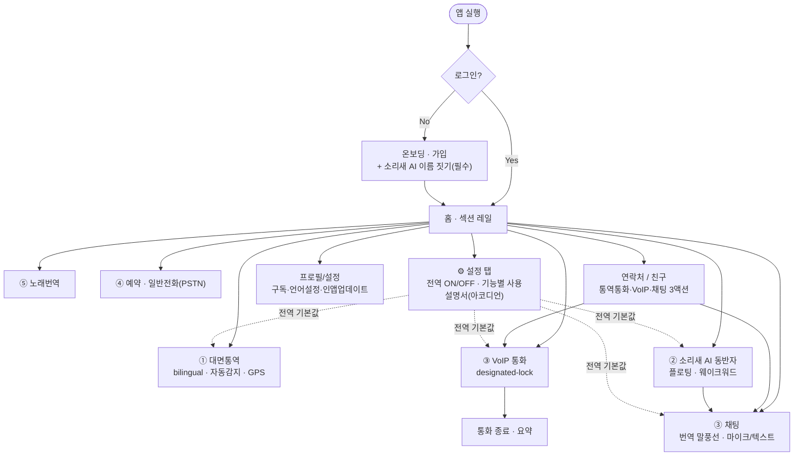
```mermaid
flowchart TD
  START(["앱 실행"]) --> AUTH{"로그인?"}
  AUTH -->|No| ONB["온보딩 · 가입<br/>+ 소리새 AI 이름 짓기(필수)"]
  AUTH -->|Yes| HOME
  ONB --> HOME["홈 · 섹션 레일"]
  HOME --> FACE["① 대면통역<br/>bilingual · 자동감지 · GPS"]
  HOME --> VOIP["③ VoIP 통화<br/>designated-lock"]
  HOME --> CHAT["③ 채팅<br/>번역 말풍선 · 마이크/텍스트"]
  HOME --> SONG["⑤ 노래번역"]
  HOME --> BOOK["④ 예약 · 일반전화(PSTN)"]
  HOME --> SORI["② 소리새 AI 동반자<br/>플로팅 · 웨이크워드"]
  HOME --> CONTACTS["연락처 / 친구<br/>통역통화·VoIP·채팅 3액션"]
  CONTACTS --> VOIP
  CONTACTS --> CHAT
  SORI --> CHAT
  VOIP --> CALLEND["통화 종료 · 요약"]
  HOME --> PROFILE["프로필/설정<br/>구독·언어설정·인앱업데이트"]
  HOME --> SETTINGS["⚙️ 설정 탭<br/>전역 ON/OFF · 기능별 사용설명서(아코디언)"]
  SETTINGS -.전역 기본값.-> VOIP
  SETTINGS -.전역 기본값.-> CHAT
  SETTINGS -.전역 기본값.-> FACE
  SETTINGS -.전역 기본값.-> SORI
```

### 1-1. 화면 인벤토리 (레이어 구분)

> **구현 현실:** 앱은 단일 컴포넌트 + 단일 `ScrollView`로, "라우팅"이 아니라 `activeRailSection` 상태로 **랜딩 블록을 토글**한다. 재설계는 각 레이어가 **독립 화면처럼 보이도록**(상단 앱바부터 하단 SafeArea까지 일관 톤) 만든다.

| 레이어 | 화면 | 진입 | 상태 | 목업 |
|--------|------|------|------|------|
| **A. 인증** | 로그인 / 온보딩 | 앱 실행(로그아웃) | 인라인+모달 혼재 → **전용 풀스크린으로 통일 예정** | ⏳ 신규 |
| **B. 홈** | 홈 런처(인사·대면통역 히어로·퀵버튼) | 로그인 후 `activeRailSection=null` | 구현됨 | (코어 목업) |
| **C. 랜딩(기능 전)** | 채팅 허브 | 레일 `채팅` | 구톤 → **재구성 예정** | ⏳ 신규 |
| | VoIP 허브 | 레일 `통화` | 구톤 → **재구성 예정** | ⏳ 신규 |
| | 노래 모드 | 레일 `노래` | 구톤 → **재구성 예정** | ⏳ 신규 |
| | 예약/주변검색 | 레일 `예약` | 구톤 → **재구성 예정** | ⏳ 신규 |
| **D. 기능 화면** | 대면통역 | 홈 히어로 | 풀스크린 Modal ✅ | `screen_face` |
| | VoIP 통화 | 허브/연락처 | 임베드+미리보기 ✅ | `screen_voip_sky` |
| | 채팅방 | 채팅 허브 | 임베드 → **전체화면화 예정** | `screen_chat` |
| | 소리새 동반자 | FAB | 풀스크린 Modal ✅ | `screen_sorisae` |
| | 노래번역 | 노래 모드 | — | `screen_song(_sky)` |
| | 여행 예약 | 예약 | — | `screen_booking(_sky)` |
| **E. 시스템** | 설정(톱니) — 전역 토글 + 사용 설명서 | 앱바 ⚙️ | **신규(2-6)** | ⏳ 신규 |

### 1-2. 하단 탭바 (Bottom Tab Bar) — IA 전환

> **결정:** 현 "상단 레일 카드 그리드"(`workspaceRailGrid`)를 **하단 고정 탭바**로 전환한다. 이유: (1) 한 손 엄지 도달 영역, (2) 화면 전환 시 탭바가 고정되어 "이어지는 느낌"·맥락 유지, (3) 표준 패턴이라 학습 비용 0.

- 탭 구성(좌→우): `💬 채팅 · 📞 통화 · 🎵 노래 · 📅 예약 · ⚙️ 설정` — 앞 4개는 `sectionRegistry` SSOT, 끝에 설정(2-6) 추가.
- active 탭 = 섹션 포인트 컬러 + 라벨 강조, inactive = muted. 높이 ~56 + **하단 SafeArea inset**(3-6).
- 홈은 탭바 위 콘텐츠 영역(레일 `null` 상태 = 홈 런처). 대면통역/소리새는 풀스크린 Modal로 탭바 위에 오버레이.
- 구현: 단일 ScrollView 구조 유지하되 탭바를 `ScrollView` 바깥 하단 고정(absolute, `insets.bottom`), `handlePressSectionRail` 재사용.

---

## 2. 화면 와이어프레임 / 목업

### 2-0. 로그인/온보딩 & 랜딩 공통 레이아웃 규약

모든 **A/B/C 레이어 화면**은 아래 단일 골격을 공유한다 → 화면 간 "이어지는 느낌" + 변화 체감 확보.

```
┌─ (전역 하늘 배경 3-0) ───────────────┐
│ [상단 앱바] 로고/뒤로 · 타이틀 · 상태/프로필  │  ← 높이 56, 투명, 텍스트 dark
│ [히어로/소개]  아이콘 + 한 줄 카피 + 보조설명  │  ← 섹션 포인트컬러 적용
│ [주요 CTA]    큰 버튼(높이 52, radius 16)   │  ← 기능 진입(시작/통화/검색…)
│ [콘텐츠 카드]  흰 surface 카드 N개            │  ← radius 16, card 그림자
│ ……(스크롤)……                              │
│ [하단 SafeArea]  insets.bottom 만큼 패딩      │  ← 내비바 겹침 금지(3-6)
└──────────────────────────────────────┘
```

**로그인/온보딩(A) 사양**
- 전용 풀스크린(현 인라인 패널+모달 → 단일화). 상단 브랜드 로고/소리새 마스코트 + "WorldLinco" 타이틀.
- 이메일/비밀번호 입력 → 큰 Primary 로그인 버튼 → 보조(생체인증·비밀번호찾기) → 하단 회원가입 전환.
- 가입 흐름에 **소리새 AI 이름 짓기(필수)** 온보딩 스텝 연결.

**랜딩(C) 섹션별 포인트 컬러** — 어느 기능인지 한눈에 체감(`colors.channel` 기준)

| 랜딩 | 포인트 컬러 | HEX | 히어로 아이콘 |
|------|------------|-----|--------------|
| 채팅 허브 | 파랑(chat) | `#1E6FE0` | 💬 |
| VoIP 허브 | 네이비(voip) | `#0B2E5E` | 📞 |
| 노래 모드 | 퍼플(song) | `#7C5CFC` | 🎵 |
| 예약/주변 | 그린(booking) | `#19C37D` | 🧭 |
| 대면통역 | 파랑(face) | `#1E6FE0` | 🗣️ |
| 소리새 | 파랑(sorisae) | `#1E6FE0` | 🐦 |

**주요 태스크 → 진입 동선 (≤2탭, 액션 타일)**

각 랜딩 상단에 **액션 타일 그리드**(2열, 타일=아이콘+큰 라벨+1줄 보조)를 둔다. 흩어진 모달/카드를 "할 일" 타일로 모아 즉시 접근.

| 사용자가 하려는 일 | 진입 위치 | 탭 수 | 현재 코드(흩어진 곳) |
|--------------------|-----------|-------|----------------------|
| 📇 전화번호로 찾기 | 채팅 허브 · 액션 타일 | 1탭 → 다이얼 | `showPhoneDialerModal` |
| 🗺️ 지도로 친구 찾기 | 채팅 허브 · 액션 타일 | 1탭 → 지도 | `showFriendMapDiscovery` |
| 💬 채팅하기(1:1) | 채팅 허브 · 액션 타일 | 1탭 → 목록/방 | `ChatRoomListScreen` |
| 👥 단체채팅 만들기 | 채팅 허브 · 액션 타일 | 1탭 → 생성 | 친구폴더·그룹 생성 |
| 📞 통역통화 걸기 | VoIP 허브 · 액션 타일 | 1탭 → 상대선택 | VoIP 허브 |
| ☎️ 일반전화(PSTN) | VoIP 허브 · 액션 타일 | 1탭 → 다이얼 | 다이얼 모달 |
| 🗣️ 대면통역 | 홈 히어로 | 1탭 | Face Modal |

**액션 타일 사양** — 높이 ≥88, radius 16, 흰 surface + 좌측 컬러 아이콘 원형(섹션 포인트컬러), 우측 큰 라벨(Subtitle·dark) + 보조(Caption·muted). 누르면 즉시 해당 모달/화면. 부가 설정·정책 배너는 타일 아래 접이식(`정밀 도구`처럼).


### 2-1. 코어 커뮤니케이션 (홈 · 대면통역 · VoIP · 채팅)

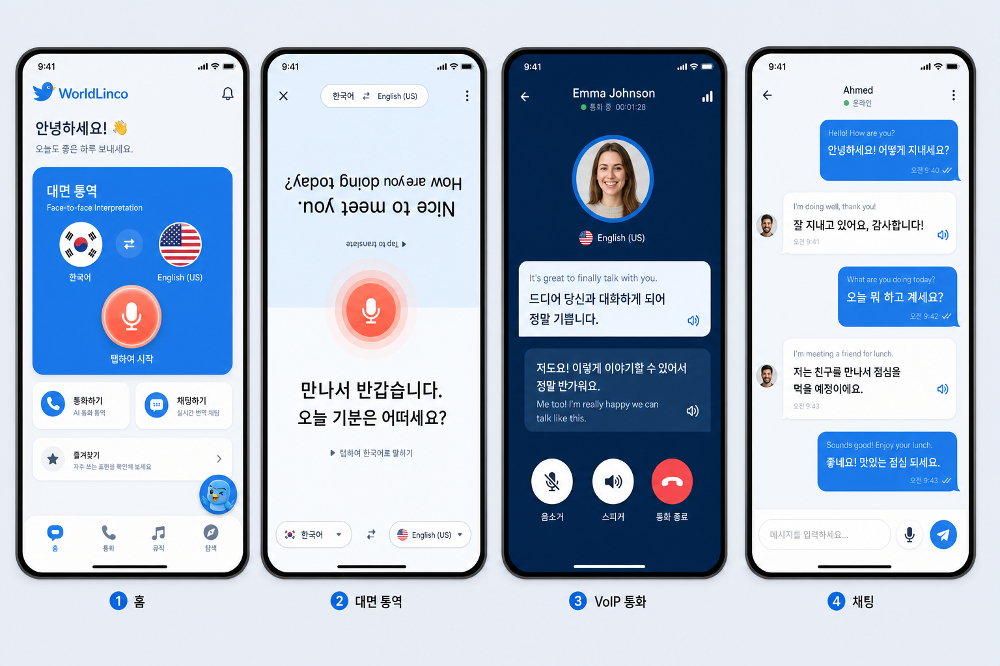

| # | 화면 | 핵심 요소 | 채널 정책 |
|---|------|-----------|-----------|
| 1 | 홈 | 대면통역 카드(언어쌍·마이크) · 하단 섹션 레일(채팅/통화/노래/예약) · 소리새 플로팅 FAB | — |
| 2 | 대면통역 | 상단 180° 회전(상대 언어) + 하단(내 언어) 분할 · 중앙 펄스 마이크 | `bilingual` |
| 3 | VoIP 통화 | 발신자 아바타 · 실시간 자막 말풍선(원문+번역) · 음소거/스피커/종료 | `designated` |
| 4 | 채팅 | 번역 말풍선 페어 · 마이크/텍스트 겸용 입력 | `designated` |

### 2-2. 소리새 · 노래번역 · 예약

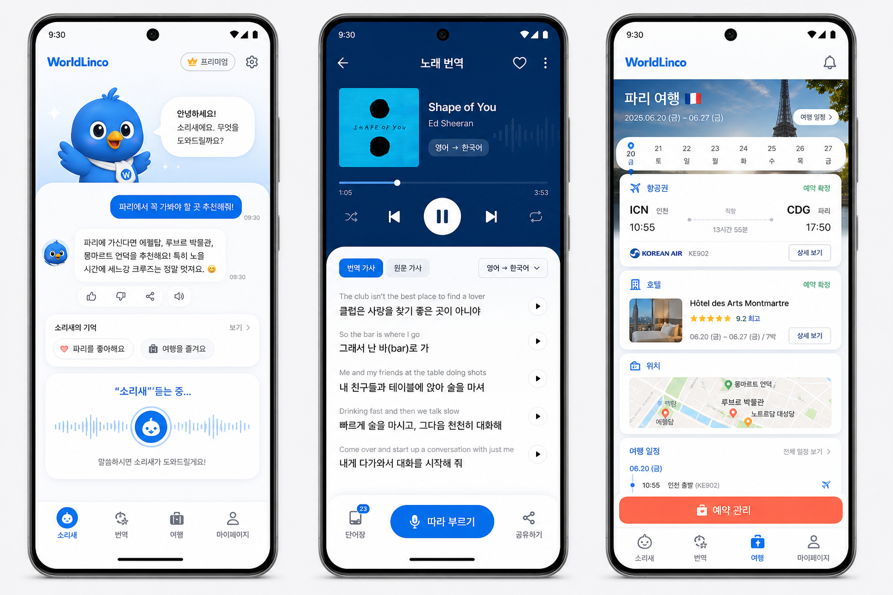

| 화면 | 핵심 요소 | 연계 모듈 |
|------|-----------|-----------|
| 소리새 AI 동반자 | 파랑새 마스코트 · "OOOO AI" 표시명 · 웨이크워드 listening · 기억/성격 칩 | `sorisae/companionIdentity·companionVoiceCall` |
| 노래번역 | 가사 라인별 원문/번역 · 재생 컨트롤 · 언어 셀렉터 | `song` |
| 여행 예약 | 항공/호텔 카드 · 지도 · 일정 타임라인 | `travel-booking·travel-itinerary` |

### 2-3. 고해상도 단일 목업

**대면통역 (bilingual)**

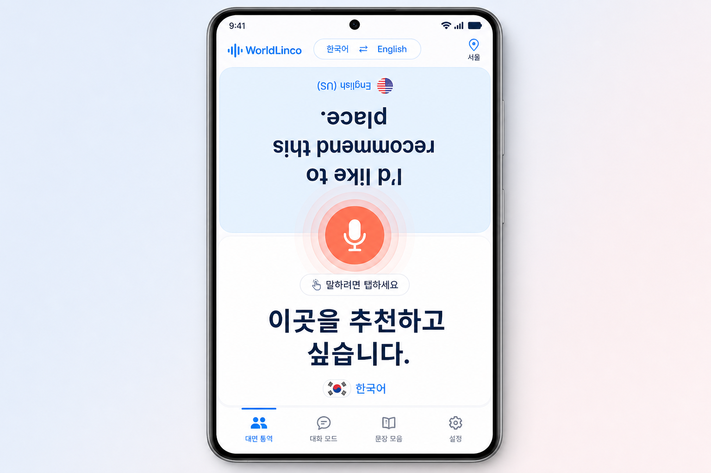

**소리새 AI 동반자**

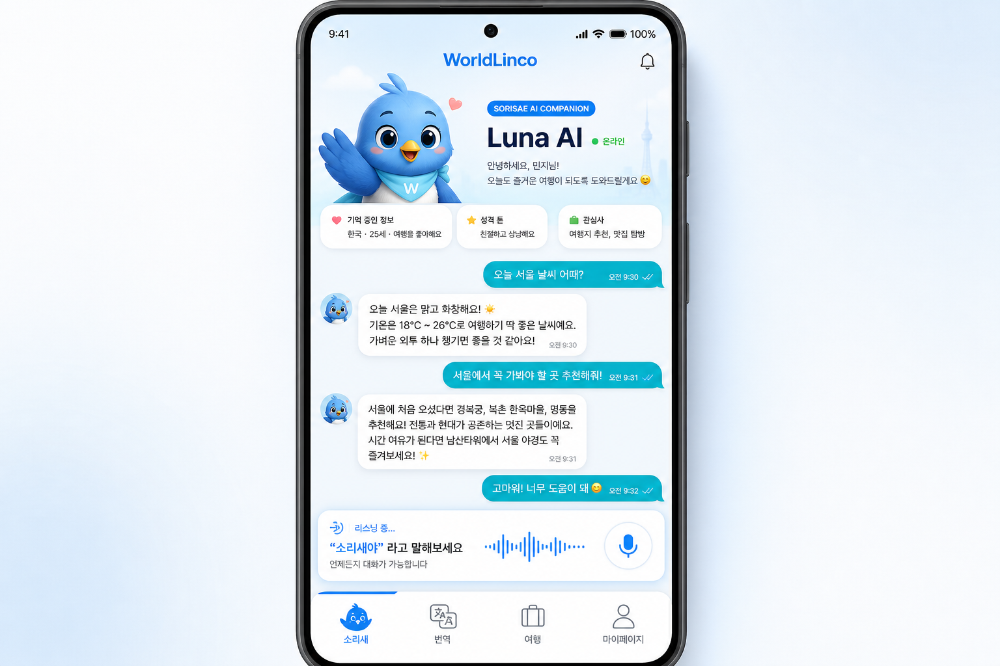

**채팅 (designated)**

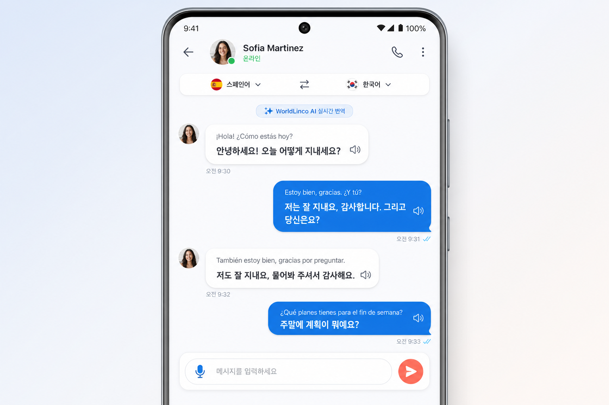

**노래번역**


**여행 예약**

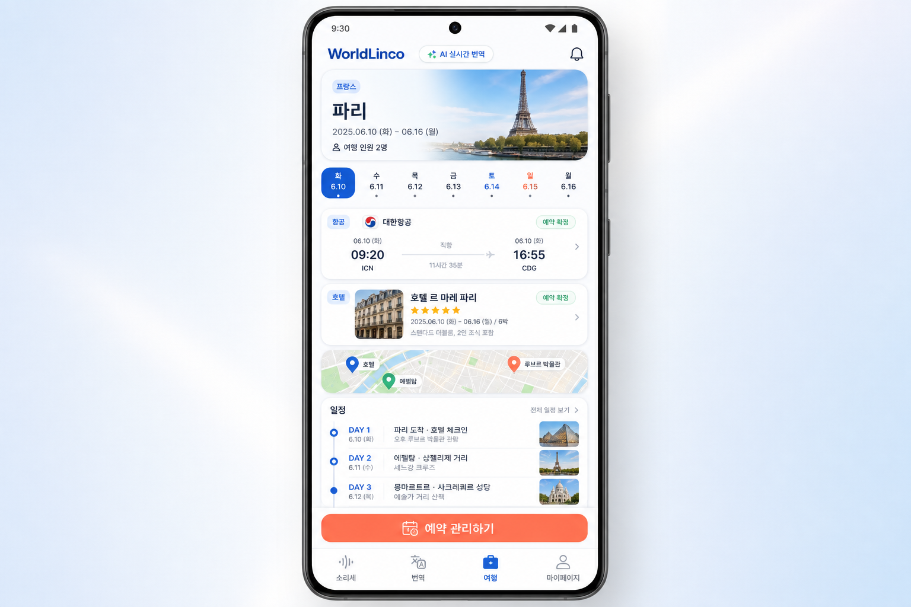

### 2-4. 하늘 배경 적용 단일 목업 (소리새 하늘색 통일)

전역 하늘 배경(3-0)을 적용한 최신 화면 시안.

**VoIP 통역 통화**

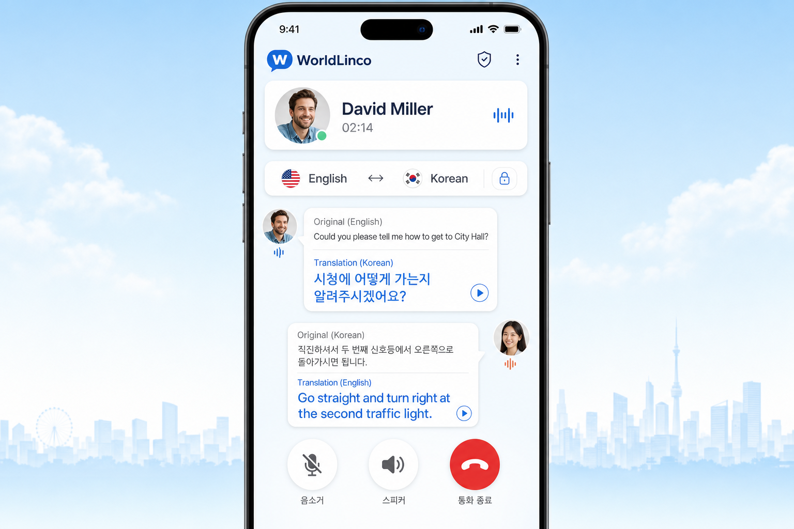

**노래번역**

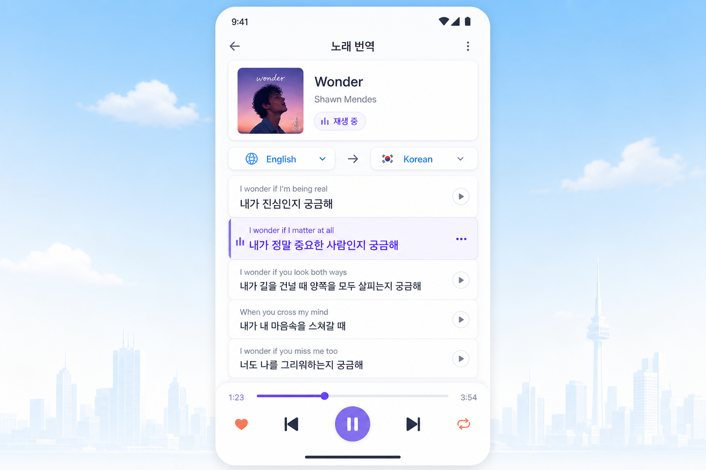

**여행 예약**

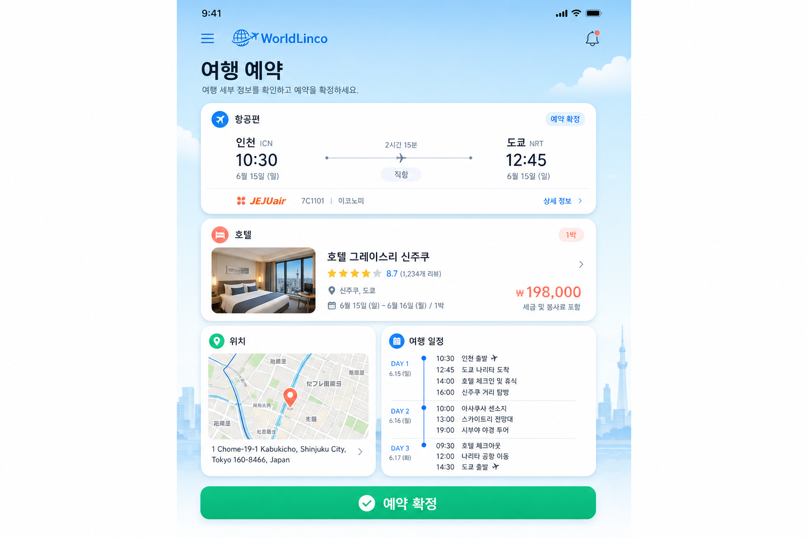

### 2-5. 신규 목업 — 로그인 + 랜딩 5종 + 설정 (하늘 톤 통일 · 확정 시안)

모두 2-0 골격 + 3-0 하늘 배경 + 섹션 포인트 컬러 + **하단 탭바(1-2)** 를 따른다.

**로그인 / 온보딩** — Primary `#1E6FE0`

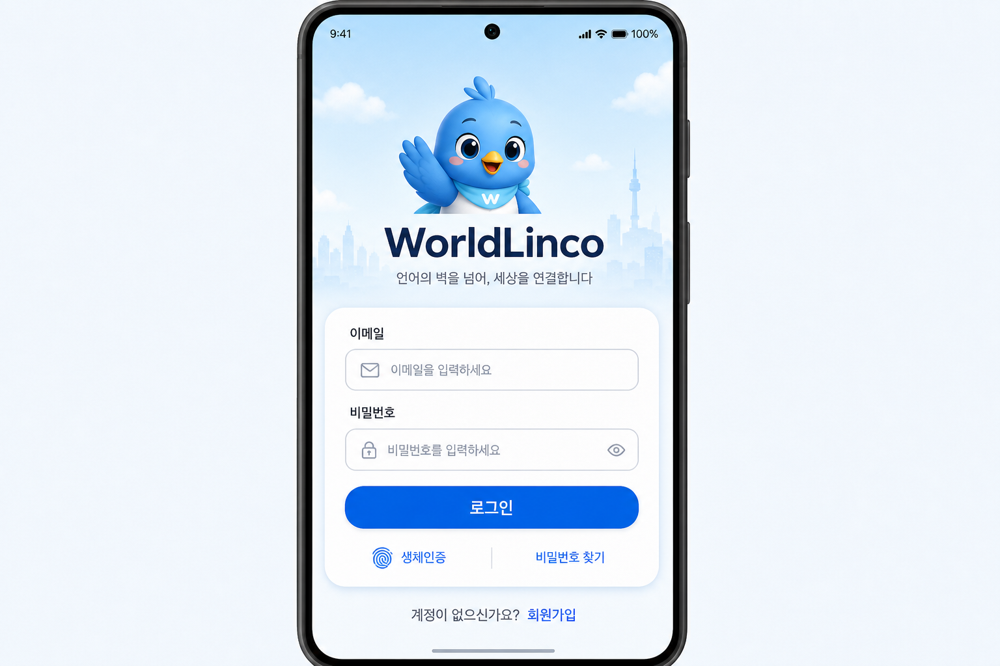

**채팅 허브(랜딩)** — `#1E6FE0` · 액션 타일 4: 전화번호로 찾기 / 지도로 찾기 / 채팅하기 / 단체채팅

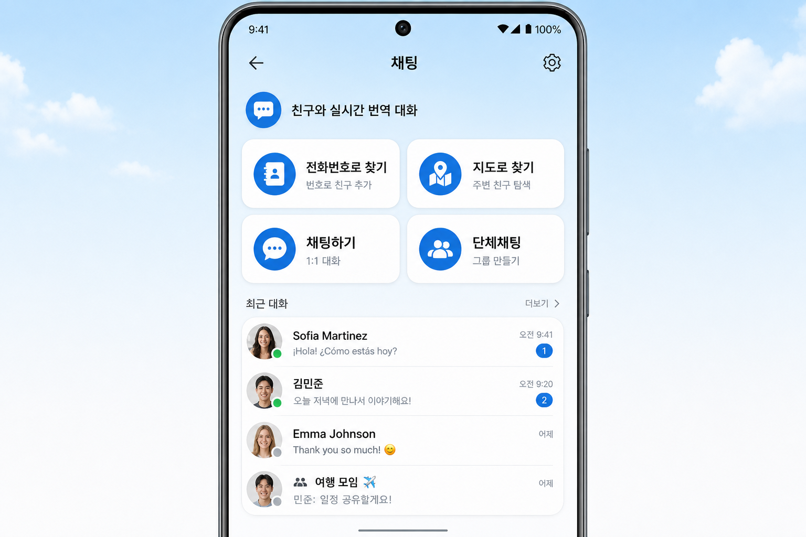

**VoIP 허브(랜딩)** — `#0B2E5E` · 액션 타일 2: 통역통화 걸기 / 일반전화(PSTN)

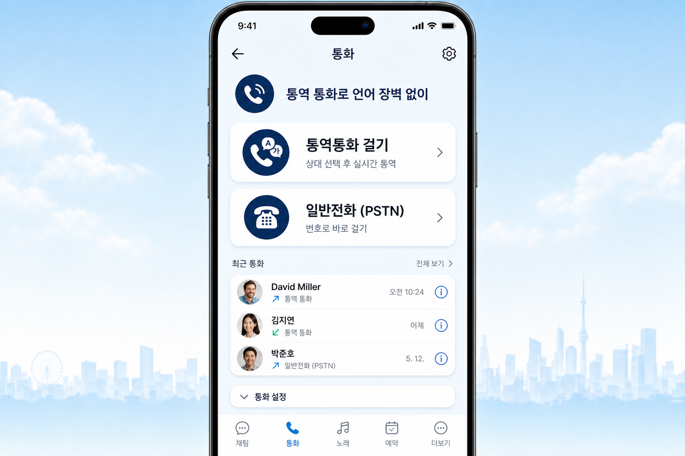

**노래 모드(랜딩)** — `#7C5CFC` · 앨범 플레이어 + 가사 라인별 원문/번역

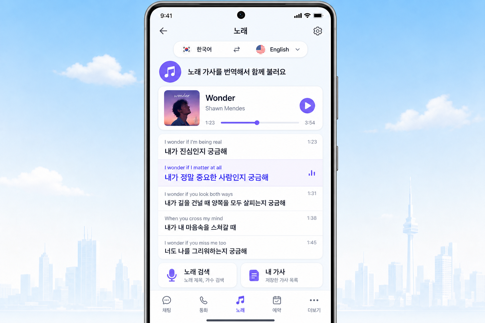

**예약/주변(랜딩)** — `#19C37D` · 액션 타일 4: 항공권 / 호텔 / 주변검색 / 일정

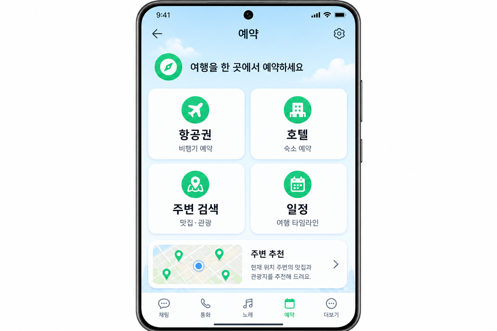

**설정 탭(⚙️)** — 그룹별 전역 ON/OFF + 사용법 아코디언 (2-6)

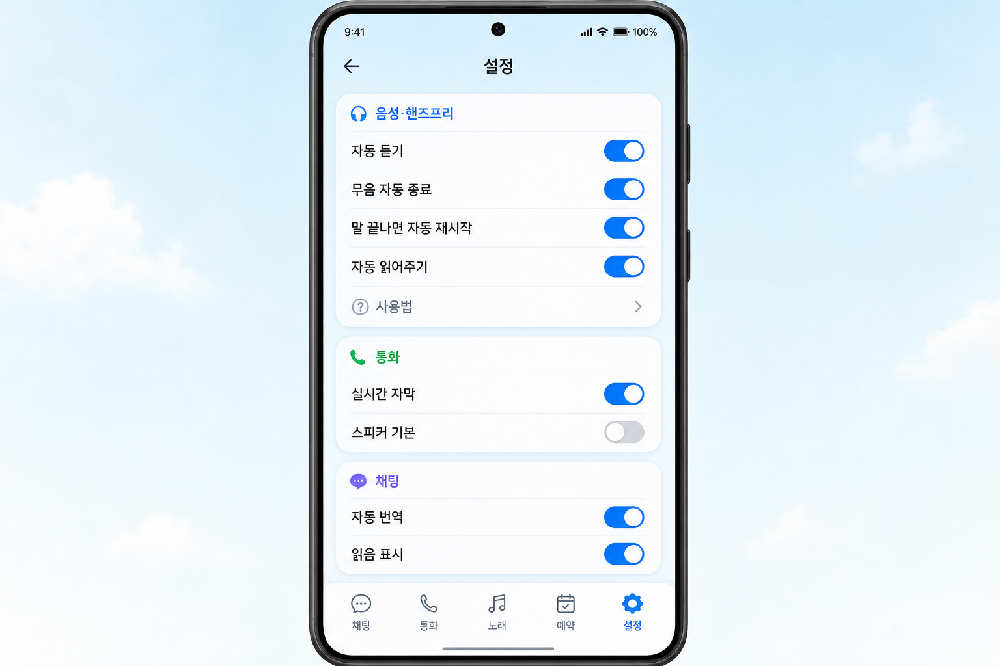

### 2-6. 설정 탭 (⚙️) — 전역 토글 + 기능별 사용 설명서

> **원칙:** 사용자가 통화·채팅·대화 중 **매번 수동 제스처(마이크 누르기 등)를 하는 것이 불편 1순위**다. 처음 진입 시 설정 톱니에서 한 번 켜두면, 모든 화면이 그 **전역 기본값**을 따른다. 화면 안의 토글은 그 세션의 임시 오버라이드일 뿐, 진실원천은 설정 탭.

**진입:** 모든 화면 상단 앱바 우측 **⚙️ 아이콘**(또는 프로필/설정). 풀스크린, 2-0 골격.

**구성:** 기능별 그룹 = `[헤더(아이콘+제목) · ON/OFF 토글들 · ❓도움말 아코디언]`. 도움말은 접힘 기본, 누르면 그 기능 사용법 펼침.

| 그룹 | 전역 토글(기본값) | 적용 화면 |
|------|-------------------|-----------|
| 🎧 **음성·핸즈프리** | 자동 듣기(ON) · 무음 자동 종료/VAD(ON) · 말 끝나면 자동 재시작(ON) · 자동 읽어주기(ON) | 채팅·VoIP·대면·소리새 **공통** |
| 📞 **통화(VoIP)** | 실시간 자막(ON) · 스피커 기본(OFF) · 언어 락 기본 자동(ON) | VoIP |
| 💬 **채팅** | 자동 번역(ON) · 받은 메시지 자동 읽어주기(ON) · 읽음 표시(ON) | 채팅방 |
| 🗣️ **대면통역** | 언어 자동 감지(ON) · 마이크 상시 대기(ON) | 대면 |
| 🐦 **소리새** | 웨이크워드 대기(ON) · 플로팅 FAB 표시(ON) | 소리새 |
| 🌐 **일반** | 테마(라이트/다크) · 글자 크기(보통/크게/아주 크게) · 인앱 자동 업데이트(ON) | 전역 |

**SSOT/구현:**
- 설정 상태는 단일 스토어(`src/features/settings/settingsStore.ts`, 영속 저장)에 보관 → 각 화면은 이 값을 **기본값으로 읽음**(예: 채팅 컴포저 "🎧 자동 듣기"는 `settings.voice.autoListen` 초기값 사용).
- 기존 화면 인라인 토글은 **제거하지 않되** 전역값을 초기 상태로 받고, 변경 시 세션 한정(또는 "기본값으로 저장" 옵션 제공).

**기능별 사용 설명서(아코디언):**
- 각 그룹 하단 `❓ 사용법` 행을 누르면 펼쳐지는 짧은 단계 설명(1·2·3 + 팁). 전체 사용 설명서는 별도 페이지가 아니라 **기능 옆에서 바로** 본다(맥락 학습).
- 콘텐츠 SSOT: `docs/worldlinco-v2/` 기능 설명 텍스트를 앱 내 `helpContent.ts`로 매핑(짧은 요약 + "자세히" 링크).


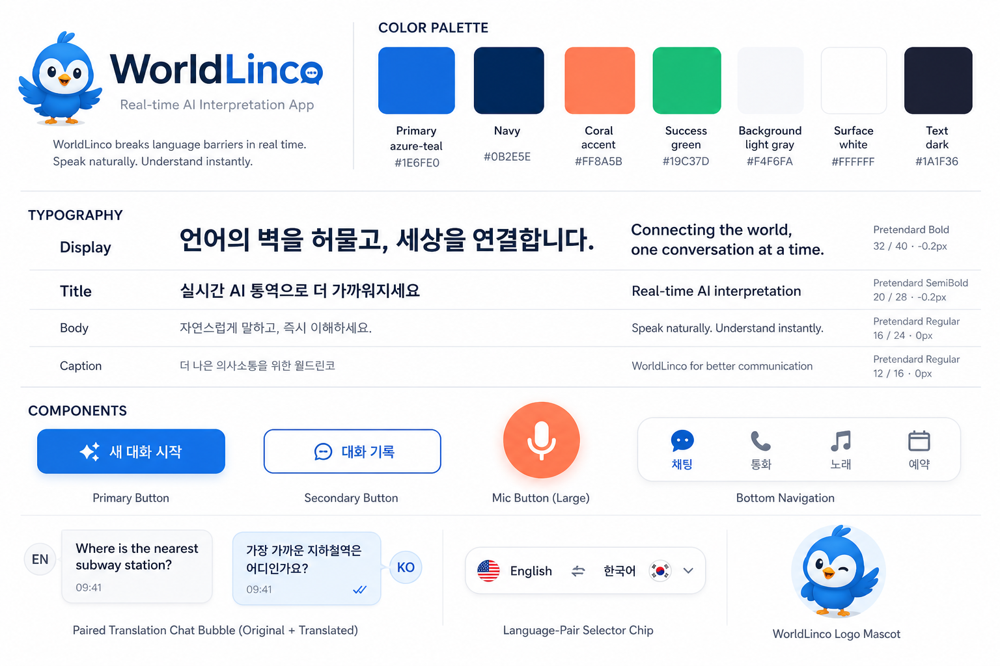

### 3-0. 전역 배경 — "소리새 하늘색" (`colors.backgroundGradient`)

모든 화면은 **소리새 동반자 화면의 하늘색 그라데이션**(연한 스카이블루 → 화이트, 옅은 구름·도시 실루엣)을 **공통 전역 배경**으로 사용한다. 콘텐츠는 흰색 `surface` 카드로 그 위에 떠 있다.

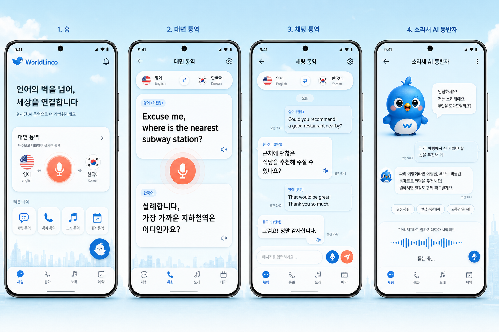

| 스킴 | `backgroundGradient` (위→아래) | 비고 |
|------|------------------------------|------|
| light | `#E3F0FF →rgb(121, 158, 200) →rgb(121, 158, 200)` | 소리새 하늘색(기본) |
| dark | `#0D1117 → #0E1320 → #111827` | 현 출시 다크 룩 유지 |

- 구현: `components/GradientBackground.tsx`(`expo-linear-gradient`) 로 화면 루트를 감싼다 → 전 화면 동일 배경.
- 토큰: `theme.ts` → `Colors.backgroundGradient`. 단색 폴백은 `colors.background`.

### 3-1. 컬러 (`theme.ts` → `colors`)

| 역할 | 토큰 | HEX | 용도 |
|------|------|-----|------|
| Primary | `colors.primary` | `#1E6FE0` | 브랜드·주요 버튼·링크 |
| Navy | `palette.navy` | `#0B2E5E` | VoIP 통화 배경·헤더 |
| Accent (Coral) | `colors.accent` | `#FF8A5B` | 마이크·통화 시작·핵심 CTA |
| Success | `colors.success` | `#19C37D` | 연결됨·완료 |
| Danger | `colors.danger` | `#E5484D` | 통화 종료 |
| Background | `colors.background` | `#F4F6FA` | 화면 배경 |
| Surface | `colors.surface` | `#FFFFFF` | 카드 |
| Text | `colors.text` / `colors.textMuted` | `#1A1F36` / `#6B7280` | 본문 / 보조 |

**채널 컬러**(`colors.channel`): `face=#1E6FE0` · `voip=#0B2E5E` · `chat=#1E6FE0` · `song=#7C5CFC` · `booking=#19C37D` · `sorisae=#1E6FE0`

### 3-2. 타이포그래피 (`theme.ts` → `typography`)

- 폰트: **Pretendard**(한글) / **Inter**(라틴), 폴백 system
- 스케일: Display 32/40 · Title 20/28 · Subtitle 18/26 · Body 16/24 · Label 14/20 · Caption 12/16
- **번역쌍 규칙:** `translationOriginal`(Caption·보조색) + `translationPrimary`(Subtitle·강조색)

### 3-3. 스페이싱 · 라운드 · 그림자

- 스페이싱(8pt): `xxs 2 · xs 4 · sm 8 · md 12 · lg 16 · xl 24 · xxl 32 · xxxl 48`
- 라운드: `sm 6 · md 10 · lg 16 · xl 24 · pill 999`
- 그림자: `card`(elev 3) · `floating`(elev 8)

### 3-4. 핵심 컴포넌트 (`theme.ts` → `components`)

| 컴포넌트 | 토큰 | 사양 |
|----------|------|------|
| 마이크 버튼 | `components.micButton` | 72dp 원형 · Coral · 녹음 시 펄스 링 |
| 섹션 레일 | `components.sectionRail` | 높이 64 · active=Primary / inactive=Muted · 4탭(채팅/통화/노래/예약) |
| 버튼 | `components.button` | 높이 52 · radius 16 · Primary(채움)/Secondary(외곽선) |
| 채팅 말풍선 | `components.chatBubble` | self=Primary / peer=Surface · radius 16 |

### 3-6. SafeArea / 시스템 바 규약 (내비바 겹침 금지)

현대 안드로이드 폰은 하단 제스처/내비게이션 바가 있고, Expo SDK 56은 기본 **edge-to-edge** 렌더링이라 콘텐츠가 그 아래로 깔린다 → 버튼이 가려져 안 눌리는 문제.

- **루트:** `react-native-safe-area-context` 의 `SafeAreaProvider` 로 앱 루트를 감싼다. (현재 `react-native`의 `SafeAreaView`만 사용 → 교체)
- **인셋 적용:** 화면/모달에서 `const insets = useSafeAreaInsets()` 로 `insets.bottom` 을 읽어:
  - 스크롤 하단 패딩 = `insets.bottom + 24`(고정 `paddingBottom:108` 대체)
  - 플로팅 칩/FAB(`음성 호출 대기`, 소리새 FAB) `bottom = insets.bottom + 12`(고정 `bottom:18` 대체)
  - 풀스크린 하단 컨트롤(대면 `faceTabBar`, VoIP 컨트롤 행) `paddingBottom = insets.bottom + 8`
- **상단:** 노치/상태바는 `insets.top` 또는 `edges={['top']}` 로 처리. 헤더는 투명 배경 + dark 텍스트.
- **탭타깃:** 모든 핵심 버튼 ≥48dp, 내비바 인셋 위로 확보.

### 3-5. 라이트/다크 스킴 (`theme.ts`)

현재 **출시 앱(build 111~)은 다크 테마**(GitHub-dark 계열)이고, 위 디자인 시스템·목업은 **라이트** 방향이다. `theme.ts` 는 둘 다 지원한다.

| 스킴 | 토큰 | 비고 |
|------|------|------|
| `lightColors` | 디자인 시스템 기본 | 신규/마케팅 화면 방향 (목업과 일치) |
| `darkColors` | 현 출시 앱 실제 팔레트 | `#0D1117`/`#111827` 배경, `#1F6FEB` primary 등 — 기존 화면 픽셀 보존용 |

- 조회: `getColors(scheme)` · `getTheme(scheme)` · 전역 기본 `activeColorScheme = 'dark'`(현 룩 유지) · `setColorScheme('light')`.
- 컴포넌트 패턴: `const styles = makeStyles(getColors(activeColorScheme))` — 인라인 hex를 토큰으로 옮기되 다크 스킴 값은 기존과 동일하게 매핑.

**마이그레이션 현황**
- ✅ `components/GradientBackground.tsx` — 전역 하늘색 배경 래퍼 추가(`backgroundGradient` 토큰 · `expo-linear-gradient`). 화면 루트를 감싸 적용.
- ✅ `components/NetworkTestBanner.tsx` — 토큰화 완료(상태색 동일, 그레이/간격은 8pt·canonical로 미세 정규화).
- ⏳ 잔여 화면(`ChatRoomScreen`, `VoIPCallScreen`, `call-mode/*` 등)은 일부 **자체 서브팔레트**(예: call-mode 퍼플 `#7c6af7`)를 사용 → 점진적으로 canonical 토큰으로 통합 예정.

---

## 4. 코드 정합성

| 디자인 요소 | 코드 SSOT |
|-------------|-----------|
| 하단 섹션 레일(채팅/통화/노래/예약) | `src/features/navigation/sectionRegistry.ts` |
| 채널별 화면 정책(face/voip/chat) | `src/features/channelProfiles.ts` |
| 소리새 "OOOO AI" 표시명 / 웨이크워드 | `src/features/sorisae/companionIdentity·companionVoiceCall` |
| 언어쌍 셀렉터 | `src/features/language/languageCatalog.ts` |
| 디자인 토큰(컬러/타이포/스페이싱) | `src/theme/theme.ts` |

---

*작성: 2026-06-25 · 화면 흐름도 + 와이어프레임(5종) + 디자인 시스템 + theme.ts 토큰 연계.*
*개정: 2026-06-25 · 화면 인벤토리(1-1) + 하단 탭바 IA 전환(1-2) + 로그인/랜딩 공통 레이아웃 규약(2-0) + 태스크 우선 원칙(0-6)·태스크 진입 동선 맵·액션 타일 사양 + 설정 탭 전역 토글·사용설명서(2-6) + 신규 목업 6종 확정(2-5) + SafeArea 규약(3-6) 추가.*
