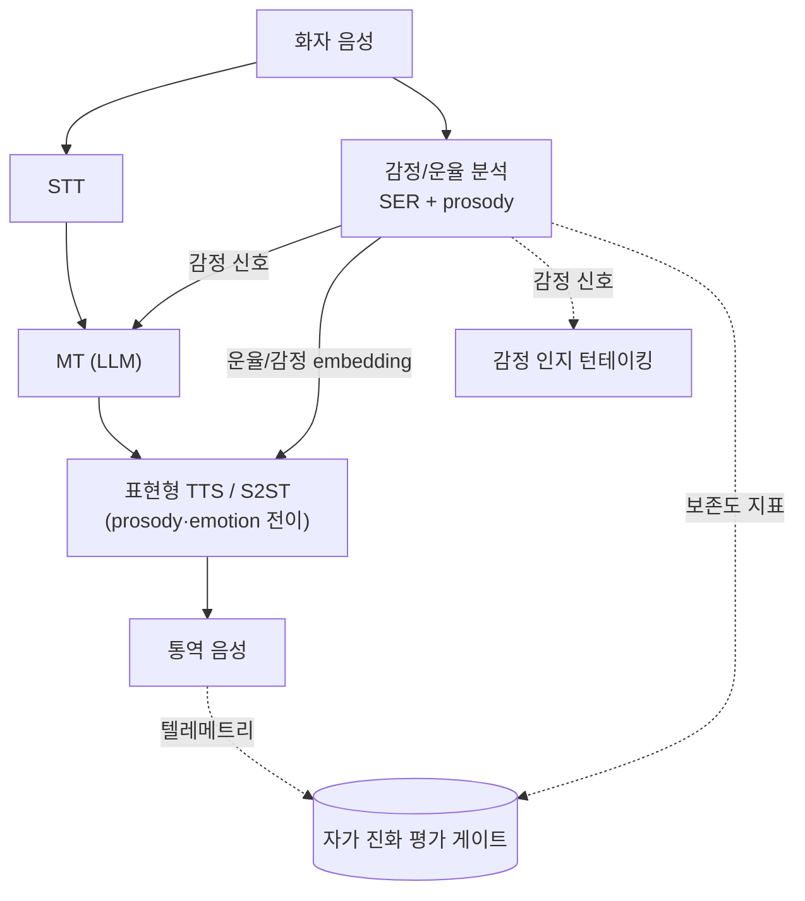

# WorldLinco V.2 — 감성·심층 감정분석 + 표현형 통역 설계서 (Emotion & Expressive S2ST)

> **목표:** 현재의 "의미만 전달하는 단조로운 로봇 TTS" 통역을, **화자의 감정·운율·음색을 보존/전달하는
> 표현형 통역**으로 끌어올린다. 동시에 **감정/감성 신호를 시스템 개선의 입력**(어조·존댓말·턴테이킹·평가지표)으로 활용해
> 자가 진화 루프([`SELF_EVOLVING_ENGINE_DESIGN.md`](SELF_EVOLVING_ENGINE_DESIGN.md))의 품질 축을 확장한다.

> ⚠️ **운영 원칙 — 품질 층, 게이트 경유, hot path 무접촉**
> 표현형/감정 기능은 **품질 층(1층)** 의 선택적 강화다. 지연·연산 비용이 크므로 **평가 게이트 통과 + 카나리** 후에만
> 핫패스에 반영하고, 현재 인앱 VOIP·대면 통역(🔒 동결) 경로는 변경하지 않는다.

> **연계:** [`SELF_EVOLVING_ENGINE_DESIGN.md`](SELF_EVOLVING_ENGINE_DESIGN.md) · [`TELEPHONY_BRIDGE_DESIGN.md`](TELEPHONY_BRIDGE_DESIGN.md) · [`SCALING_STT_MT_SEPARATION.md`](SCALING_STT_MT_SEPARATION.md) · [`SECURITY_STRIDE_DESIGN.md`](SECURITY_STRIDE_DESIGN.md)
> **최종 갱신:** 2026-06-21

---

## 0. 왜 필요한가 — 의미 전달 ≠ 소통

현재 파이프라인은 **무엇을 말했는가(content)** 는 옮기지만 **어떻게 말했는가(감정·태도·긴급도·존중)** 는 버린다.
실제 통화에서 화남·다급함·공손함·친밀감은 의미만큼 중요하다. 통역이 이를 평탄화하면 "쓸 만하지만 어색한" 체감의 원인이 된다.
표현형 통역은 이 격차를 메운다.

---

## 1. 두 갈래 활용 — (a) 표현 보존 출력 · (b) 감정 신호 입력

### (a) 표현 보존 출력 — 표현형 S2ST/TTS
- **Meta SeamlessExpressive** (2023): speech-to-speech 번역에서 **운율(speech rate·pause)·음색·감정 톤 보존**.
  - 구성: *Prosody UnitY2*(운율 인지 speech→unit) + *PRETSSEL*(표현형 unit→speech, 화자 음색·감정 전이).
  - **SeamlessStreaming**: 약 2초 지연의 동시 번역(SeamlessM4T v2 기반).
  - ([AI at Meta](https://ai.meta.com/research/seamless-communication/) · [코드](https://github.com/facebookresearch/seamless_communication) · [논문](https://ai.meta.com/research/publications/seamless-multilingual-expressive-and-streaming-speech-translation/))

### (b) 감정 신호 입력 — 시스템 개선
- **감정 인지 MT register:** 화남/공손/긴급 신호 → **존댓말 수위·어휘·어조** 선택(한국어 격식 일관성에 특히 유효).
- **감정 인지 턴테이킹:** 긴급·격앙 단서로 끼어들기/대기 정책 조정([`SELF_EVOLVING_ENGINE_DESIGN.md`](SELF_EVOLVING_ENGINE_DESIGN.md) §4.2 VAP와 결합).
- **평가 지표:** "감정 보존도"를 목적함수 항으로 추가(아래 §4).

---

## 2. 기술 요소 (Speech Emotion Recognition + 운율)

- **SER(Speech Emotion Recognition):** 음향 특징(피치·에너지·MFCC·운율)으로 감정 범주(분노/기쁨/슬픔/중립 등) 또는 **차원(valence·arousal·dominance)** 추정. 자기지도 음성표현(wav2vec2/HuBERT 류) 미세조정이 최신 주류.
- **운율 전이(prosody transfer):** 화자의 speech rate·pause·억양을 타깃 언어 합성에 이전(SeamlessExpressive의 핵심).
- **표현형 TTS:** 감정/스타일 토큰 또는 reference 음성 조건화로 표현형 합성.

---

## 3. 한국어 격차와 우회 (중요 — 솔직한 제약)

- **SeamlessExpressive의 표현 보존 언어쌍은 현재 en/es/de/fr/it/zh 6종 — 한국어 미포함.** ([Meta 블로그](https://ai.meta.com/blog/seamless-communication/))
- **ko 우회 전략(택1/혼합):**
  1. **SER(언어 무관 음향) + 감정 토큰 → 표현형 한국어 TTS**: 감정/운율을 추출해 한국어 표현형 합성기에 조건으로 전달(전이 대신 "재현").
  2. **감정 신호 → MT register 제어**: 음색 전이는 미루더라도, 감정→존댓말/어휘 제어만으로도 체감 개선.
  3. **자체 운율·감정 전이 미세조정**: ko 포함 데이터로 표현형 모듈 파인튜닝(자가 진화 루프 §3.4와 결합, 연속 학습).
- **결론:** ko는 "완전 음색 전이"는 단계적 목표로 두고, **(2) 감정→register 제어 + (1) SER 조건 표현형 TTS** 부터 적용한다.

---

## 4. 평가 지표 (자가 진화 목적함수 확장)

[`SELF_EVOLVING_ENGINE_DESIGN.md`](SELF_EVOLVING_ENGINE_DESIGN.md) §3.2 목적함수에 **표현 축**을 추가한다:

- **감정 보존도:** 원문 SER 분포 vs 통역 출력 SER 분포 일치도(예: valence/arousal 거리).
- **운율 유사도:** speech rate·pause 패턴 유사도(SeamlessExpressive 평가툴 류).
- **register 적절성:** 감정·관계 맥락 대비 존댓말/어휘 적절성(LLM-as-judge + 규칙).
- **체감 균형:** 표현형 추가가 **지연 예산(P95<2s)** 을 깨지 않는지(품질↑ vs 지연↑ 트레이드오프 모니터).

> 모든 표현형 변경은 객관 지표 + LLM-judge로 평가하고 **평가 게이트 통과 시에만** 배포(편향 방지 위해 단독 judge 신뢰 금지).

---

## 5. 단계별 로드맵

| Phase | 내용 | 산출물 | 위험 | 선행 |
|-------|------|--------|------|------|
| **E0. SER 베이스라인** ✅스캐폴드 | 언어 무관 SER(음향) 추가, 통화 텔레메트리에 감정 라벨 부착 | [`backend/communication/emotion/`](../../backend/communication/emotion/) 휴리스틱 베이스라인(off-path, flag) | 무 | 현 로그 |
| **E1. 감정→register 제어** ✅배선 | 감정 신호로 MT 존댓말/어휘 제어(ko 우선) | [`emotion/register.py`](../../backend/communication/emotion/register.py) + `llm/router.py` context_hint 합성, `COMM_V2_EMOTION_REGISTER` flag | 낮음 | E0 |
| **E2. 표현 보존도 지표** ✅하니스+✅emission | 목적함수에 감정 보존 항 + **실데이터 emission** | [`objective.py`](../../eval/worldlinco/objective.py) `emotion_av_loss`/`_WEIGHTS["emotion_loss"]` + `EMOTION_PROBE` 파싱 / **emission**: [`integration.build_emotion_probe`](../../backend/communication/emotion/integration.py)→[`router.py`](../../backend/llm/router.py) 응답 `emotion`→[`VoIPCallScreen.tsx`](../../apps/mobile-nadotongryoksa/src/screens/VoIPCallScreen.tsx) `VOIP_EMOTION_PROBE` 로그캣(`COMM_V2_EMOTION_PROBE`, off=0 기여) | 무 | E0 |
| **E3. 표현형 TTS(ko 우회)** ✅운율매핑+✅카나리배선 | SER 조건 표현형 한국어 합성(전이 대신 재현) | [`expressive_tts.py`](../../backend/communication/emotion/expressive_tts.py)(감정→rate/pitch/volume + Azure `mstts:express-as` SSML) + [`integration.build_expressive_tts_plan_from_pcm16`](../../backend/communication/emotion/integration.py). **카나리 배선 완료**: [`router.py`](../../backend/llm/router.py)가 입력 PCM16 감정→운율 플랜 산출→[`voice_gateway._synthesize_tts(expressive=)`](../../backend/llm/voice_gateway.py)→edge-tts `Communicate(rate/volume/pitch)`. `COMM_V2_EMOTION_EXPRESSIVE_TTS` off / 저신뢰·중립=비표현형(기존)과 100% 동일, baseline 속도 기준 델타. **지연 예산 모니터링**: [`budget.py`](../../backend/communication/emotion/budget.py) `voice_tts_synth_seconds{expressive}` 메트릭(Grafana P95<2s 패널) + 롤링 P95 초과 시 **자동 비표현형 폴백 서킷브레이커**(§6 구현, `COMM_V2_EMOTION_EXPRESSIVE_TTS_MAX_MS`) | 중(지연) | E1·E2 |
| **E4. 표현형 S2ST(지원 언어쌍)** | SeamlessExpressive 적용(en/zh 등 지원쌍) | 표현형 S2ST 채널 | 중 | E2 |
| **E5. ko 표현 전이 학습** | ko 포함 운율·감정 전이 미세조정(연속학습) | ko 표현형 모델 | 높음 | E3·E4 |

---

## 6. 가드레일

- **지연 예산** — 표현형 모델은 무거움. RTX 5090 활용·스트리밍·모델 분리([`SCALING_STT_MT_SEPARATION.md`](SCALING_STT_MT_SEPARATION.md))로 P95<2s 유지, 위반 시 비표현형 폴백.
- **프라이버시** — 감정/음색은 민감 정보. SER·음색 전이용 데이터는 동의·익명화([`SECURITY_STRIDE_DESIGN.md`](SECURITY_STRIDE_DESIGN.md)).
- **오인식 안전망** — SER 오판이 어조를 왜곡하지 않도록 신뢰도 임계·중립 폴백.
- **현 hot path 무접촉** — 표현형은 선택적 강화, 게이트 경유 카나리만.
- **라이선스** — SeamlessExpressive는 자체 라이선스·AUP 준수(모델 아티팩트 요청 필요).

---

## 7. 인용

- Communication 팀(Meta), **"Seamless: Multilingual Expressive and Streaming Speech Translation"** (2023) — SeamlessExpressive(Prosody UnitY2 + PRETSSEL), SeamlessStreaming(~2s). [블로그](https://ai.meta.com/blog/seamless-communication/) · [코드](https://github.com/facebookresearch/seamless_communication)
- 턴테이킹(VAP)·동시통역(LAAL)·지연 표준(G.114/G.107) — [`SELF_EVOLVING_ENGINE_DESIGN.md`](SELF_EVOLVING_ENGINE_DESIGN.md) §4.
