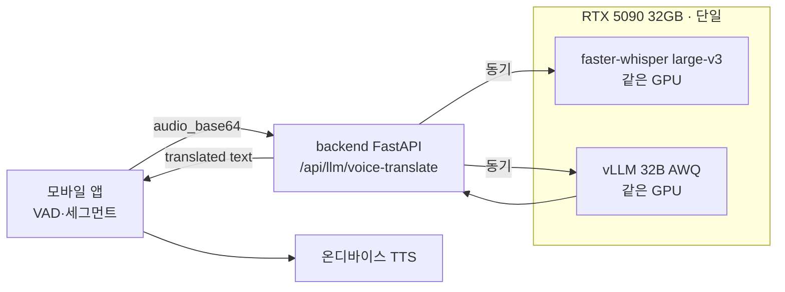
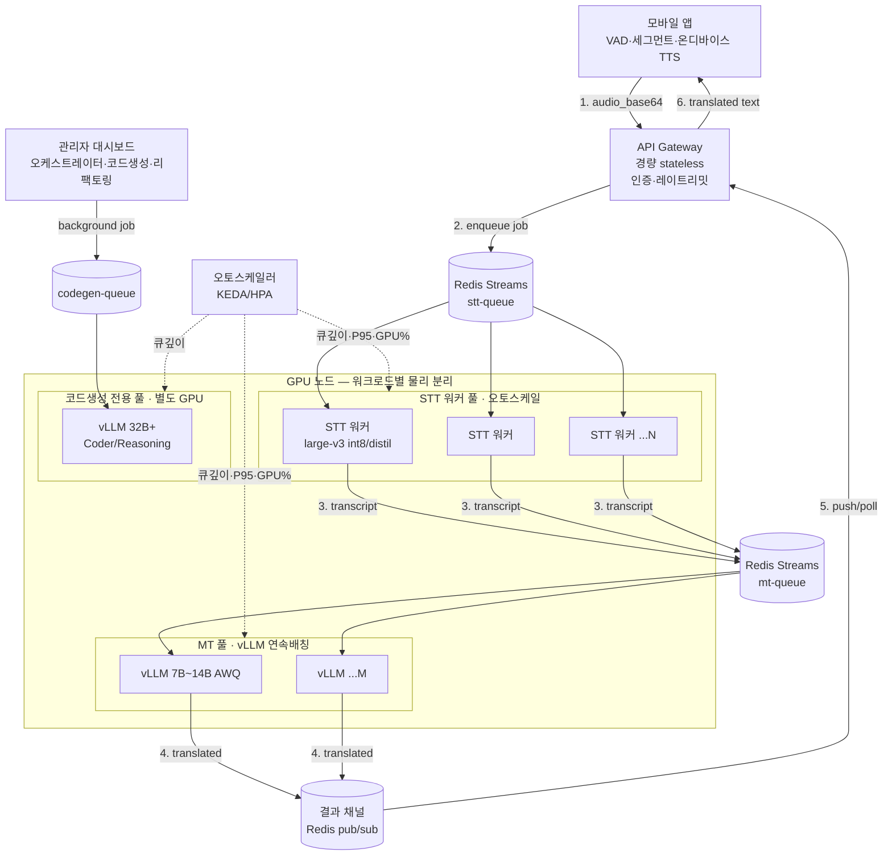

# WorldLinco V.2 — STT/MT 분리 + 오토스케일 배포 설계도

> 목표: 단일 GPU(현 RTX 5090 32GB)에 STT·MT가 함께 얹혀 서로 throughput을 잠식하는
> 현 구조를, **STT 풀 / MT 풀을 물리적으로 분리하고 큐 기반으로 수평 확장**하여
> **동접 500명(≈250 통화)** 까지 P95 지연 < 2s를 유지하도록 한다.
>
> 전제: **TTS는 단말(폰) 온디바이스 합성** → 서버 GPU 비용 0. 서버 GPU 부하는 **STT + MT + 코드생성** 뿐.

> ⚠️ **운영 원칙 — 현재 실험 단계(GPU 미확장) 동결**
> 본 문서의 분리·다운사이즈·오토스케일은 **GPU 확장 이후** 적용하는 목표 설계다.
> **현재 단일 5090 실험 환경은 그대로 안정 유지**(vLLM 32B + large-v3 + safety_cap 12000)하며,
> 이 설계 적용을 이유로 현재 런타임을 변경하지 않는다. 분리 작업의 트리거는 **GPU 증설 완료** 시점이다.

> ⚠️ **중요 — 관리자 오케스트레이터/멀티 코드생성기도 같은 vLLM(:8008) 공유**
> `orchestrator.py`·`smart_router.py`·`loader.py`·`voice_gateway.py` 모두 `OLLAMA_BASE=:8008`를 사용한다.
> 코드생성은 **긴 출력·장시간·지연관대**, 실시간 번역은 **짧은 출력·지연민감**이라 같은 배치에 섞이면
> 코드생성 1건이 번역 P95를 급등시킨다. → **코드생성 전용 풀을 별도 GPU로 분리**해야 한다.

---

## 1. 현재 구조 (Before) — 단일 GPU 혼재



**한계**
- STT와 MT가 같은 GPU에서 SM/메모리 대역을 경쟁 → 한쪽 부하가 다른 쪽 지연을 끌어올림.
- 요청이 동기 처리라 버스트에 큐잉/타임아웃 발생.
- 확장 단위가 "GPU 1대 통째"라 STT만 부족한데 MT까지 같이 늘려야 함(비효율).

---

## 2. 목표 구조 (After) — 분리 + 큐 + 오토스케일



**핵심 변경**
1. **API Gateway는 GPU 무관 stateless** → 무한 수평 확장(인증/레이트리밋/큐 적재만).
2. **STT 풀과 MT 풀을 별도 GPU 노드**로 분리 → 각각 독립 스케일.
3. **Redis Streams 큐**로 비동기 디커플링 → 버스트 흡수, 백프레셔 제어.
4. **vLLM은 연속 배칭(continuous batching)** 으로 짧은 번역 다건을 묶어 처리(throughput↑).
5. **오토스케일러(KEDA)** 가 큐 깊이/P95/GPU%로 워커 수 자동 증감.

---

## 3. 컴포넌트 사이징

| 컴포넌트 | 모델/스펙 | GPU VRAM | 비고 |
|---|---|---|---|
| API Gateway | CPU only | — | stateless, 다수 레플리카 |
| Redis | mem 4~8GB | — | Streams(stt/mt) + 결과 pub/sub |
| **STT 워커** | large-v3 **int8** 또는 **distil-large-v3** | **6~10GB/워커** | 16~24GB GPU에 1~2워커. 실시간 20~40배 배치 |
| **MT (vLLM)** | **7B~14B AWQ instruct** | 7B≈6GB / 14B≈10GB + KV캐시 | 24~48GB GPU 권장(배칭 KV 여유) |
| **코드생성(vLLM)** | **32B+ Coder/Reasoning AWQ** | ~20GB + KV캐시 | **번역과 별도 GPU**. 지연관대·배치/백그라운드 |

> **번역 모델 후보(7~14B AWQ, 양자화 기준)**: Qwen2.5-**14B**-Instruct-AWQ, Qwen2.5-**7B**-Instruct-AWQ,
> 또는 다국어/번역 특화 instruct(예: gemma2-9b-it, aya-expanse-8b 계열) AWQ.
> **4B 이하는 비권장**(관용·뉘앙스 손실). 현재 32B는 **코드 특화(Coder)** 라 번역엔 비효율 → instruct 계열이 동급 이상.
> 품질은 기존 누수가드(`_has_residual_source_script`) + googletrans 폴백으로 추가 방어.
>
> **모델 전환은 무중단**: `LLM_TRANSLATE_MODEL` 환경변수 + `_discover_served_model()` 자동발견으로
> 번역 풀만 작은 모델로 바꿔도 코드생성 풀(32B)은 그대로 둘 수 있다.

---

## 4. 용량 산정 (동접 → 필요 GPU)

가정: 발화 듀티사이클 ~40%, 평균 발화 5s, STT 배치 ~25배 실시간, 14B 번역 배칭.
"활성 발화자" = 동접 × 0.4. 단일 5090급 처리 한계 ≈ 활성 발화자 30~50명.

| 동접 | ≈통화 | 활성 발화자 | STT GPU(5090급) | MT GPU(5090급) | 합계(권장) |
|---:|---:|---:|---:|---:|---:|
| 50 | 25 | ~20 | 1 (공용 가능) | 공용 | **1** (현재) |
| 100 | 50 | ~40 | 1 | 1 | **2** |
| 200 | 100 | ~80 | 2 | 1~2 | **3~4** |
| **500** | **250** | **~200** | **3~5** | **2~3** | **5~8** (32B 그대로) / **3~4** (14B+int8 최적화) |

> 데이터센터 GPU(L40S 48GB·H100 80GB)는 배칭 효율이 높아 위 수의 **1/2~1/3**로 대체 가능.
> 예: **500 동접 ≈ L40S 48GB 2대(STT 1 + MT 1)** 도 최적화 시 현실적.
>
> **+ 코드생성 풀은 위 수치에 별도**로 최소 **GPU 1대(32B+ 상주)** 를 추가 산정한다(실시간 번역과 물리 분리).
> 코드생성은 동시성이 낮으면 1대로 충분하나, 번역 GPU와는 절대 공유하지 않는다.

---

## 5. 오토스케일 트리거

| 풀 | 스케일아웃 조건 | 스케일인 조건 | 지표 출처 |
|---|---|---|---|
| STT 워커 | `stt-queue` 깊이 > 워커수×3 **또는** STT P95 > 1200ms (60s 지속) | 큐 < 1 & GPU% < 30% (5분) | Redis XLEN, Prometheus |
| MT(vLLM) | `mt-queue` 깊이 > 임계 **또는** TTFT/P95 > 1000ms | 큐 비고 GPU% < 30% (5분) | vLLM metrics, Prometheus |
| Gateway | CPU > 60% 또는 RPS 임계 | — | HPA |

- **백프레셔**: 큐 깊이 상한 초과 시 Gateway가 429 + "잠시 후 재시도" → STT 폭주 방지.
- **워밍**: 스케일아웃 워커는 모델 프리로드 완료(헬스 200) 후에만 큐 소비(콜드스타트 지연 차단).

---

## 6. 단계적 롤아웃

> **분리·다운사이즈의 트리거 = GPU 증설 완료.** GPU 미확장 상태(현재)에서는 Phase 0를 유지하며
> 런타임을 변경하지 않는다(실험 안정성 최우선).

0. **Phase 0 (현재·동결)**: 단일 5090 혼재(32B + large-v3). 클로즈드 베타(동접 ≤ ~80) 실험용. **변경 금지**.
1. **Phase 1 — 비동기화** *(GPU 확장 후)*: `/voice-translate` 뒤에 Redis 큐 도입(코드 변경 최소, 응답은 long-poll/WS). STT·MT는 아직 같은 GPU여도 디커플링 효과.
2. **Phase 2 — 물리 분리** *(GPU 확장 후)*: STT 워커 / 번역 vLLM(7~14B) / **코드생성 vLLM(32B+)** 을 각각 별도 GPU 노드로. 번역 다운사이즈 동시 적용.
3. **Phase 3 — 오토스케일**: KEDA로 큐 기반 자동 증감 + Prometheus/Grafana 관측.
4. **Phase 4 — 멀티리전/엣지**: 장거리 통화 대비 리전 분산(별도 트랙).

---

## 7. 검증 루프 (부하테스트와 연동)

`scripts/worldlinco_loadtest.py` 로 단계별 P95/처리량을 측정해 **SLA 통과 최대 동접**을 확정한다.

```bash
# 번역(MT) 경로 한계
python scripts/worldlinco_loadtest.py --mode mt --stages 20,50,100,200 --duration 30 --out lt_mt.json

# 전체(STT+MT) 경로 한계 (Windows: SAPI 자동 합성)
python scripts/worldlinco_loadtest.py --mode stt --gen-audio --stages 10,20,40,80 --duration 30 --out lt_stt.json
```

**SLA 기준(권장)**: 각 단계 **P95 < 2000ms** 이고 **오류율 < 1%** 인 최대 동접 = 해당 구성의 처리 한계.
이 값으로 §4 용량표를 실측 보정한 뒤 GPU 증설 수량을 확정한다.

**단계별 기대 곡선(설계 가설 — 실측으로 보정 필요)**

| 단계 | 구성 | 부하 | 기대 P95 | 비고 |
|---|---|---|---:|---|
| Baseline | 단일 5090(혼재) | 동접 80(≈40통화) | ~1.8s | 현재 정책 |
| Phase 1 | 단일 GPU + 큐 | 동접 80 | ~2.3s | 큐 2단(stt→mt) 대기 누적 |
| Phase 2 | 2 GPU(STT+MT) + 배칭 | 동접 80 | ~1.4s | mt 대기 감소 |
| Phase 3 | 4 GPU(STT2+MT2) + 오토스케일 | **동접 500** | ~1.7s | SLA 충족 목표 |

> Phase 1에서 P95가 일시 상승(큐 대기)하는 것은 정상 — **동시 파이프라인**(STT 결과를 즉시 mt-queue push)과
> **pre-scale**(큐 깊이 > 워커×5 시 선제 워커 추가)로 흡수한다(§9 R1).
> 검증은 **5개 언어(EN·KO·JA·ZH·VI) 각 100회**로 다국어·억양·VAD 편차를 포함해 평균/분산을 기록한다.

---

## 8. 닫힌문/계약 보존 메모

- 모바일 `voice-translate` 요청 계약(`mode`, `device_tts`, `lang_a/b`)은 **그대로 유지**(구버전 클라이언트 호환).
- 비동기화(Phase 1) 시에도 동기 응답 경로를 폴백으로 남겨 hot path 회귀 위험 차단.
- 번역 모델 교체는 `LLM_TRANSLATE_MODEL` 환경변수 + `_discover_served_model()` 자동발견으로 무중단 스위치.

---

## 9. 리스크 레지스터 & 완화 (2026-06-20 리뷰 반영)

| # | 리스크 | 원인/영향 | 완화·대응 |
|---|---|---|---|
| R1 | E2E 지연 ≤ 2s 위배 | stt→mt 2단 큐 대기 누적, vLLM `max_wait_time` 상승 | ① 큐 깊이 경보+**pre-scale**(stt-queue > 워커×5 → 즉시 증설) ② STT 결과 **즉시** mt-queue push(동시 파이프라인) ③ OTel trace에 `queue_enter/exit` 타임스탬프 |
| R2 | STT 워커 로드 시 VRAM 폭주 | large-v3 int8≈6GB·distil≈4GB, 동일 GPU 2워커 시 초과 | ① `CUDA_VISIBLE_DEVICES` 격리 + 시작 전 `nvidia-smi` 확인 ② GPU mem > 80% → 워커 재시작 + `torch.cuda.empty_cache()` |
| R3 | Redis Streams 가용성/유실 | 단일 인스턴스 장애 시 큐 소실 | Redis **Cluster(3노드) + AOF 영속화**, 소비자그룹 `XACK` 누락분 `XCLAIM` 재할당 |
| R4 | 중복 작업/멱등성 | 재시도·크래시 후 재큐 → 동일 오디오 중복 번역 | `job_id(UUID)` + `audio_hash(SHA-256)` 메타, `XADD` 전 `SETNX` 1회 삽입, `max_retries=3` 후 **dead-letter** 이동 |
| R5 | GPU% 스케일 트리거 부재 | KEDA 기본 CPU/메모리만 지원 | **DCGM-Exporter** → Prometheus `DCGM_FI_DEV_GPU_UTIL`, KEDA **External Scaler**로 GPU% 전달 |
| R6 | vLLM KV-Cache 포화/누수 | 연속 배칭 시 캐시 가득 → 워커 재시작 지연 | `max_total_tokens`로 eviction, GPU mem > 90% 시 `SIGTERM` 후 **warm-restart**(모델 워밍업) |
| R7 | 모델 다운사이즈 품질 급락 | 7~14B → 4B 변동 시 뉘앙스 손실 | **Canary(2% 트래픽)** A/B, BLEU/chrF 저하 시 **자동 googletrans 폴백**(기존 `_has_residual_source_script` 가드와 연계) |
| R8 | 재시도 폭주 | 429에 무조건 재시도 | `Retry-After` + **exponential back-off**, 연속 오류 시 **Circuit-Breaker** 일시 차단 |
| R9 | 보안·프라이버시(평문 저장) | 오디오·번역 텍스트가 Redis에 평문 | §11 보안 섹션 강제(TLS·at-rest 암호화·짧은 TTL·JWT scope) |
| R10 | 동기→비동기 계약 파손 | 구앱은 동기 POST 응답 기대 | **백워드 호환**: POST 응답에 `job_id`+`poll_url`, WS 지원 시 push, 동기 폴백 유지 |

---

## 10. 구현·운영 권고

### 10.1 API Gateway (비동기화 레이어)
- **Job ID**: 요청 시 `uuid4()` 발급 → `XADD`에 `job_id`+payload 저장, 응답에 `job_id`/`poll_url`/`ws_endpoint` 반환.
- **동기 폴백**: `GET /voice-translate/{job_id}` 폴링 제공(`XREADGROUP`/`GET` 결과 확인).
- **WebSocket push**: `GET /ws/translation/{job_id}` → Redis pub/sub `translation:{job_id}` 구독.
- **백프레셔**: `XLEN(stt-queue) > MAX_QUEUE_LEN` → `429 + Retry-After`.
- **입력 검증**: `audio_base64 ≤ 2MiB`, `lang`/`mode` enum(Pydantic `constr`/`Literal`).

### 10.2 STT 워커
- 프로세스: GPU당 단일 워커(`uvicorn -w 1`), `cudnn.benchmark=True`(+선택 `torch.compile`).
- 배치: CPU측 VAD로 1~2s 세그먼트 합산 → `batch_size 8~16`.
- VRAM 제한: `CUDA_VISIBLE_DEVICES=${GPU_ID}` + `set_per_process_memory_fraction(0.85)`.
- 헬스: `/healthz`(mem<90% → 200, else 503), `/metrics`(job_id·audio_hash·duration_ms).

### 10.3 MT 풀 (vLLM)
- `max_batch_size 32~64`, `max_wait_time 0.3s`(SLA 보장), `block_size 16`/`prefill_chunk` 튜닝으로 KV 단편화 최소화.
- 14B AWQ ≈ 10GB + KV ≈ 12GB → **24GB+ GPU**(L40S/4090/5090).
- 무중단 교체: `LLM_TRANSLATE_MODEL` + `_discover_served_model()` Hot-Swap. 400(invalid) → 재큐 금지, **dead-letter**.

### 10.4 코드생성 전용 풀
- 32B Coder AWQ(VRAM ≥ 20GB), `codegen-queue` → `codegen-result` Pub/Sub, 배치 ≤ 4(지연관대).
- `priority`(high/low) 필드로 번역 우선, 결과 < 5분 내 UI 알림. **번역 GPU와 절대 비공유.**

### 10.5 오토스케일 (KEDA)

```yaml
apiVersion: keda.sh/v1alpha1
kind: ScaledObject
metadata:
  name: stt-scaledobject
spec:
  scaleTargetRef:
    name: stt-worker
  minReplicaCount: 1
  maxReplicaCount: 8
  triggers:
  - type: redis
    metadata:
      address: redis://redis:6379
      stream: stt-queue
      consumerGroup: stt-group
      pendingEntriesCount: "10"
```

| 스케일러 | 트리거 | 파라미터 |
|---|---|---|
| Redis Streams(STT) | `stt-queue` XLEN | `targetQueueLength = workers×3` |
| Redis Streams(MT) | `mt-queue` XLEN + GPU% | `targetQueueLength = workers×2`, `gpuUtil < 70%` |
| HPA(Gateway) | CPU% | `min2/max10`, target 60% |
| External(GPU) | `DCGM_FI_DEV_GPU_UTIL` | >80% scale-out, <30% scale-in(cool-down 5분) |

---

## 11. 보안·프라이버시 (요청 핵심 — 강제 적용)

| 항목 | 조치 |
|---|---|
| 전송 | 모든 HTTP/WebSocket **TLS 1.3 강제** + `Strict-Transport-Security`(HSTS) |
| 저장 | Redis **at-rest 암호화(AES-256)** + `masterauth`/`requirepass`. 키 관리는 Vault/Consul |
| 접근 제어 | Gateway JWT `scopes=["voice:translate"]`, `stt/mt-queue`는 **Redis ACL service-account 전용** |
| 토큰 | WS/REST JWT `exp ≤ 5분`, 재발행은 `/auth/refresh` 한정 |
| 데이터 최소화 | `audio_base64 ≤ 10s` 제한, 처리 후 **즉시 `DEL`**(또는 TTL 30s) — 개인음성 잔존 금지 |
| 감사 | PostgreSQL `audit_log`(job_id·user_id·event·timestamp·client_ip) — **GDPR 호환** |

> ⚠️ R9 직접 대응: 오디오(개인음성)·번역 텍스트의 **평문 잔존 금지**가 본 설계의 보안 1순위.
> 큐/결과 키는 **짧은 TTL + 즉시 삭제**, 전송·저장 전 구간 암호화를 기본값으로 한다.

> 📑 **STRIDE 심화 설계(SSOT):** Zero-Trust·mTLS·Redis ACL·PodSecurity·GPU 격리·GDPR 전체 설계는
> [`SECURITY_STRIDE_DESIGN.md`](SECURITY_STRIDE_DESIGN.md) 참조. 본 표는 그 요약이며, 적용 단계는 동일하게
> **Phase 0 동결(런타임 무변경) → GPU 증설 후 Phase 1~5** 순서를 따른다.

---

## 12. 관측·알림 (KPI/임계)

| 지표 | 수집처 | 임계 |
|---|---|---|
| gateway RPS | Prometheus | > 500 → info |
| stt_queue_len | Redis XLEN | > 200 → warning |
| mt_queue_len | Redis XLEN | > 150 → warning |
| stt_latency_P95 | OTel | > 1.2s → critical |
| mt_latency_P95 | vLLM metric | > 1.0s → critical |
| gpu_util | DCGM | > 85%(5분) → scale-out |
| worker_restart | K8s | > 3/24h → 조사 |
| job_failure_rate | dead-letter count | > 0.5% → 조사 |

**핵심 KPI**: GPU% ≤ 80%(5분평균) · STT-P95 ≤ 1.2s · MT-P95 ≤ 1.0s · 전체 ≤ 2.0s · 오류율 ≤ 0.5%.
대시보드: Gateway(RPS·latency·429/5xx) / STT(queue·GPU·P95) / MT(batch·wait·KV·GPU) / CodeGen(queue·duration·error).

---

## 13. 장애 복구·재시도 플로우

- **STT 워커 Crash** → 미-ACK 레코드 PENDING → KEDA 워커 재기동 + `XCLAIM` 재할당.
- **MT 워커 OOM** → vLLM 재시작 + 작업 dead-letter 이동 + 자동 알림.
- **Redis 다운** → Cluster 자동 failover, 워커 `retry_backoff=5s` 재연결.
- **GPU 노드 장애** → Pod-Anti-Affinity로 타 노드 이동, **PodDisruptionBudget**로 최소 1워커 유지.

---

## 14. 액션 아이템 (우선순위 P0–P10)

| 우선 | 작업 | 담당 | 마감(예시) |
|---|---|---|---|
| **P0 — 동결 유지** | 문서에 "Phase 0 — 변경 없음" 명시, CI에서 `voip`·`voice-translate` 디렉터리 보호 | 아키 | 2026-06-30 |
| P1 — 비동기화 | Gateway `job_id`/`poll_url`/`ws` 반환, Redis Streams `stt/mt-queue`, `GET /voice-translate/{job_id}` | 백엔드(VOIP) | 2026-07-14 |
| P2 — STT 워커 | `stt-worker` 이미지 + GPU 전용 배포, `healthz`/`metrics`, `max_retries` | ML Ops | 2026-07-21 |
| P3 — MT 풀 | vLLM 배칭 튜닝(`max_batch_size`/`max_wait_time`), Prometheus, KEDA Redis 스케일러 PoC | ML Ops | 2026-08-04 |
| P4 — 코드생성 풀 | 별도 GPU 32B Coder, `codegen-queue`→`codegen-result` | 백엔드(코드생성) | 2026-08-11 |
| P5 — 오토스케일 | KEDA ScaledObject(STT/MT), DCGM-Exporter + GPU% 어댑터, Helm | 인프라 | 2026-08-18 |
| P6 — 관측·알림 | Grafana 대시보드 + Alertmanager 규칙 | SRE | 2026-08-25 |
| P7 — 보안 강화 | Redis ACL·TLS·JWT scope·audit-log + STRIDE 심화([`SECURITY_STRIDE_DESIGN.md`](SECURITY_STRIDE_DESIGN.md)) 적용 | 보안 | 2026-09-01 |
| P8 — 부하·성능 | `worldlinco_loadtest.py` 단계별 P95, 500 동접 → GPU 재산정 | QA | 2026-09-08 |
| P9 — Canary 모델 | `LLM_TRANSLATE_MODEL` A/B(2%) + 자동 폴백 | ML Ops | 2026-09-15 |
| P10 — 운영 가이드 | Run-book(재시작·dead-letter·scaling) | 운영 | 2026-09-22 |

> **P0 불변 원칙**: 위 P1~P10은 **GPU 증설 완료 이후** 트리거된다. GPU 미확장 현재는 Phase 0(단일 5090, 32B+large-v3+safety_cap 12000) **동결 유지** — 본 설계 반영을 이유로 현재 런타임을 변경하지 않는다.
