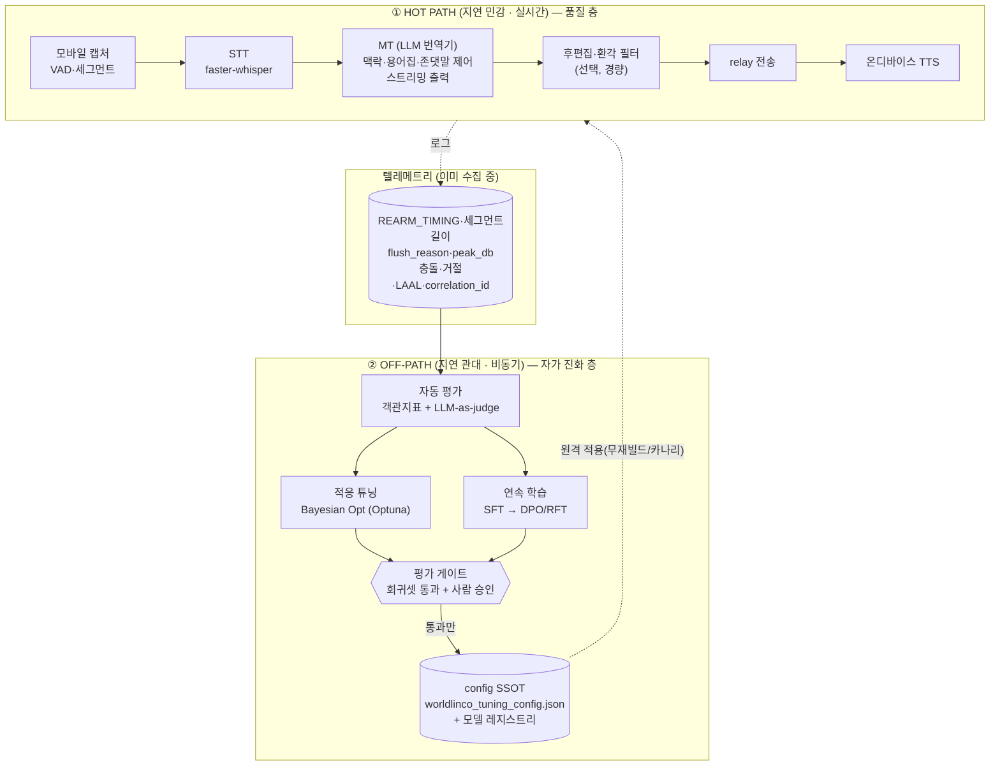

# WorldLinco V.2 — 자가 진화형 통역 엔진 설계서 (Self-Evolving Interpretation Engine)

> **목표:** 현재의 STT→MT→TTS 통역 파이프라인을, **LLM(엔진) + 평가/학습 루프(진화) + 게이트(안전)** 의 2층 구조로 확장해
> 통화를 거듭할수록 **품질·정책이 데이터로 스스로 개선**되도록 한다. "개발자 기준 체감 만족"을 정량 목표로 둔다.
>
> **핵심 명제:** *LLM을 얹는다고 저절로 진화하지 않는다.* 진화는 LLM이 아니라 그 주위를 도는
> **데이터 플라이휠(실통화 → 평가 → 학습 → 게이트 → 배포)** 에서 나온다. LLM은 엔진, 루프가 진화 메커니즘이다.

> ⚠️ **운영 원칙 — 현재 hot path 동결, 점진 적용(Strangler Fig)**
> 본 문서는 **목표 설계**다. 현재 운영 중인 `POST /api/llm/voice-translate` hot path(≈2.8s),
> VOIP voice relay, 대면 통역(🔒 동결)은 **이 설계 적용을 이유로 변경하지 않는다.**
> 모든 변경은 ① **핫패스 밖(off-path)** 에서 먼저 검증하고 ② **평가 게이트 통과 시에만** 핫패스에 반영한다.
> **무감독 자가수정은 금지** — 회귀(그동안 반복된 고통)를 막기 위해 자동 평가 게이트 + 사람 승인을 강제한다.

> **연계:** [`WORLDLINCO_V2_ROADMAP.md`](WORLDLINCO_V2_ROADMAP.md) · [`SCALING_STT_MT_SEPARATION.md`](SCALING_STT_MT_SEPARATION.md) · [`SECURITY_STRIDE_DESIGN.md`](SECURITY_STRIDE_DESIGN.md) · [`ORCHESTRATOR_ID_BACKBONE.md`](ORCHESTRATOR_ID_BACKBONE.md) · [`V2_FEATURE_AUDIT.md`](V2_FEATURE_AUDIT.md) · [`VOIP_AEC_CAPTURE_PLAN.md`](VOIP_AEC_CAPTURE_PLAN.md) · [`TELEPHONY_BRIDGE_DESIGN.md`](TELEPHONY_BRIDGE_DESIGN.md) · [`EMOTION_EXPRESSIVE_DESIGN.md`](EMOTION_EXPRESSIVE_DESIGN.md)
> **최종 갱신:** 2026-06-21

---

## 0. 왜 지금 이 설계인가 — 문제 정의

삼성 등 상용 통화 통역도 "쓸 만하지만 완벽하진 않다"는 평가를 받는다. 근본 이유는 LLM 부재가 아니라
**캐스케이드 파이프라인의 물리적 한계**다:

1. **지연(latency)** — STT + MT + 전송 + TTS가 직렬로 쌓여 mouth-to-ear 지연이 커진다.
2. **엔드포인팅(turn-taking)** — "말이 끝났다"를 고정 침묵 타이머로 판정 → 너무 빠르면 자르고, 너무 느리면 텀이 길다.
3. **에코/반이중** — 자기 출력 재캡처, 턴 충돌.

LLM은 이 물리를 없애주지 않는다. 대신 **품질 축**(번역 자연스러움·맥락·존댓말)과, 루프를 통해 **정책 축**(엔드포인팅·세그먼트·억제창 튜닝)을 끌어올린다. 본 설계는 그 둘을 분리해 안전하게 적용한다.

---

## 1. 전체 아키텍처 — 2층 구조



**두 층의 결정적 차이**

| | ① Hot Path (품질 층) | ② Off-Path (진화 층) |
|---|---|---|
| 시간 예산 | **밀리초~초** (ITU-T G.114 예산) | **분~일** (관대) |
| 위험 | 회귀 시 즉시 사용자 체감 | 게이트가 막아 **사용자 무영향** |
| 변경 주체 | 사람 승인 후 배포 | 자동 탐색·학습, **게이트가 관문** |
| 출력물 | 더 자연스러운 번역 | 더 나은 config·모델 후보 |

---

## 2. 1층 — 품질 층 (Hot Path LLM)

현재 MT를 **맥락 인지 LLM 번역기**로 교체/보강한다. 단, **지연이 곧 품질**(§4 표준)이므로 지연 관리가 전제다.

### 2.1 LLM 번역기가 더하는 가치
- **대화 맥락 주입:** 직전 N턴을 컨텍스트로 → 대명사·생략·중의성 해소.
- **한국어 존댓말/호칭 제어:** 상대·관계에 맞는 격식(반말/해요체/하십시오체) 일관 유지.
- **용어집(glossary)·도메인 적응:** 고유명사·전문용어 고정.
- **환각·STT 오류 후편집:** 우리가 G7/T1에서 싸운 **반복 환청·자기 에코 텍스트**를 맥락으로 기각.

### 2.2 지연 가드 (필수)
- **스트리밍 출력**(부분 가설) + **동시통역 정책**(§4.3 wait-k/LA/AlignAtt)으로 첫 토큰 지연 최소화.
- **모델 크기 트레이드오프:** 소형/양자화 모델 우선, 필요한 난도에서만 대형으로 에스컬레이션(라우팅).
- **GPU:** 현 서버 **RTX 5090 32GB** 활용( [`SCALING_STT_MT_SEPARATION.md`](SCALING_STT_MT_SEPARATION.md) 의 STT/MT 분리·코드생성 풀 격리 원칙 준수 — 코드생성 1건이 번역 P95를 끌어올리지 않게).
- **예산 불변식:** LLM 추가가 **mouth-to-ear P95 < 2s** 를 깨면 롤백(§4.1).

### 2.3 엔드포인팅은 큰 LLM이 아니라 전용 소형 모델로
턴 종료 판정은 거대 LLM에 맡기지 않는다(지연·과잉). **VAP(Voice Activity Projection, §4.2)** 같은
CPU 실시간 소형 모델로 "말이 끝날 것"을 **예측**해 고정 `silero_silence_ms` 타이머를 대체/보강한다.

---

## 3. 2층 — 자가 진화 층 (Off-Path Flywheel)

### 3.1 데이터 플라이휠
```
실통화(동의·익명화)  →  텔레메트리/녹취 코퍼스
        ▲                         │
        │                         ▼
   카나리 배포  ←  평가 게이트  ←  자동 평가 + 학습/튜닝
```
- **이미 수집 중인 연료:** `REARM_TIMING`(단계별 ms)·세그먼트 길이·`flush_reason`·`peak_db`·충돌/거절/굶김·`correlation_id`(ID 백본). 이것이 목표함수 입력.
- **추가 수집(동의 전제):** 익명화된 (오디오, STT, MT, 사용자 정정/재발화) 쌍 → 학습 코퍼스.

### 3.2 자동 평가 (Evaluation)
두 종류를 결합한다.
- **객관 지표:** 번역 품질(BLEU/COMET), 동시통역 지연 **LAAL/AL(computation-aware)**, 재무장 지연, 이중발화 건수, 굶김 시간, STT 무음거절율, E-model **R-factor**(§4.1).
- **LLM-as-judge:** 자연스러움·존댓말 적절성·의미보존을 점수화(편향 보정 위해 객관지표와 병용, 단독 신뢰 금지).

### 3.3 적응 튜닝 (Auto-Tuning)
- **오프라인 베이지안 최적화:** [Optuna](https://optuna.readthedocs.io) 다목적(TPE/GP sampler, **Pareto front**)로 config 공간 탐색.
  - 탐색 변수 예: `silero_silence_ms`, `silero_min/safety_cap_ms`, `fairness_barge_in_ms`, 억제 꼬리(native/fallback), 동시통역 chunk size.
  - 목적: `minimize(재무장지연, 이중발화, 굶김, 클리핑)` s.t. `R-factor ≥ 목표`. (다목적은 단일 스칼라 대신 **제약+Pareto**로.)
- **온라인 적응 휴리스틱(저위험):** `silence_ms`를 사용자 실측 pause 분포로, 억제창을 실측 에코 꼬리(`NATIVE_ECHO_TAIL`)로 자동 산출. 사람·기기·통화별 적응.

### 3.4 연속 학습 (Continual Learning)
- **SFT → DPO/RFT** 순으로 MT·후편집·엔드포인터를 개선(선호 쌍/보상은 자동평가+사용자 정정에서).
- **회귀 방지:** 고정 **회귀 테스트셋(golden set)** 으로 catastrophic forgetting·드리프트 감시.

### 3.5 평가 게이트 (안전 관문 — 가장 중요)
> 자동 탐색·학습 결과는 **절대 자동으로 핫패스에 들어가지 않는다.** 반드시:
1. **회귀셋 무회귀** (품질·지연·이중발화·에코 0회귀) →
2. **카나리/A·B**(소수 트래픽) 지표 우위 →
3. **사람 승인** →
4. config SSOT/모델 레지스트리에 반영(원격·무재빌드 또는 카나리 롤아웃), **즉시 롤백 경로 유지.**

이 게이트가 "스스로 진화하되 폭주하지 않는" 핵심 장치다.

### 3.6 튜닝 케이던스 & 기기 계층화 (운영 정책)
> **확정 운영 규칙(2026-06-21, 사용자 결정):** **단일 통화로 config를 바꾸지 않는다.**
> n=1 결과는 노이즈가 커, 통계가 거칠다(예: build 157 첫 통화에서 reject% 19→44는 단일 표본 변동일 수 있음).

- **배치 결정 — "10통화당 1회 조정":** config 후보당 **최소 ~10통화** 누적 후에야 튜닝 결정을 내린다.
  - 지표는 **개별 통화가 아니라 분포(중앙값·IQR)** 로 본다. 이상치 1~2건이 결정을 흔들지 못하게.
  - 이 케이던스가 §3.5 평가 게이트의 **표본 크기 하한**으로 작동한다(무회귀 판정도 배치 단위).
- **기기 계층화(stratification) — S10 vs Tab 분리 집계:** 체감·지표에 **기기별 편차**가 실재한다.
  - 관측: **S10 체감 ≥80%**(build 157 텀 단축 뚜렷), **Tab은 편차** — 단말 오디오 HW·지연·AEC 특성 차이로 추정.
  - 따라서 목적함수·게이트는 **기기군별로 따로** 평가하고, 필요 시 **기기별 config 프로파일**(예: Tab 전용 노브)을 둔다. 한 기기에서 좋아진 값이 다른 기기를 악화시키지 않도록.
  - **권고:** probe 이벤트에 `device_model`(이미 파일명에 암시) + `build`/`config_version` 필드를 실어 계층 집계를 자동화(§데이터 위생, `eval/worldlinco/README.md`).

---

## 4. 인용·표준 (정량 근거)

### 4.1 지연 QoE 표준 — "좋다"의 정의
- **ITU-T G.114** *One-way transmission time*: mouth-to-ear **≤150ms 사실상 투명 / 150–400ms 허용 / >400ms 부적합**. ([ITU-T G.114](https://www.itu.int/rec/T-REC-G.114))
- **ITU-T G.107 / G.107.1 (E-model)**: 지연·에코·손실 → **R-factor** 단일 품질점수. 우리 "체감"을 수치화하는 목적함수 항. ([G.107.1](https://www.itu.int/rec/T-REC-G.107.1))
- **ITU-T G.168 / G.131**: 에코 캔슬러·토커 에코 — AEC·억제창 설계 근거(G10 연계).

### 4.2 턴테이킹 — 고정 타이머 → 학습형 예측
- Ekstedt & Skantze, **"Voice Activity Projection: Self-supervised Learning of Turn-taking Events"**, *Interspeech 2022*. ([arXiv 2205.09812](https://arxiv.org/abs/2205.09812), [project](https://erikekstedt.github.io/VAP/))
- Inoue, Jiang, Ekstedt, Kawahara, Skantze, **"Real-time and Continuous Turn-taking Prediction Using Voice Activity Projection"**, *IWSDS 2024* — **CPU 실시간**(1s 컨텍스트로 정확도 유지). ([arXiv 2401.04868](https://arxiv.org/abs/2401.04868))

### 4.3 동시통역(SimulST) — 세그먼트/flush 정책 = 지연-품질 트레이드오프
- Ma et al., **wait-k** (STACL) — 고정 지연 정책.
- Liu et al. / Polák et al., **Local Agreement (LA)** — IWSLT 2022 우승 정책.
- Papi et al., **"AlignAtt"**, *Interspeech 2023* — LA 대비 **지연 0.5–0.8s 단축**, 2초 이하 달성. ([ISCA](https://www.isca-archive.org/interspeech_2023/papi23_interspeech.html))
- 지표: **Average Lagging(AL)** / **Length-Adaptive AL(LAAL)**, computation-aware 버전.
- **NAIST IWSLT 2024/2025** 시스템 — chunk size **200–1000ms**, pause length `Lpause`, threshold θ 를 **언어쌍별로 튜닝**(우리가 손으로 만진 노브와 동일). ([IWSLT 2024](https://aclanthology.org/2024.iwslt-1.23.pdf), [IWSLT 2025](https://aclanthology.org/2025.iwslt-1.39.pdf))

### 4.4 자동 튜닝·연속 학습 방법론
- **Bayesian / 다목적 최적화:** [Optuna](https://optuna.readthedocs.io) (TPE·GP·MOTPE sampler, Pareto front, 제약 최적화).
- **선호 기반 미세조정:** RLHF / **DPO**(Direct Preference Optimization) / **RFT**(grader 기반 강화 미세조정).

### 4.5 궁극형 — Full-duplex end-to-end
- Kyutai **Moshi**(2024) 류 full-duplex 음성 대화 모델: 겹쳐 말하기·끼어들기(barge-in)를 네이티브 처리. 우리의 수동 "공정성 캡·억제창"을 모델이 흡수하는 장기 방향.

---

## 5. 현재 파라미터 ↔ 표준/연구 대응표

| 현재 수동 노브 (SSOT) | 대응 개념 | 자동화 경로 |
|---|---|---|
| `silero_silence_ms` (1000) | 엔드포인팅 / pause length `Lpause` | VAP 예측(§4.2) 또는 pause 분포 적응 |
| `silero_min_segment_ms`·`safety_cap_ms` (3000/7000) | SimulST chunk size | Optuna로 언어쌍별 최적화(§4.3) |
| `fairness_barge_in_ms` | 턴 충돌/barge-in 정책 | full-duplex 모델 흡수(§4.5) |
| 억제 꼬리(native 250 / fallback 700) | 에코 제어(G.168) | 실측 에코 꼬리 온라인 적응(§3.3) |
| MT 프롬프트/모델 | 번역 품질 | SFT/DPO/RFT 연속 학습(§3.4) |
| (없음) "체감" | E-model **R-factor** | 목적함수 항으로 정량화(§4.1) |

---

## 6. 단계별 로드맵 (한 번에 하나·실검 원칙 유지)

> 각 단계는 **off-path 검증 → 게이트 → 카나리** 순. 현 hot path·대면 동결 무접촉.

| Phase | 내용 | 산출물 | 위험 | 선행 |
|---|---|---|---|---|
| **P0. 목적함수 정의** ✅ | 텔레메트리 → "재무장지연+이중발화+굶김+클리핑+R-factor" 가중/제약 정의 | [`eval/worldlinco/objective.py`](../../eval/worldlinco/objective.py) | 무 (분석만) | 현 로그 |
| **P1. 오프라인 평가 하니스** ✅ | 통화 로그 리플레이 → 지표 산출(LAAL·R-factor 등) + config별 비교 | [`eval/worldlinco/evaluate.py`](../../eval/worldlinco/evaluate.py) · [README](../../eval/worldlinco/README.md) | 무 (off-path) | P0 |
| **P2. 베이지안 자동튜닝** 🟡(스캐폴드) | 관측 ingest → 다음 config 제안(ask-and-tell, 기기별). Optuna 있으면 TPE, 없으면 stdlib 폴백 | [`eval/worldlinco/optimize.py`](../../eval/worldlinco/optimize.py) · [`search_space.py`](../../eval/worldlinco/search_space.py) | 무 (제안만) | P1 |
| **P3. 평가 게이트 + 카나리** | 회귀셋 무회귀 + A·B + 사람 승인 → SSOT 반영 | 게이트 파이프라인 | 낮음 (롤백 보유) | P2 |
| **P4. LLM 번역기(1층)** | 맥락·존댓말·용어집 + 스트리밍, 지연예산 가드 | 핫패스 MT 교체(카나리) | 중 (지연) | P3 |
| **P5. 학습형 엔드포인터(VAP)** | 고정 타이머 → 턴 예측 모델 | 엔드포인터 서비스 | 중 | P3 |
| **P6. 연속 학습(SFT→DPO/RFT)** | 정정/선호로 MT·후편집 개선 | 모델 레지스트리 + 회귀셋 | 중 | P4 |
| **P7. (탐구) Full-duplex** | end-to-end 모델 PoC | 벤치 리포트 | 높음 | P4–P6 |

---

## 7. 가드레일 (반드시 동반)

- **무감독 자가수정 금지** — 모든 변경은 **평가 게이트 + 사람 승인**. (회귀 방지 = 최우선)
- **개인정보·동의** — 통화 음성은 민감정보. 학습 데이터화는 **명시 동의 + 익명화/가명화** 후에만. [`SECURITY_STRIDE_DESIGN.md`](SECURITY_STRIDE_DESIGN.md) 연계(저장·전송·보존기간·삭제권).
- **드리프트/망각** — 고정 golden 회귀셋, 학습 전후 비교 필수.
- **지연 예산 불변식** — mouth-to-ear P95 < 2s(G.114 기반). 위반 시 자동 롤백.
- **보존 불변식** — 대면 통역(🔒 동결)·VOIP 핫패스 보존 불변식([`V2_FEATURE_AUDIT.md`](V2_FEATURE_AUDIT.md))과 [`VOIP_AEC_CAPTURE_PLAN.md`](VOIP_AEC_CAPTURE_PLAN.md) §6.4 무접촉.
- **재현성** — 모든 config/모델 후보는 버전·`correlation_id`로 추적(ID 백본).

---

## 7.5 P0+P1 부트스트랩 결과 (2026-06-21)

`eval/worldlinco/` 하니스로 `evidence/s10-g10-15*.log`를 평가한 첫 데이터 검증:

| config | calls | flush_rearm(중앙) | translate_lag | reject% | J(mean) |
|--------|-------|------------------|---------------|---------|---------|
| **v2** (build 152~153) | 4 | 3758ms | 1642ms | **68%** | 0.848 |
| **v3** (build 156) | 3 | 3032ms | 1639ms | **19%** | **0.652** |

- **판정:** config v3가 데이터 최적(J·거절률·재무장텀 모두 우위). 사용자 체감과 일치 → **수동 튜닝이 데이터로 1차 검증됨.**
- **데이터 위생 발견:** logcat 버퍼 잔존으로 파일명 빌드번호가 154/155에서 실제 빌드와 불일치 → 콘텐츠 신호(REARM_TIMING)로 보정. **권고: probe 이벤트에 `build`/`config_version` 필드 추가**(P0 후속).
- **남은 헤드룸:** v3 flush_rearm ~3032ms에 번역 직렬대기(~1.3s) 잔존 → **build 157**(§ V2_FEATURE_AUDIT G10) 이 제거. 하니스가 다음 실통화로 자동 재검증(진화 루프가 코드 변경을 검증하는 첫 사례).
- **지연 QoE:** interaction-delay 프록시 ≈3.3s → ITU-T G.114 부적합 구간(R≈44). "완벽하지 않다"의 정량 근거·최적화 목표 확보.

---

## 7.6 P2 자동튜닝 스캐폴드 (2026-06-21)

[`eval/worldlinco/optimize.py`](../../eval/worldlinco/optimize.py) + [`search_space.py`](../../eval/worldlinco/search_space.py) 로 P1 관측을 소비하는 **ask-and-tell 제안기**를 부트스트랩:

- **노브 단일 출처(`search_space.py`):** `silero_silence_ms`(600–1400)·`silero_min_segment_ms`(400–3000)·`silero_safety_cap_ms`(5000–12000)·`fairness_barge_in_ms`(0–4000). 각 노브에 경계·스텝·현재 SSOT·주 영향 성분(`objective._WEIGHTS`) 명시.
- **백엔드 이중화:** Optuna 설치 시 TPE ask-and-tell, 미설치 시 **성분-우선 좌표 탐색** stdlib 폴백 — 둘 다 동일 제안 JSON. (운영서버 RTX 5090 환경엔 Optuna 도입 권장, CI/오프라인엔 폴백으로 무의존 동작.)
- **정직한 범위:** 오프라인에서 임의 config의 J를 직접 평가할 수 없으므로(시스템 실행 필요), 이 스캐폴드는 *대리 평가기*가 아니라 **배포·측정된 config의 J만 학습해 다음 실험점을 제안**한다(플라이휠을 닫는 역할).
- **기기 계층화(§3.6):** S10/Tab 독립 스터디 → 기기 프로파일별 제안. 첫 실행 결과 두 기기 모두 지배 성분이 `post_flush_rearm`이라 `silero_silence_ms` −50ms(보수적) 제안.
- **평가 게이트 준수(§3.4):** 제안은 자동 배포 금지. JSON `gate_status = PROPOSAL_ONLY_REQUIRES_HARNESS_REEVAL_AND_HUMAN_APPROVAL`. 제안 config로 **≥10통화 수집 → 하니스 재평가 → 사람 승인** 후에만 SSOT 반영.
- **검증:** [`tests/test_worldlinco_optimize.py`](../../tests/test_worldlinco_optimize.py) 8/8 통과(노브 클램프·관측 그룹화·지배성분 방향·결정론·제안 JSON 경계).

> **다음 의사결정 게이트:** build 158(S10·Tab)로 각 ~10통화 누적 → `evaluate --json` → `optimize`. reject% 추세가 ~10통화에서도 높으면 제안이 `silero_min_segment_ms` 상향으로 전환(config v4 후보).

---

## 8. 결론

"LLM 탑재 → 자동 진화"는 절반만 맞다. 정확히는 **LLM(엔진) + 데이터 플라이휠(진화) + 평가 게이트(안전)** 의 조합이다.
우리는 그 토대 — **풍부한 텔레메트리·튜닝 SSOT·RTX 5090·오케스트레이터/ID 백본** — 를 이미 갖췄다.
P0(목적함수)·P1(평가 하니스)는 **새 데이터 수집 없이 기존 로그만으로 즉시 착수 가능**하며, 이것이 "갈수록 개선되는 프로젝트"의 출발점이다.
P2(자동튜닝 스캐폴드)까지 부트스트랩 완료 — 이제 통화가 쌓일수록 하니스가 J를 재평가하고 옵티마이저가 다음 config를 제안하는 **루프가 닫혔다**. 남은 것은 데이터 누적(≥10통화/기기)과 게이트 통과뿐.
