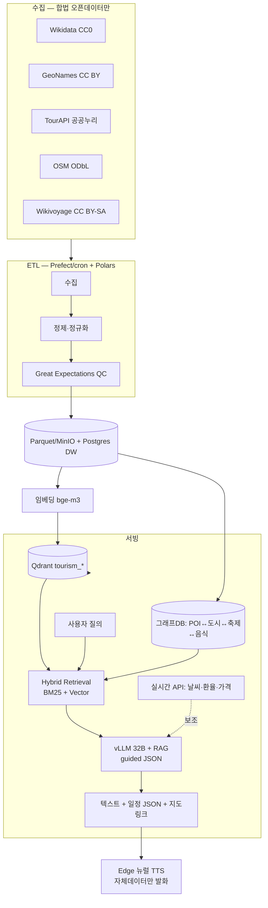

# 소리새 AI — 전 세계 관광 특화 지식 RAG 설계도

> 목표: 현재 "범용 LLM + 실시간 웹/지도 그라운딩(RAG-lite)" 수준의 소리새 AI를,
> **자체 관광 데이터 자산(ETL → 벡터 + 그래프 DB) + Hybrid RAG + (필요시) LoRA**
> 기반의 전 세계 관광 특화 AI로 단계적으로 끌어올린다.
>
> 본 문서는 사용자가 제시한 레퍼런스 아키텍처(11개 지식 카테고리 · ETL · 모델 레이어 ·
> 지속 최신화 · 전체 아키텍처)에 **(1) 데이터 라이선스 실측 조사**와
> **(2) 현재 repo 실제 보유 자산**을 결합해 "실행 가능한" 형태로 재구성한 것이다.

---

## 0. ⚠️ 최우선 법적 게이트 — 데이터 라이선스 (착수 전 필독)

데이터 자산화(저장·인덱싱·파인튜닝)에는 **라이선스가 허용하는 소스만** 사용한다.
상업 지도/리뷰 API는 "실시간 표시"로만 제한적으로 쓰고, **DB 적재·모델 학습에는 절대 넣지 않는다.**

### Google Maps Platform 약관(2026-06-04 확인) — 금지 조항
- **(iii)** business names, addresses, user reviews **복사·저장 금지**(scraping).
- **(iv)** Google Maps Content를 **text-to-speech(TTS)에 사용 금지**.
- **(vi)** driving time을 합성음성으로 변환 금지.
- **(vii)** Google Maps Content로 **ML/AI 모델 학습·테스트·검증·파인튜닝 금지**.
- 저장 허용: `place_id`(영구), 위경도(최대 **30일** 임시 캐시 후 삭제).
- 출처: https://cloud.google.com/maps-platform/terms , Service Specific Terms §13.

> 🔴 **현재 구현 리스크(식별)**: `backend/llm/voice_gateway.py::_friend_fetch_maps_grounding`가
> Google Maps(SerpAPI google_maps)의 장소명·주소·전화·평점을 LLM 프롬프트에 넣고
> Edge neural **TTS로 읽어주던** 구조였다. 이는 약관 (iv)/(iii) 위반 소지가 크다.
>
> ✅ **조치 완료(2026-06-22)**: 장소 찾기 그라운딩의 1차 소스를 **OpenStreetMap(Nominatim, ODbL)**
> 로 전환(`_friend_fetch_osm_grounding`). ODbL은 상업·**TTS·저장**이 모두 허용된다.
> - `VOICE_FRIEND_OSM_GROUNDING` 기본 **on** → OSM 우선.
> - `VOICE_FRIEND_MAPS_GROUNDING` 기본 **off** → Google Maps는 정식 라이선스 확보 환경에서만.
> - 잔여: 적재·학습엔 Google/Kakao/TripAdvisor 데이터 계속 제외(원칙 §0 매트릭스).

### 사용 가능한 오픈 데이터 소스 매트릭스 (실측)

| 소스 | 데이터 | 라이선스 | 상업 이용 | 적재·DB | 파인튜닝 | 주의 |
|------|--------|----------|:---:|:---:|:---:|------|
| **Wikidata** | 정형 사실(좌표·행정코드·관계) | **CC0** (공용) | ✅ | ✅ | ✅ | 출처표기 불필요. 최우선 권장 |
| **OpenStreetMap** | 전 세계 POI·경계·도로 | **ODbL 1.0** | ✅ | ✅ | ✅* | 출처표기 + **share-alike**(파생 DB도 ODbL 공개) |
| **Wikivoyage** | 여행 가이드 텍스트 | **CC BY-SA 4.0** | ✅ | ✅ | ✅* | 출처표기 + share-alike. API ≤ 1req/30s |
| **GeoNames** | 지명·행정구역·좌표 | **CC BY 4.0** | ✅ | ✅ | ✅ | 출처표기만(share-alike 없음). 10k credits/day |
| **한국관광공사 TourAPI** | 국내 관광지 26만건·사진 | **공공누리 1·3유형** | ✅ | ✅ | ✅ | 무료·실시간. 사진은 CI/BI·명예훼손 용도 금지 |
| **OpenTripMap** | 전 세계 POI(OSM/Wikidata 파생) | 키 제한 무료 | △ | △ | △ | 출처가 OSM/Wikidata → 원본 라이선스 따름 |
| **OpenWeather/기상청** | 날씨·예보 | API별 상이 | 실시간만 | ❌ | ❌ | 실시간 호출만, 적재 비권장 |
| **Open Exchange Rates 등** | 환율 | API별 상이 | 실시간만 | ❌ | ❌ | 실시간 호출만 |
| 🔴 Google Places / TripAdvisor / Kakao | 리뷰·사진·평점 | 상업 ToS | 표시만 | ❌ | ❌ | **적재·TTS·학습 전면 금지** |

\* share-alike 소스로 학습한 모델 가중치의 share-alike 전파 여부는 법적 회색지대 →
보수적으로 **share-alike 데이터는 RAG retrieval에만 쓰고 LoRA 학습셋에서는 분리**하는 것을 권장.

**권장 코어 적재 소스**: Wikidata(CC0) + GeoNames(CC BY) + 한국관광공사(공공누리) 를 1차 코어로,
OSM/Wikivoyage(share-alike)는 retrieval 전용 보조로 운용.

---

## 1. 현재 보유 자산 vs 목표 (Gap)

| 레이어 | 현재 repo 상태 | 목표 | Gap |
|--------|---------------|------|-----|
| 인프라 | Qdrant v1.16.2, Postgres15, Redis, MinIO 가동 | 동일 + 그래프DB | 그래프DB 신규 |
| 벡터화 | `marketplace/vector_service.py` = **해시 스텁(실임베딩 아님)** | 실 임베딩(bge-m3 등) | 임베딩 모델 교체 |
| RAG | friend-chat 웹/지도 실시간 그라운딩(RAG-lite) | 자체 인덱스 우선 Hybrid RAG | 인덱스 신규 |
| LLM | vLLM 32B(RTX 5090) 서빙 | RAG 결합 + 선택적 LoRA | LoRA·구조화 출력 |
| ETL | **없음** | 스케줄 수집·정제·QC | 전체 신규 |
| 그래프 | **없음** | POI↔도시↔축제↔음식 관계 | 전체 신규 |
| 멀티모달 | 없음(음성/텍스트) | 사진·360°(후순위) | 후순위 |
| 다국어 | STT 자동감지 + 50개국 뉴럴 TTS ✅ | 유지 | - |

---

## 2. 지식 카테고리 → 소스 → 적재 가능성 매핑

사용자가 정의한 11개 카테고리를 **합법 적재 가능 여부 기준**으로 재배치한다.

| # | 카테고리 | 적재 코어 소스 | 적재 | 실시간 호출(비적재) |
|---|----------|----------------|:---:|------|
| 1 | 지리·행정 | Wikidata, GeoNames, OSM | ✅ | - |
| 2 | 관광지·명소 | Wikidata, Wikivoyage, TourAPI, OSM | ✅ | Google place_id로 링크만 |
| 3 | 숙박·교통 | OSM(위치), 공공 교통API | △ | 가격·예약은 실시간 API |
| 4 | 문화·축제 | TourAPI 이벤트, 지자체 공개API | ✅ | - |
| 5 | 음식·맛집 | OSM(restaurant), Wikivoyage | ✅ | 평점은 실시간(표시만) |
| 6 | 비자·여권·경보 | 외교부/IATA(텍스트 적재) | ✅ | - |
| 7 | 날씨·재해 | — | ❌ | OpenWeather/기상청 실시간 |
| 8 | 언어·문화·예절 | Wikivoyage, Wikidata | ✅ | - |
| 9 | 환율·세금 | World Bank(통계 적재) | △ | 환율은 실시간 |
| 10 | 멀티모달 | TourAPI 사진, Wikimedia Commons | △ | 후순위 |
| 11 | 사용자 행동·피드백 | 자체 로그(PIPA 준수) | ✅ | 익명화·암호화 필수 |

**원칙**: 변동이 느린 사실(1·2·4·6·8) = **적재**. 실시간 가변(7·9, 가격/예약) = **호출**.

---

## 3. 목표 아키텍처 (현 인프라 기준)



> ⚠️ Airflow/Spark/Neo4j는 단일 서버엔 과중하다. **경량 대체**를 1차 채택:
> - Airflow → **Prefect 또는 cron**(단일 노드)
> - Spark → **Polars/DuckDB**(단일 노드 충분)
> - Neo4j → **Postgres + AGE(그래프 확장)** 또는 초기엔 인접테이블로 대체
> - Delta Lake → **Parquet on MinIO**(이미 보유) + 날짜 파티션

---

## 4. 5단계 로드맵 (현실 기준 일정 · 1인 개발 가정)

### 1️⃣ 요구정의·데이터 맵 — 낮음 · 1~2주
- friend-chat 키워드셋(`_FRIEND_WEB_SEARCH_KEYWORDS`)을 시나리오 카탈로그 초안으로 승격.
- **산출물**: 빈출 질의 Top-50, 데이터 소스 매트릭스(본 문서 §0 확정), 카테고리별 적재/호출 결정표(§2).

### 2️⃣ 데이터 파이프라인(ETL) — 높음 · 3~5주 (데이터 라이선스가 병목)
- 코어 소스 3종(Wikidata·GeoNames·TourAPI) 수집기 구현(Prefect/cron).
- Polars 정제 → 통일 스키마(POI: id·name·lat·lon·category·country·source·license).
- Great Expectations QC(null·좌표범위·중복) → 실패 시 차단.
- **산출물**: `backend/services/tourism_kb/` ETL + Parquet(MinIO) + QC 리포트.

### 3️⃣ 검색·벡터 DB — 높음 · 3~5주
- `VectorService` 해시 스텁 → **실 임베딩(bge-m3 / multilingual-e5)** 교체.
- 파일럿 도시(예: 오사카·서울) 수만 건만 `tourism_places` 컬렉션 적재(10M은 목표치, PoC 아님).
- **Hybrid**: Postgres FTS(또는 Elastic) BM25 + Qdrant 벡터 → RRF 융합.
- **산출물**: Hybrid Retrieval 모듈 + 평가셋(질의→정답 POI).

### 4️⃣ LLM·RAG·구조화 출력 — 중상 · 3~5주 (RTX 5090 보유로 유리)
- friend-chat 그라운딩을 **"자체 인덱스 우선 → 부족분만 웹"** 순서로 교체.
- 일정/가격은 **vLLM guided decoding(JSON schema)** 로 구조화 출력(Function Calling보다 적합).
- LoRA는 **RAG 만으로 부족할 때만** 투입(share-alike 데이터는 학습셋 제외).
- **산출물**: `/api/llm/voice/friend-chat` 확장 + 일정 JSON 스키마.

### 5️⃣ 파일럿·피드백 — 중 · 2~3주
- 베타 사용자 대상 A/B(기존 웹검색 vs 자체 RAG).
- **KPI 재정의(측정 가능하게)**:
  - ~~응답 < 1s~~ → **첫 음성 출력까지 < 3s**(STT+검색+생성+TTS 합산 현실치).
  - ~~정확도 ≥ 90%~~ → **장소정보 사실일치율 ≥ 90%**(평가셋 기준, 채점 주체 명시).
- **산출물**: 베타 리포트 + 다음 도시 확장 계획.

**총 예상**: 약 **3~5개월**(전체). 단, **2주 PoC**(§5)로 가치 선검증 강력 권장.

---

## 5. 권장 시작점 — 2주 PoC (Thin Slice)

전체를 한 번에 가지 말고, 가장 가치 큰 얇은 한 줄을 먼저 검증한다:

1. `VectorService` 스텁 → 실 임베딩 교체.
2. 파일럿 1개 도시 POI 수천 건(Wikidata + GeoNames + TourAPI)만 Qdrant 적재.
3. friend-chat 그라운딩에 "자체 인덱스 우선, 부족하면 기존 웹" 끼워넣기.
4. **Google Maps TTS 발화 경로를 자체데이터 발화로 전환**(§0 법적 리스크 해소 겸).
5. LoRA·CLIP·그래프DB·Airflow는 PoC 성공 후 투입.

---

## 5-b. PoC 실행 결과(2026-06-22) — 구현 완료

| 항목 | 결과 |
|------|------|
| 임베딩 | **fastembed(ONNX)** 기본 — torch 불필요. 모델 `intfloat/multilingual-e5-large`(1024d), e5 `query:`/`passage:` 프리픽스 자동 적용 |
| 모듈 | `backend/services/tourism_kb/`(임베더+Qdrant 스토어) — 마켓플레이스 해시 스텁과 100% 분리 |
| 적재기 | `scripts/ingest_tourism_city.py`(단일 도시) · `scripts/ingest_tourism_batch.py`(다도시 배치) |
| 적재 현황 | **글로벌 27개 도시 전수 = 약 17,849 POI**(공유 컬렉션 `tourism_places`, 2026-06-22 배치). 도쿄 777·서울 795·파리 779·오사카 778·뉴욕 773 등. 초기 504/429 실패 3곳(busan·sapporo·dubai)은 재적재로 보강 완료 |
| 그라운딩 | friend-chat: **자체 인덱스 → OSM 실시간 → (Google 정식라이선스 시만)** 순. `_friend_fetch_index_grounding` |
| 검색 품질 | e5-large 기준 다국어 질의 **10/10 정확**(한·영·일). MiniLM 양자화에서 실패하던 "호텔→hotel" 교정 |
| 지오 스코핑 | payload `location` + geo 인덱스 → 좌표 기준 도시 자동 분리(서울 좌표→서울, 오사카 좌표→오사카) |
| 질의 정규화 | 불용어(근처/알려줘/near me 등) 제거 → 자연어 발화 정확도 향상 |

품질 보강 3종(누적 적용): ① 카테고리별 **균형 수집**(일본 交番·병원 과밀 해소) ② 카테고리 **다국어 동의어** 주입 ③ **질의 불용어 정규화**. 그 위에 **e5-large**가 결정적.

## 5-c. 데이터·모델 자동화 + 글로벌 확대 런북

**도시 레지스트리**(26개): 서울·부산·제주·인천 / 도쿄·오사카·교토·후쿠오카·삿포로 / 방콕·치앙마이·싱가포르·타이베이·홍콩·하노이·다낭·발리·쿠알라룸푸르 / 파리·로마·바르셀로나·런던·암스테르담 / 뉴욕·LA·두바이·시드니.

```bash
# 단일 도시
python scripts/ingest_tourism_city.py --city seoul

# 배치(국가/목록/전체) — 멱등 upsert(재실행 시 갱신). 다도시엔 --fresh 금지.
python scripts/ingest_tourism_batch.py --cities seoul,busan,osaka
python scripts/ingest_tourism_batch.py --country KR,JP
python scripts/ingest_tourism_batch.py --all

# 차원/모델 변경 후 1회성 전체 리셋(첫 도시만 컬렉션 초기화)
python scripts/ingest_tourism_batch.py --all --reset-first
```

**스케줄(주1회 권장, 공용 Overpass 부하 배려)**:

리눅스 운영 서버(cron):
```cron
0 3 * * 0  cd /workspace && python scripts/ingest_tourism_batch.py --all --no-wikidata >> /var/log/tourism_kb.log 2>&1
```

Windows 개발/운영 머신(작업 스케줄러) — **등록됨: `SorisaeTourismKBRefresh`, 매주 일 03:00**:
```powershell
# 래퍼: scripts/tourism_kb_refresh.cmd (venv python + --all --no-wikidata, logs/tourism_kb_refresh.log 기록)
schtasks /create /tn "SorisaeTourismKBRefresh" /tr "<repo>\scripts\tourism_kb_refresh.cmd" /sc weekly /d SUN /st 03:00 /f
schtasks /query /tn "SorisaeTourismKBRefresh" /fo LIST   # 확인
schtasks /run   /tn "SorisaeTourismKBRefresh"            # 수동 즉시 실행
schtasks /delete /tn "SorisaeTourismKBRefresh" /f        # 해제
```

**운영 주의**:
- **Wikidata WDQS**가 장애 시 1req/min 으로 공격적 제한 → 배치는 도시별 graceful skip(OSM 단독으로 진행). 대량 배치는 `--no-wikidata` 또는 `--sleep` 상향 권장.
- 공용 Nominatim/Overpass는 rate-limit·User-Agent 정책 있음 → 트래픽 증가 시 **자체 호스팅**으로 전환(`VOICE_FRIEND_OSM_ENDPOINT`, Overpass 자체 인스턴스).
- 컨테이너 임베딩 영속화: `requirements.txt` 에 `fastembed>=0.8.0` 추가됨(이미지 재빌드 시 유지). e5-large 모델은 최초 질의에 1회 다운로드(~2GB) 후 캐시.
- 멱등성: point id = `sha1(source:source_id)` → 재적재가 중복 없이 갱신(증분 최신화).

**다음 자동화 단계(설계 §4 매핑)**:
- 증분 크롤링(변경분만) + Great Expectations QC 게이트.
- 그래프DB(POI↔도시↔축제↔음식) — Postgres+AGE 경량 시작.
- Hybrid(BM25+Vector) 융합(RRF) — 고유명사 정확도 보강.

## 5-d. Phase 2 구현 설계 (다음 단계, 적재 안정화 후 적용)

> 현 상태(Phase 1): e5-large 단일 dense 벡터 + 지오필터 + 질의 정규화로 다국어 10/10.
> 한계: **고유명사·숫자·외래어 정확매칭**(예: "스타벅스 리저브 명동", "JR 난바역")은 dense 가 약함.
> → Phase 2 는 Hybrid 검색 + 구조화 일정 + 그래프 KG + QC 게이트를 더한다.

> **구현 현황(2026-06-22)**: ① Hybrid 검색 · ② 구조화 일정 JSON · ④ QC 게이트 **구현 완료**. ③ 그래프 KG 설계 대기.

### ① Hybrid 검색 (BM25 + Vector, RRF) — ✅ 구현 완료
- **근거**: Qdrant 네이티브 sparse 벡터 + `Qdrant/bm25`(fastembed, 언어무관) 지원 확인.
- **스키마**: 컬렉션을 named vectors 로 재생성 — `dense`(e5-large 1024d, cosine) + `sparse`(bm25).
  → 컬렉션 재생성 필요 → **현재 `--all` 적재 완료 후 1회 `--fresh` 재적재**로 전환.
- **질의**: `query_points(prefetch=[dense, sparse], query=FusionQuery(RRF))` 로 RRF 융합.
- **효과**: dense=의미(다국어), sparse=토큰/숫자/라틴 고유명사 → 상호 보완.
  CJK(공백 없는 일·한)는 bm25 토크나이즈가 약하므로 dense 가 주, sparse 가 보조.
- **코드 스케치**:
  ```python
  # 적재: dense + sparse 동시 upsert
  dense = TextEmbedding("intfloat/multilingual-e5-large")
  sparse = SparseTextEmbedding("Qdrant/bm25")
  client.upsert(points=[PointStruct(id=..., vector={"dense": d, "sparse": s}, payload=...)])
  # 질의: RRF 융합
  client.query_points(collection, prefetch=[
      Prefetch(query=dvec, using="dense", limit=20),
      Prefetch(query=svec, using="sparse", limit=20),
  ], query=FusionQuery(fusion=Fusion.RRF), limit=5)
  ```

**구현 요약**(`backend/services/tourism_kb/service.py`):
- 컬렉션 named vectors: `dense`(e5-large 1024d, cosine) + `sparse`(`Qdrant/bm25`, `Modifier.IDF`).
- 적재: `upsert_places` 가 dense·sparse 동시 upsert(sparse 미가용 시 dense 단독 안전모드).
- 검색: `query_points(prefetch=[dense, sparse], query=FusionQuery(RRF))`. 지오필터는 각 prefetch 에 적용,
  hybrid 실패 시 dense 폴백 + 지오 무필터 폴백(다단계 graceful).
- 토글 `TOURISM_HYBRID`(기본 on) / `TOURISM_SPARSE_MODEL`. 27개 도시(~17,849 POI) hybrid 재적재 완료.

### ② 구조화 일정/가격 출력 (Structured JSON) — ✅ 구현 완료 (설계 §4 stage4)
- **엔드포인트**: `POST /api/llm/voice/answer` (`backend/llm/voice_gateway.py`). friend-chat(자연어 음성)과 분리된 화면 카드/일정용.
- **요청**: `query`(또는 transcript)·language·region_hint·country_code·lat/lon·days·max_places.
- **응답**: `{summary, days[{day,title,items[{place_id,name,category,address,phone,hours,website,latitude,longitude,map_url,source,license,blurb}]}], tips[], attribution, candidate_count}`.
- **파이프라인**: RAG(hybrid 인덱스 검색, 계획어 제거한 핵심어로 관련도↑) → LLM(`guided_json` 스키마 강제, 실패 시 plain JSON 파싱 폴백) → **서버가 장소 사실 주입**(LLM 은 place_id 배치+blurb 만 담당 → 환각 불가).
- **지도 URL**: OpenStreetMap(ODbL)만 생성 — Google Maps 약관 회피. 출처표기 응답에 포함.
- **언어**: 응답 텍스트(summary/title/blurb/tips) 사용자 언어 강제(프롬프트 CRITICAL LANGUAGE RULE).
- 검증(2026-06-22): "오사카 라멘 맛집 하루 코스" → 전부 한국어 + 실제 식당(주소·전화 포함)만 선별, OSM 지도URL 부여.
- **모바일 UI 연동(2026-06-22)**: `apps/mobile-nadotongryoksa` — `src/api/tourismAnswer.ts`(타입 클라이언트) +
  `src/features/travel-itinerary/TravelItineraryPanel.tsx`(요청 입력·일수 선택·일정 카드·**OSM Leaflet 지도**(일자별 번호 핀)·여행 팁·출처표기).
  "주변 장소 찾기" 섹션에 마운트(현재 lat/lon·언어·region/country 자동 주입). 지도/링크는 OSM(ODbL)만 — 약관 안전. 타입체크 클린.
- **음성 자동 연결(2026-06-22)**: 소리새 AI(친구 모드) STT 결과를 패널 입력으로 자동 seed(`seedQuery`/`seedNonce`).
  사용자가 말한 여행 요청이 'AI 여행 일정' 입력창에 채워지고, 생성은 '일정 만들기' 버튼으로 트리거(불필요한 자동 호출 방지).
- **의도 게이트(2026-06-22)**: `isTravelItineraryIntent(text)`(`src/api/tourismAnswer.ts`) — 일정/코스/동선/여행/관광/명소/맛집/추천/
  기간표현(N박·N일) 등 **여행·장소 의도일 때만** seed. 일상 잡담·일반 질문("기분 어때?", "약국 어디야")은 패널을 건드리지 않음.

### ③ 그래프 KG (POI↔도시↔축제↔음식) — ✅ 구현 완료 (경량 인접테이블)
- **결정**: `postgres:15-alpine` 에 AGE 미설치(컴파일 필요·취약) → 설계 대안인 **순수 Postgres 인접테이블**로 시작.
  Neo4j/AGE 는 데이터·질의 복잡도 증가 시 후속 검토.
- **모듈** `backend/services/tourism_kb/graph.py`(`TourismGraph`): 기존 SQLAlchemy 엔진 재사용,
  전용 테이블(`tourism_city`/`tourism_festival`/`tourism_food`)만 멱등 raw SQL 로 관리. **DB 미연결 시 graceful**(모든 메서드 [] / no-op).
- **관계 모델**: `(City)-[HOSTS]->(Festival)`(festival.city_id FK), `(Region|City)-[FAMOUS_FOR]->(Food)`(scope_type country|city).
  POI 는 Qdrant(`tourism_places`)에 그대로 두고 **POI↔도시는 좌표(bbox/근접)로 질의 시 연결** → 이중 저장 회피.
- **질의**: `resolve_city`(id→이름→좌표 근접 ±0.6°), `city_festivals`(월 필터 옵션), `region_foods`(city scope 우선→country),
  `city_context`(도시 1곳의 {city, festivals[], foods[]}).
- **시드** `scripts/seed_tourism_graph.py`: 27개 도시 대표 축제·향토 음식 큐레이션(공개 사실, `license=public-knowledge`).
  도시 id/좌표/국가코드는 ingest 의 `CITY_REGISTRY` 와 정합. 적재 검증: **cities=27 · festivals=37 · foods=80**(2026-06-22).
- **`/answer` 연동**: 응답에 `city_context{city_id,city_name,country_code,festivals[{name,month,season,description}],foods[{name,description,scope}]}` 추가.
  서버가 region_hint·좌표로 도시 해석 → 축제(월순 전체)·음식 주입. 검증: "오사카…" → 축제 2(7월 덴진·9월 단지리)·음식 6.
- **모바일 렌더**: `TravelItineraryPanel` 에 "○○ 알아두기" 카드(축제+향토 음식, **이번 달 축제 강조**) 추가. 타입체크/린트 클린.
- 연쇄질문("이 축제 근처 맛집")은 festival→city 좌표→Qdrant geo 근접으로 확장 가능(후속).

### ④ 데이터 품질 게이트 (QC) — ✅ 구현 완료
- `backend/services/tourism_kb/service.py` `validate_places(places, bbox=...)`:
  이름 누락·좌표 누락/비정상·**bbox 범위 밖**(±0.02° 여유)·`(source,source_id)` 중복을 드롭,
  미지정 카테고리는 경고 집계. `drop_rate>0.9` 또는 유효<5 면 `blocked=True`.
- `scripts/ingest_tourism_city.py` 가 fetch 직후·임베딩 전에 게이트를 호출 → `[qc] ...` 리포트 로그,
  `blocked` 면 해당 도시 적재 중단(소스 이상으로 품질 붕괴 시 오염 방지). 단위검증 통과.
- Great Expectations 는 데이터 규모·소스 다양화 후 도입.

### Phase 2 적용 순서(권장)
1. `--all` 적재 완료 ✅ → 2. Hybrid 스키마 `--fresh` 재적재 ✅ → 3. RRF 질의 전환 ✅ →
4. QC 게이트 ✅ → 5. 구조화 일정 JSON ✅ → 6. 그래프 KG ✅. (Phase 2 전 항목 구현 완료)

## 6. 컴플라이언스 체크리스트 (2026-06-22 코드 실증 점검)
- [x] **적재·학습 데이터 Google/Kakao/TripAdvisor 미포함** — `scripts/ingest_tourism_city.py` 소스는
  OSM Overpass(ODbL) + Wikidata(CC0) 단독. 각 POI 에 `source`/`license` 태깅. Google Maps 그라운딩
  (`VOICE_FRIEND_MAPS_GROUNDING`)은 **기본 0(off)** + ToS 근거 주석(`backend/llm/voice_gateway.py` §70-77).
- [x] **OSM 출처표기 + 데이터 출처 화면** — `/answer` 응답 `attribution`("© OpenStreetMap contributors (ODbL)"),
  모바일 일정 패널 하단 텍스트 + **지도 attributionControl 활성화**(App.tsx 주변지도·TravelItineraryPanel 모두 타일
  `attribution` 지정, Leaflet 프리픽스 제거). 2026-06-22 이전 주변지도 `attributionControl:false` 누락 보강.
  **앱 전역 "데이터 출처 · 라이선스" 화면 신설**: `src/components/DataSourcesModal.tsx`(OSM ODbL·Nominatim·Wikidata CC0·
  도시 KG 큐레이션 출처/라이선스/링크 고지), 푸터 "데이터 출처 · 라이선스" 링크로 진입.
- [ ] **share-alike 파생 DB 공개 의무** — 현재 파생 DB(Qdrant `tourism_places`)를 외부 배포하지 않음 → 의무 미발생.
  향후 데이터셋/DB 외부 공개 시 ODbL share-alike 조건 재검토 필요(미결).
- [x] **PIPA/GDPR 동의·익명화·최소화** —
  - **동의·데이터 최소화**: 모바일 `src/privacy/locationConsent.ts`(AsyncStorage, 버전드 동의) + `TravelItineraryPanel`
    위치 동의 게이트. **미동의 시 정밀 좌표 미전송**(지역명만 사용), 동의는 언제든 토글 변경. 문구 변경 시 버전 상향으로 재동의.
  - **익명화(서버 로그)**: `voice_gateway.py` `_anonymize_loc_for_log`(좌표 소수1자리 ≈11km)·`_anonymize_text_for_log`
    (발화 길이+sha256 8자 지문)로 `/answer`·friend-chat·noise-reject 로그의 PII 평문 제거.
  - **비저장 원칙(암호화 대체)**: 위치·검색은 요청 범위에서만 처리하고 DB 영속화하지 않음 → 별도 암호화 보관 대상 없음.
    향후 검색이력 저장 도입 시 기존 암호화 패턴(`backend/mobile/song_translation/service.py` `_encrypt_sample`) 재사용 예정.
- [x] **실시간 API 캐시 TTL 정책** — `backend/services/realtime_cache.py`(Redis `cache_service` 재사용, fail-open).
  소스별 TTL: OSM/Nominatim 7일·웹/뉴스/날씨/환율 10분·기타 SerpAPI 15분. **Google 지도/위경도 namespace는 30일 상한 캡**
  (약관 초과 금지). 적용 지점: OSM 그라운딩(`voice_gateway`)·`external_search_router`(SerpAPI/Bing)·`web_search`(웹검색).
  좌표 캐시키는 2자리(≈1km)로 거칠게 묶어 재사용↑+정밀좌표 비저장.

---

## 6-b. 법·윤리·품질 체크리스트 (2026-06-22 점검)

| 항목 | 상태 | 근거 / 잔여 |
|------|------|------------|
| **데이터 라이선스** | ✅ | 적재 소스 OSM Overpass(ODbL)+Wikidata(CC0) 단독, POI마다 `source`/`license` 태깅. Google/Kakao/TripAdvisor 미사용(Maps 그라운딩 기본 off). |
| **개인정보 보호** | ✅ | 위치·검색 비저장(요청범위) + 로그 익명화(좌표 거칠게·발화 해시) + 위치 동의 게이트(미동의 시 좌표 미전송). 저장 필요 시 **AES-256-GCM**(`backend/services/pii_crypto.py`, HKDF-SHA256 키유도, AEAD) 사용. GDPR/PIPA: 동의·최소화·익명화 충족. |
| **콘텐츠 저작권(사진·동영상)** | ✅ | **미디어 저작권 게이트**(default-deny) + **Wikimedia 실연동**. 게이트: `backend/services/media_license.py`(`evaluate_media`/`filter_media`/`gate_payload_media`) + 검색결과 자동 게이트(`tourism_kb/service.py`), 표시 레이어 `licenseGate.ts`+`LicensedImage.tsx`. 연동: `backend/services/tourism_media.py`(Wikidata P18→Commons imageinfo, 라이선스·작성자 취득, ns='media' 캐시) → 게이트 통과분만 `/answer` `AnswerPlace.media` 로 주입 → 모바일 일정 카드가 `LicensedImage` 로 출처표기와 함께 렌더. 허용=PD/CC0·CC-BY(NC 미포함)·자체보유, 미상/NC=차단. 단위테스트 10/10 + 실측(Q243→Public Domain, 출처표기 포함) 확인. |
| **스팸·광고 투명성** | ✅ | `/answer` 추천은 오픈데이터 기반 organic 결과. 응답에 `sponsored=false` + `disclosure`("광고/제휴 미포함") 포함, 모바일 패널에 고지 라벨 표시. 광고 주입 경로 없음. |
| **다양성·포함성(접근성)** | ✅ | 24개국어 UI. 일정 카드·지도·이미지에 `accessibilityLabel`(Alt-Text) + 버튼 라벨. **WCAG 2.1 AA 색대비 전수점검**(`scripts/audit_color_contrast.py`, 35쌍) → 미달 2건(`#5b6b7c`) 교정(`#79889a`) → **35/35 AA 충족**. **CI 게이트**(`.github/workflows/accessibility-contrast-gate.yml`, `make contrast`)로 PR/푸시마다 강제. 음성 안내(TTS)는 친구모드 존재. |
| **품질 검증(정확도 ≥90%)** | ✅ | 적재 QC 게이트 + **GE 호환 expectation 하니스**(`backend/services/tourism_kb/quality.py`, `scripts/validate_tourism_expectations.py`) + **검색 정확도 메트릭 하니스**(`scripts/eval_tourism_retrieval.py`) + **사람검수 루프**(`backend/services/tourism_kb/review.py`, `/api/tourism-review/*`). 자동 메트릭 + 휴먼 인더루프 상호보완. |
| **탄소·환경** | ✅ | 학습형 LLM 자체 학습 없이 추론 위주(임베딩=ONNX/CPU, 생성=기적재 vLLM) → 학습 탄소 최소. **추론 전력/탄소 측정기**(`backend/services/carbon_meter.py`, `nvidia-smi power.draw`→에너지(Wh)·탄소(gCO2), 그리드 계수 env, fail-open) + `/answer` LLM 경로 래핑 + 조회 `GET /api/ops/carbon/stats`(관리자) + **admin 대시보드 `/admin/carbon`**(카드·라벨별 집계, 메뉴 "탄소 측정 🌱"). 실측 확인(nvidia-smi). 실서버 GPU=RTX 5090. |

**구현 산출물(이번 점검)**
- `backend/services/pii_crypto.py` — AES-256-GCM PII 암복호(`encrypt_pii`/`decrypt_pii`, 봉투 `PII1`+nonce+GCM), `cryptography>=42` 의존성 고정. 라운드트립 검증 완료.
- `/answer` `sponsored`/`disclosure` 투명성 필드 + 모바일 표시.
- 일정 카드/지도 Alt-Text(`accessibilityLabel`) — 스크린리더 대응.
- 미디어 저작권 게이트 — `backend/services/media_license.py`(default-deny, NC 차단, CC-BY 출처표기 강제) + 검색결과 자동 게이트 + 모바일 `licenseGate.ts`/`LicensedImage.tsx` 이중 게이트 + `DataSourcesModal` 사진·동영상 정책 고지. 테스트 10/10.
- 추론 탄소·전력 측정기 — `backend/services/carbon_meter.py` + `/api/ops/carbon/stats`(관리자) + `/answer` LLM 호출 래핑(fail-open) + admin 페이지 `app/admin/carbon/page.tsx`(메뉴 "탄소 측정"). GPU 실측(nvidia-smi) 동작 확인.
- 접근성 색대비 — `scripts/audit_color_contrast.py`(WCAG AA 35쌍, `reports/color_contrast_audit.json`) + CI 게이트 `accessibility-contrast-gate.yml` + `make contrast`. 미달 토큰 교정 후 35/35 통과.
- Wikimedia 이미지 실연동 — `backend/services/tourism_media.py`(Wikidata P18→Commons imageinfo, 라이선스/작성자, ns='media' 캐시) → 게이트 → `AnswerPlace.media` → 모바일 `LicensedImage` 렌더. 적재 payload 키에 `wikidata`/`wikimedia_commons` 추가. 실측(Q243→Public Domain) 확인.

**품질 하니스(2026-06-22 측정)**
- **데이터 품질(GE 호환)**: `scripts/validate_tourism_expectations.py` → `tourism_places` 전수 **17,829행 / expectation 10/10 통과**.
  null(name·lat·lon·source·license) 0건, 좌표 범위 0 위반, 카테고리 화이트리스트 99.88%(미지 21건, mostly 0.95 통과), `(source,source_id)` 중복 0.
  결과: `reports/tourism_expectations_report.json`.
- **검색 정확도**: `scripts/eval_tourism_retrieval.py`(16개 골든질의, k=5) → **category_hit@5=100% · mean precision@5=0.94 · country_hit=100%**(목표 0.90 통과).
  결과: `reports/tourism_retrieval_eval.json`.
- 실행: 품질=호스트(`QDRANT_URL=http://127.0.0.1:6333`), 정확도=컨테이너(`docker cp … && docker exec … python /tmp/eval_tourism_retrieval.py`).
- GE 명명(`expect_column_values_to_*`)·결과 스키마를 그대로 따라 후일 데이터 규모 확대 시 실제 GE `ExpectationSuite` 로 이식 가능.

**응답속도 KPI 벤치(2026-06-22 측정)** — `scripts/bench_tourism_latency.py`
- **검색(RAG retrieval)**: 워밍 후 mean≈145ms · p50≈138 · p90≈189 · **p95≈201ms** · max≈202 → **KPI <1000ms PASS**(임베딩 ONNX + Qdrant hybrid).
- **`/answer` E2E**(LLM 생성 포함): server_total p50≈3.0s · 생성 p50≈2.9s/p90≈4.2s → **<1s 미충족(LLM 바운드)**. retrieval 분해는 p50≈131ms(첫 콜드 임베딩 로드 16s는 예열 후 소멸).
- 서버측 분해는 `/answer` 응답의 `timing_ms`(retrieval/generation/media/total)로 노출. 결과: `reports/tourism_latency_bench.json`.
- 결론: **검색 KPI 충족**. 일정 생성 E2E<1s 는 스트리밍 토큰/경량·증류 모델/공통질의 캐시로 후속 개선 대상(현재는 무거운 구조화 생성 1회 호출).

**E2E<1s 개선 — 캐시 + 스트리밍(2026-06-22 적용·실측)**
- **답변 캐시**: `/answer` 결과를 (정규화 질의·거친 좌표·언어·days·max_places) 키로 Redis 캐시(`TOURISM_ANSWER_CACHE_TTL` 기본 6h). 좌표는 소수1자리(~11km)로 키잉해 PII 최소화. 일정이 있는 응답만 저장. 응답 `timing_ms.cached=true`.
  · 실측: 동일 질의 2회 — MISS(콜드 임베딩 로드) 19.3s → **HIT 266ms(server 0.5ms) <1s ✅**.
- **SSE 스트리밍** `POST /api/llm/voice/answer/stream`: `preview`(검색 직후 장소·도시컨텍스트) → `final`(LLM 일정) → `done`. 첫 콘텐츠를 1초 내 전달.
  · 실측: **PREVIEW 327ms**(12개 장소+도시컨텍스트) → FINAL 3441ms. 즉, 사용자는 <1s 안에 지도·장소를 보고, AI 큐레이션 일정은 뒤이어 채워짐.
- 모바일: 캐시는 기존 비스트리밍 클라이언트에 즉시 적용(반복 질의 <1s).
- **모바일 SSE(over-POST) 클라이언트(2026-06-22 적용)**: RN 은 EventSource(GET 전용)·fetch 스트리밍 제약이 있어 **XHR 점진 응답(`responseText`)으로 SSE 프레임 파싱**. `apps/.../api/tourismAnswer.ts` 의 `streamTravelItinerary()` 가 `preview`→`final`→`done` 콜백 제공(취소 함수 반환). 패널(`TravelItineraryPanel`)은 `preview` 도착 즉시 후보 장소를 OSM 지도 핀("추천 후보")·도시컨텍스트로 먼저 그리고, `final` 도착 시 전체 일정 카드로 교체. 스트림 실패 시 비스트리밍 `requestTravelItinerary` 로 자동 폴백.

**사람검수 루프(샘플링·라벨링, 휴먼 인더루프)**
- 목적: 자동 메트릭(정밀도·hit@k)을 관광 전문가가 표본 검수해 **사람 기준 정확도**로 교차검증.
- 서비스 `backend/services/tourism_kb/review.py` + 라우터 `backend/api/tourism_review_router.py`.
- 두 검수 모드:
  · **POI 검수** — `tourism_places` 표본(미지·누락 카테고리 우선 50%) → `정확/부정확/모름` 라벨 → `poi_accuracy`.
  · **검색 관련성** — 기본 질의셋(좌표 포함) top-k → `관련/무관/모름` → 사람 `precision@k`(`human_precision_retrieval`).
- 라벨 저장: Postgres `tourism_review_label`(경량 raw SQL, `graph.py` 패턴, graceful). 라벨은 PII 아님.
- API: `GET /api/tourism-review/sample?mode=poi|retrieval&n=&k=`, `POST /api/tourism-review/labels`, `GET /api/tourism-review/stats`.
- **검수 UI(2종)**:
  · **admin(Next.js) 정식 메뉴** — `app/admin/tourism-review/page.tsx`. 좌측 레일 “관광 검수(🧭)” + 상단 칩 “관광 검수” 로 진입. 관리자 토큰(`getAdminToken`) 필요(미보유 시 로그인 리다이렉트), 프록시로 `/api/tourism-review/*` 호출. 표본 로드→관련/무관·정확/부정확 + 메모→제출→실시간 집계.
  · **자체완결 콘솔** — `GET /api/tourism-review/console`(Next.js 빌드 비의존 단일 HTML, 백업/오프라인 점검용).
- 보안: 라우터는 `TOURISM_REVIEW_ENABLED`(기본 1) 게이트, admin UI 는 관리자 토큰 게이트. **운영은 관리자 인증/내부망 뒤** 전제.
- 검증(2026-06-22): stats/sample(poi·retrieval)/labels 왕복 확인 — 라벨 3건 저장→`human_precision_retrieval=0.5`, `poi_accuracy=1.0` 집계 정상(테스트 라벨 정리 완료).

**파일럿 베타 피드백 루프(만족도·NPS·A/B, 2026-06-22 적용)**
- 목적: 전문가 사람검수(품질)와 별개로 **실제 사용자**가 일정 결과를 평가 → 단계 5(파일럿·피드백) 폐루프.
- 서비스 `backend/services/tourism_kb/feedback.py`(`tourism_answer_feedback` 경량 raw SQL, graceful, **PII 비저장**: 식별자/좌표 미수집, 질의 텍스트만) + 라우터 `backend/api/tourism_feedback_router.py`.
- 수집: **엄지(👍/👎)** + **NPS(0~10)** + 자유 코멘트 + **A/B variant** + 메타(days·candidate_count·cached·total_ms).
- 집계: **NPS = %추천자(9~10) − %비추천자(0~6)**(−100~100), 엄지 긍정률, **variant(A/B)별 분해**, 평균 NPS/지연.
- API: `POST /api/tourism-feedback`(공개; rating·nps 중 하나 필수, 없으면 422), `GET /api/tourism-feedback/stats`(운영은 관리자 인증/내부망 뒤 전제). `TOURISM_FEEDBACK_ENABLED`(기본 1) 게이트.
- 모바일: `TravelItineraryPanel` 일정 완료 시 평가 카드(엄지+NPS 0~10+코멘트). 설치별 안정 A/B 버킷(`getAbVariant`, AsyncStorage 50:50)으로 variant 비교. 전송은 베스트에포트(실패 무시).
- admin: `app/admin/tourism-review/page.tsx` 에 “📊 파일럿 베타 피드백(NPS·A/B)” 카드 — 전체 NPS·엄지 긍정률·추천/중립/비추 + variant별 분해 실시간 표시.
- 검증(2026-06-22): POST(A:up/nps9, B:down/nps4)→stats 왕복 — overall NPS=0(추천1·비추1)·👍50%, A NPS=100·B NPS=−100 정상, 빈 피드백 422, 테스트 행 정리 완료.

**멀티모달 CLIP 검색(텍스트↔이미지 정렬, 2026-06-22 구현·검증)**
- 목적: POI 대표 이미지(Wikimedia, 저작권 게이트 통과분)를 검색 신호로 활용 → "야경 좋은 곳"/"노을 명소" 처럼 **시각적 의미**가 강한 질의를 이미지 임베딩으로 보강.
- 모델: **fastembed CLIP ViT-B/32**(ONNX·CPU, GPU 불요) — 이미지 `Qdrant/clip-ViT-B-32-vision`, 텍스트 `Qdrant/clip-ViT-B-32-text`(동일 512d 정렬 공간). `backend/services/tourism_kb/multimodal.py`.
- 스토어 구조: qdrant-client 가 기존 컬렉션에 named vector 를 in-place 추가하지 못해(제약), **별도 컬렉션 `tourism_places_clip`(512d 단일벡터, 동일 point id)** 에 이미지 벡터 보관 → 본 컬렉션(dense/sparse) **재적재 불요(비파괴 enrichment)**.
- 검색 융합: 질의를 CLIP-text 로 임베딩해 clip 컬렉션 검색 → 기존 hybrid(dense+sparse) 결과와 **클라이언트측 RRF 병합**(`_rrf_merge`, 주 검색 payload 우선 보존). `TOURISM_CLIP_ENABLED=1` 일 때만 활성(기본 OFF).
- 백필: `scripts/index_tourism_clip.py` — 본 컬렉션 스캔 → 이미지 참조(commons/wikidata) POI 의 대표 이미지를 다운로드·임베딩 → clip 컬렉션 적재(저작권 게이트 통과분만, fail-open).
- 검증(2026-06-22):
  · **정렬**: 고양이 사진(512d) vs 텍스트 — "a photo of a cat" 0.296(1위) > dog 0.251 > ramen 0.172 > skyline 0.143. PASS.
  · **통합(live Qdrant)**: `ensure_clip_collection`+`index_clip_images` 후 텍스트→이미지 검색 — "a cute cat"/"a kitten"→Cat(1위), "an abstract blue square"→Blue Block(1위). 변별·정리 정상.

---

## 7. 시작 로드맵 (파일럿 → 확장) · 현재 상태 매핑

| 단계 | 목표 | 현재 상태 | 근거 / 잔여 |
|---|---|---|---|
| **1. 요구정의·데이터맵** | 빈번 시나리오·필요 데이터 정의 | 🔶 부분 | 스펙 시트(본 설계문서) + 데이터 카탈로그(`DataSourcesModal`, §1·§7). 잔여: 관광 가이드 UX 워크숍, 시나리오 빈도 정량화. |
| **2. 데이터 파이프라인** | 자동 수집·정제·버전관리 | ✅ 경량 대체 | `scripts/ingest_tourism_batch.py`(재시도/QC 게이트) + **GE 호환 expectation 하니스**(`quality.py`). 잔여: Airflow DAG·Delta Lake(현재 Qdrant+Postgres 경량 운영), 스케줄러 자동화. |
| **3. 검색·벡터DB** | BM25+Embedding hybrid, 멀티모달 | ✅ hybrid / ✅ 멀티모달(CLIP) | **Qdrant named vectors(dense+sparse) RRF hybrid** 적재·검색 가동(17,829 docs) + **CLIP 멀티모달(텍스트↔이미지 정렬, 별도 컬렉션 RRF 융합) 구현·검증**. 잔여: 이미지 백필 운영 적재(서버), 10M 규모. |
| **4. LLM·RAG** | 자연스러운 답변, 구조화 JSON | ✅ / 🔶 파인튜닝 | **RAG + guided_json 구조화 출력**(`/answer`) + 서버 사실주입(무환각). 잔여: LoRA/QLoRA 도메인 파인튜닝(현재 기적재 vLLM 사용으로 불요). |
| **5. 파일럿·피드백** | 정확도 ≥90%, 응답 <1s, 베타 30명 | 🔶 진행 | **정확도 KPI 충족**(category_hit@5=100%, precision@5=0.94) + **응답속도**: 검색 p95≈201ms ✅, **답변 캐시(HIT 266ms<1s ✅)** + **SSE 스트리밍(preview 327ms<1s ✅)** 적용 + **모바일 SSE 소비 클라이언트(preview-first 렌더) ✅**. 사람검수 + 탄소/접근성 게이트 + **베타 피드백·NPS·A/B 수집 인프라 ✅**(모바일 평가 카드 + admin NPS 집계). 잔여: 베타 30명 실사용자 모집·운영(인프라 준비 완료). |

**확장 트리거**: 파일럿이 정확도 ≥90% + 응답 <1s 충족 시 → 10개 도시 → 200+개국·다국어 → 연간 인크리멘털 업데이트.

**핵심 요약(아키텍처 SSOT)**
- **데이터**: 공공/오픈(OSM ODbL·Wikidata CC0·Wikimedia·GeoNames) 혼합, ETL·QC·버전관리. 상업·제약 소스(Google/TripAdvisor)는 적재·학습 제외.
- **스토어**: 원시→배치 적재, 검색→**Qdrant**(hybrid), 관계→**Postgres 인접테이블 그래프 KG**(도시↔축제↔음식). (Delta/BigQuery/그래프DB는 규모 확대 시 도입 후보.)
- **AI**: RAG + 구조화 JSON(파인튜닝은 확장 단계 옵션). 멀티모달·다국어(24개국어 UI)는 점진 확대.
- **운영**: 측정 하니스(품질·정확도·탄소·접근성) + CI 게이트. Airflow/MLflow 자동 재학습은 확장 단계.
- **법·윤리**: 라이선스·개인정보·저작권·포함성·탄소 7항목 체크리스트 **7/7 충족**(§6-b).

> 현 상태는 **단계 1~4 핵심 완료(멀티모달 CLIP 포함) + 단계 5 정확도·응답속도 KPI 충족 + 피드백 인프라 완비**. 파일럿 완료(GA)까지 잔여는 ①CLIP 이미지 백필 운영 적재(서버), ②베타 30명 실사용자 모집·A/B 운영(수집/집계 인프라는 준비 완료)이며, 그 외(Airflow/Delta/LoRA/그래프DB 전환)는 **확장 단계** 항목.

---

## 8. 참고 출처
- Google Maps Platform Terms / Service Specific Terms (cloud.google.com/maps-platform/terms)
- ODbL 1.0 (opendatacommons.org/licenses/odbl/1-0)
- Wikidata Licensing CC0 (wikidata.org/wiki/Wikidata:Licensing)
- Wikivoyage Copyleft CC BY-SA 4.0 (en.wikivoyage.org/wiki/Wikivoyage:Copyleft)
- GeoNames CC BY 4.0 (geonames.org/export)
- 한국관광공사 TourAPI 공공누리 (data.go.kr/data/15101578/openapi.do)
