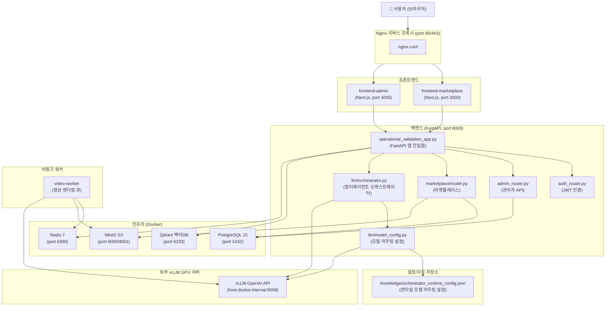

# codeAI 프로젝트 — 구조 분석 & 개선안

## 1. 프로젝트 개요

**codeAI**는 **AI 기반 코드 자동 생성 & 마켓플레이스 플랫폼**입니다.  
사용자가 요구사항을 입력하면 LLM 멀티 에이전트 오케스트레이터가 자동으로 코드를 설계·생성·검증하고, 그 결과를 마켓플레이스를 통해 거래할 수 있습니다.

> [!IMPORTANT]
> 현재 도메인: `metanova1004.com` / GPU: NVIDIA RTX 5090 32GB  
> LLM 백엔드: **vLLM (OpenAI 호환)** 서버 (`http://host.docker.internal:8008/v1`)  
> 기본 모델: `Qwen/Qwen2.5-Coder-32B-Instruct-AWQ`

---

## 2. 전체 아키텍처



---

## 3. 레이어별 상세 설명

### 3.1 프론트엔드
| 서비스 | 포트 | 역할 |
|--------|------|------|
| `frontend-marketplace` | 3000 | 일반 사용자 마켓플레이스 UI (상품 구매/주문) |
| `frontend-admin` | 3005 | 관리자 대시보드 (승인/모니터링/LLM 설정) |

- 두 서비스 모두 **동일한 Next.js Dockerfile**을 사용하며 `LOCAL_FRONTEND_ROLE` 환경변수로 역할을 구분
- `BACKEND_PROXY_TARGET=http://backend:8000` 으로 백엔드 프록시 구성

### 3.2 백엔드 (FastAPI)
- **진입점**: `backend/main.py` → `operational_validation_app.py`
- **주요 라우터**:
  - `/api/auth/*` — JWT 기반 인증
  - `/api/admin/*` — 관리자 기능 (오케스트레이터 모니터링, 승인 게이트)
  - `/api/llm/*` — LLM 멀티에이전트 오케스트레이터 (핵심)
  - `/api/marketplace/*` — 마켓플레이스 CRUD, 통계

### 3.3 LLM 오케스트레이터 (핵심 모듈)
- **파일**: `backend/llm/orchestrator.py` (15,232줄, 약 800KB!)
- **에이전트 파이프라인**:
  ```
  DESIGN → PLAN → GENERATE → BUILD → REFINER_FIXER → TEST → REFLEXION → FIX → DONE/FAILED
  ```
- **에이전트 역할**:
  | 에이전트 | 모델 라우트 | 역할 |
  |----------|------------|------|
  | Planner | `planner` | 요구사항 분석 & 설계 |
  | Coder | `coder` | 코드 생성 |
  | Reviewer | `reviewer` | 코드 리뷰 & 품질 검증 |
  | Designer | `designer` | UI/UX 설계 |
  | Smart Planner | `smart_planner` | 고급 계획 수립 |
  | Smart Executor | `smart_executor` | 고급 실행 |
  | Smart Designer | `smart_designer` | 고급 디자인 |

### 3.4 모델 라우팅 시스템
- **설정 파일**: `knowledge/orchestrator_runtime_config.json`
- **우선순위**: `runtime_config.json` > 환경변수 > 코드 기본값
- **현재 프로파일**: `rtx5090_32gb` — 모든 라우트에 `Qwen2.5-Coder-32B-Instruct-AWQ` 사용
- 캐시 TTL 기반 동적 리로드 (기본 30초)

### 3.5 인프라
| 서비스 | 역할 |
|--------|------|
| PostgreSQL | 사용자·주문·마켓플레이스 데이터 |
| Redis | 작업 큐 (영상 렌더 워커) |
| Qdrant | 벡터 검색 (코드/문서 임베딩) |
| MinIO | 파일 저장소 (업로드, 영상) |

---

## 4. 현재 발견된 이슈

### 🔴 심각 (High)

#### 4.1 orchestrator.py가 단일 거대 파일 (God File)
- **15,232줄, 약 800KB** — 단일 파일로는 매우 비정상적인 크기
- 유지보수·테스트·디버깅이 극도로 어려움
- 코드 검색, IDE 인덱싱 성능 저하

#### 4.2 환경변수 중복 설정
- `docker-compose.yml`의 `backend`와 `video-worker`에 동일한 환경변수 블록이 **복붙**되어 있음
- `VIDEO_*`, `MINIO_*`, `AZURE_*` 관련 변수가 두 서비스에 완전히 동일하게 선언
- 변경 시 두 곳 모두 수정해야 하므로 **설정 불일치 버그** 위험

#### 4.3 CORS가 운영환경에서도 하드코딩
- `operational_validation_app.py` L251~258에 `localhost:3000/3005`가 **하드코딩**
- 환경변수 `CORS_ORIGINS`는 docker-compose에 정의되어 있지만 FastAPI 앱에서 미사용

### 🟡 경고 (Medium)

#### 4.4 `on_event("startup")` Deprecated
- FastAPI 최신 버전에서 `@app.on_event("startup")`은 deprecated
- `lifespan` 컨텍스트 매니저로 교체 권장

#### 4.5 tmp 파일들이 백엔드 루트에 방치
- `tmp_check_hard_gate_progress.py`, `tmp_hard_gate_paths.py` 등 임시 스크립트가 `backend/` 루트에 존재
- `.gitignore`에 포함되어야 하거나 제거 필요

#### 4.6 여러 .venv 디렉토리 난립
- `.venv`, `.venv312`, `.venv313`, `.venv-arcface310` 등 **10개 이상**의 가상환경 디렉토리
- 어떤 것이 현재 사용 중인지 불명확

#### 4.7 루트 디렉토리에 스크린샷/마크다운 파일 산재
- `admin-home-current.png`, `marketplace-current.png`, `browser-*.md` 등 수십 개의 관찰/디버깅 파일이 루트에 존재
- 프로젝트 루트 오염 및 Git 히스토리 용량 증가

### 🟢 개선 권고 (Low)

#### 4.8 QWEN Q4/Q5/Q6/Q8 태그가 모두 동일 모델명
```python
QWEN_CODER_Q4_TAG = "Qwen/Qwen2.5-Coder-32B-Instruct-AWQ"
QWEN_CODER_Q5_TAG = "Qwen/Qwen2.5-Coder-32B-Instruct-AWQ"  # 동일!
```
- vLLM으로 이전했는데 Ollama 양자화 태그 체계 그대로 유지 중
- 의미 없는 상수 분기 제거 또는 vLLM 기준 모델명 통일 필요

#### 4.9 Nginx healthcheck 부재
- `nginx` 서비스에 `healthcheck` 미설정
- 시작 순서 의존성 (`depends_on: service_started`)만으로는 불충분

---

## 5. 개선 제안 로드맵

### Phase 1 — 즉시 적용 가능 (1~2일)

| # | 항목 | 파일 | 내용 |
|---|------|------|------|
| 1 | docker-compose 환경변수 중복 제거 | `docker-compose.yml` | `x-common-env` anchor로 공통 env 분리 |
| 2 | CORS 환경변수 연동 | `operational_validation_app.py` | `CORS_ORIGINS` env 파싱 |
| 3 | tmp 파일 정리 | `backend/` | `tmp_*.py` 파일 제거 또는 `scripts/debug/`로 이동 |
| 4 | 루트 디버깅 파일 정리 | `/` | `browser-*.md`, `*.png` → `docs/debug/`로 이동 |
| 5 | `on_event` 교체 | `operational_validation_app.py` | `lifespan` 컨텍스트 매니저 사용 |

### Phase 2 — 중기 개선 (1~2주)

| # | 항목 | 내용 |
|---|------|------|
| 6 | orchestrator.py 분할 | 에이전트별 파일 분리: `planner_agent.py`, `coder_agent.py`, `reviewer_agent.py` 등 |
| 7 | .venv 정리 | `.venv` 하나만 남기고 나머지 제거, `README.md`에 Python 버전 명시 |
| 8 | Nginx healthcheck 추가 | `docker-compose.yml` nginx 서비스에 healthcheck 추가 |
| 9 | vLLM 모델 상수 정리 | Q4/Q5/Q6/Q8 가짜 분기 제거, `VLLM_MODEL_ID` 단일 상수 |

### Phase 3 — 장기 아키텍처 개선

| # | 항목 | 내용 |
|---|------|------|
| 10 | Celery/Dramatiq 작업 큐 도입 | 현재 단순 Redis 큐 → Celery로 교체해 작업 모니터링 강화 |
| 11 | 오케스트레이터 API 분리 | orchestrator 기능을 독립 마이크로서비스로 분리 고려 |
| 12 | 관찰가능성(Observability) 강화 | Prometheus + Grafana 연동, 에이전트별 latency 메트릭 수집 |

---

## 6. 즉시 적용 — docker-compose 환경변수 중복 제거 예시

```yaml
# docker-compose.yml 상단에 추가
x-video-env: &video-env
  VIDEO_EXTERNAL_API_URL: ${VIDEO_EXTERNAL_API_URL:-}
  VIDEO_EXTERNAL_API_KEY: ${VIDEO_EXTERNAL_API_KEY:-}
  AZURE_OPENAI_ENDPOINT: ${AZURE_OPENAI_ENDPOINT:-}
  AZURE_OPENAI_API_KEY: ${AZURE_OPENAI_API_KEY:-}
  VIDEO_DEDICATED_ENGINE_URL: ${VIDEO_DEDICATED_ENGINE_URL:-}
  # ... 등

x-minio-env: &minio-env
  MINIO_ENDPOINT: minio:9000
  MINIO_ACCESS_KEY: ${MINIO_ACCESS_KEY:-}
  MINIO_SECRET_KEY: ${MINIO_SECRET_KEY:-}
  MINIO_BUCKET: marketplace-projects

# 서비스에서 사용:
services:
  backend:
    environment:
      <<: [*video-env, *minio-env]
      DATABASE_URL: ...
  
  video-worker:
    environment:
      <<: [*video-env, *minio-env]
```

---

## 7. 즉시 적용 — CORS 환경변수 연동 예시

```python
# operational_validation_app.py
cors_origins_raw = os.getenv("CORS_ORIGINS", "http://localhost:3000,http://localhost:3005")
cors_origins = [origin.strip() for origin in cors_origins_raw.split(",") if origin.strip()]

app.add_middleware(
    CORSMiddleware,
    allow_origins=cors_origins,
    allow_credentials=True,
    allow_methods=["*"],
    allow_headers=["*"],
)
```
